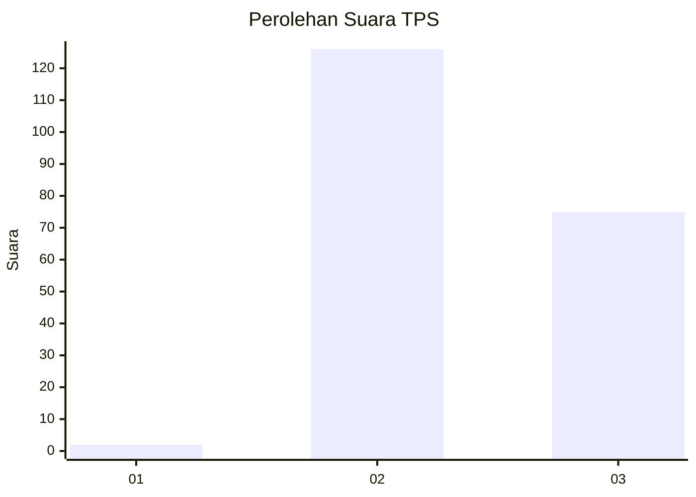
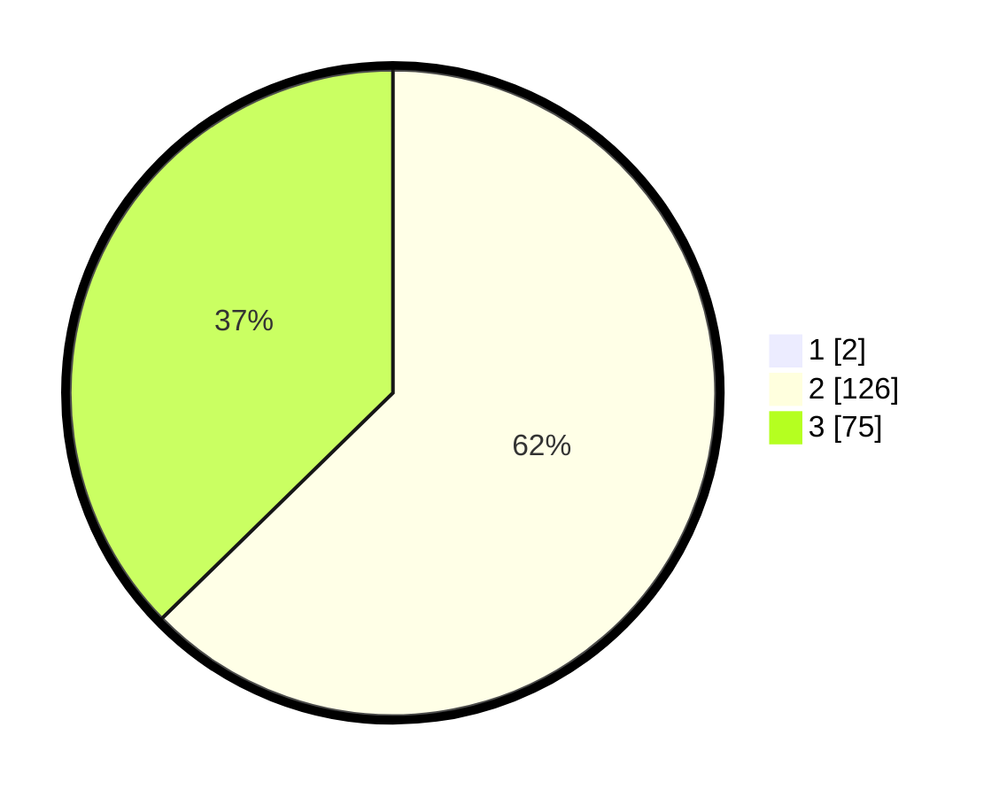

# Hasil

## Grafik

## Tabel

| No. | Nama Paslon    | Suara | Suara (raw) | Persentase |
|:--- |:-------------- | -----:| -----------:| ----------:|
| 1   | ANIES MUHAIMIN | 2     | [2][p-1]    | 0,99       |
| 2   | PRABOWO GIBRAN | 126   | [126][p-2]  | 62,07      |
| 3   | GANJAR MAHFUD  | 75    | [75][p-3]   | 36,95      |

[p-1]: https://github.com/gigit-pemilu/pemilu-2024-51-bali/blob/main/pilpres/hitung-suara/sub/51-bali/sub/08-buleleng/sub/04-banjar/sub/2005-gesing/sub/003-tps/sub/paslon-1.txt
[p-2]: https://github.com/gigit-pemilu/pemilu-2024-51-bali/blob/main/pilpres/hitung-suara/sub/51-bali/sub/08-buleleng/sub/04-banjar/sub/2005-gesing/sub/003-tps/sub/paslon-2.txt
[p-3]: https://github.com/gigit-pemilu/pemilu-2024-51-bali/blob/main/pilpres/hitung-suara/sub/51-bali/sub/08-buleleng/sub/04-banjar/sub/2005-gesing/sub/003-tps/sub/paslon-3.txt

## Foto C Plano

https://sirekap-obj-formc.kpu.go.id/c63a/pemilu/ppwp/51/08/04/20/05/5108042005003-20240224-071414--1239f226-5ac3-4f12-b839-d7d4e4288e3c.jpg

https://sirekap-obj-formc.kpu.go.id/c63a/pemilu/ppwp/51/08/04/20/05/5108042005003-20240224-071429--96083303-eed0-476a-a17b-6f8554702e63.jpg

https://sirekap-obj-formc.kpu.go.id/c63a/pemilu/ppwp/51/08/04/20/05/5108042005003-20240224-071439--f70b2655-5960-442e-a943-96cbb9f32a79.jpg

## Metadata

| Key        | Value               |
| ---------- | ------------------- |
| Time Stamp | 2024-02-24 22:31:28 |

