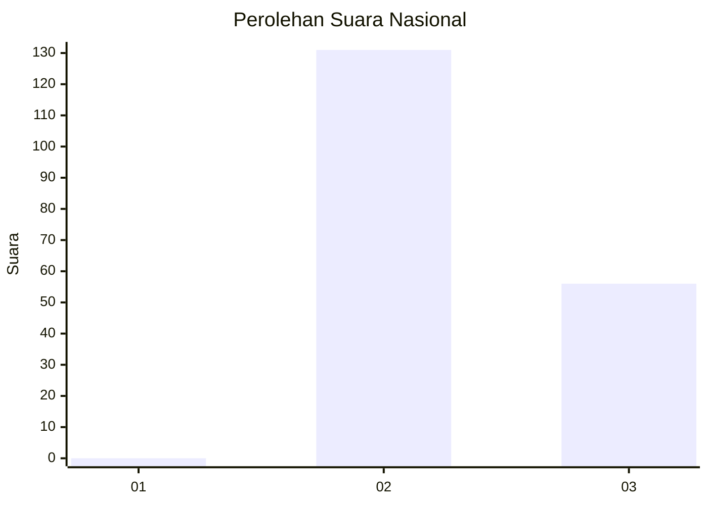
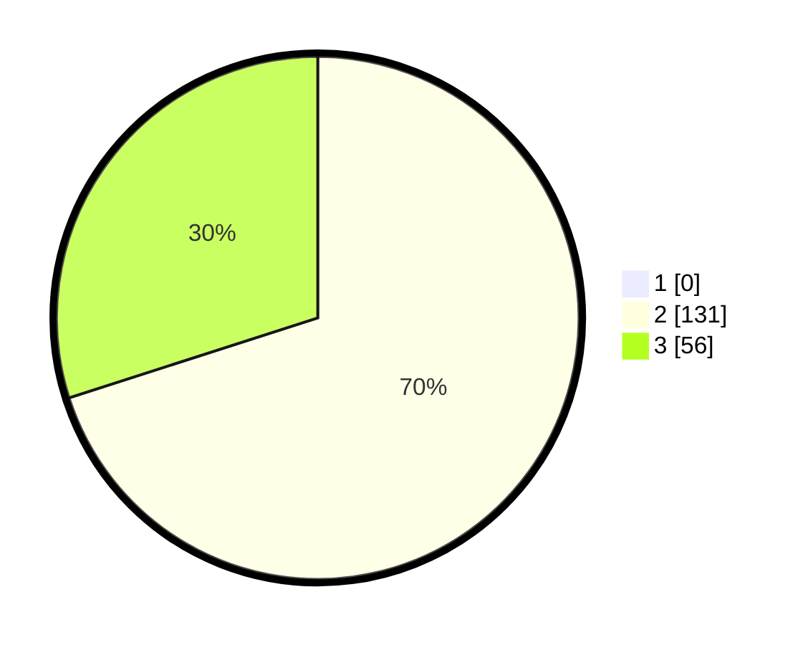

# Hasil

## Grafik

## Tabel

| No. | Nama Paslon    | Suara | Suara (raw) | Persentase |
|:--- |:-------------- | -----:| -----------:| ----------:|
| 1   | ANIES MUHAIMIN | 0     | [0][p-1]    | 0,00       |
| 2   | PRABOWO GIBRAN | 131   | [131][p-2]  | 70,05      |
| 3   | GANJAR MAHFUD  | 56    | [56][p-3]   | 29,95      |

[p-1]: https://github.com/gigit-pemilu/pemilu-2024/blob/main/pilpres/hitung-suara/sub/51-bali/sub/08-buleleng/sub/04-banjar/sub/2005-gesing/sub/004-tps/sub/paslon-1.txt
[p-2]: https://github.com/gigit-pemilu/pemilu-2024/blob/main/pilpres/hitung-suara/sub/51-bali/sub/08-buleleng/sub/04-banjar/sub/2005-gesing/sub/004-tps/sub/paslon-2.txt
[p-3]: https://github.com/gigit-pemilu/pemilu-2024/blob/main/pilpres/hitung-suara/sub/51-bali/sub/08-buleleng/sub/04-banjar/sub/2005-gesing/sub/004-tps/sub/paslon-3.txt

## Foto C Plano

https://sirekap-obj-formc.kpu.go.id/e8c0/pemilu/ppwp/51/08/04/20/05/5108042005004-20240224-071700--6df49c1f-7d01-41ba-81ad-193da1559ede.jpg

https://sirekap-obj-formc.kpu.go.id/e8c0/pemilu/ppwp/51/08/04/20/05/5108042005004-20240224-071713--02272e47-2842-4b05-8245-1fdc10fa2184.jpg

https://sirekap-obj-formc.kpu.go.id/e8c0/pemilu/ppwp/51/08/04/20/05/5108042005004-20240224-071728--f7057c8d-c881-4cb9-8bdb-36aa6fa6a20c.jpg

## Metadata

| Key        | Value               |
| ---------- | ------------------- |
| Time Stamp | 2024-02-24 22:31:28 |

