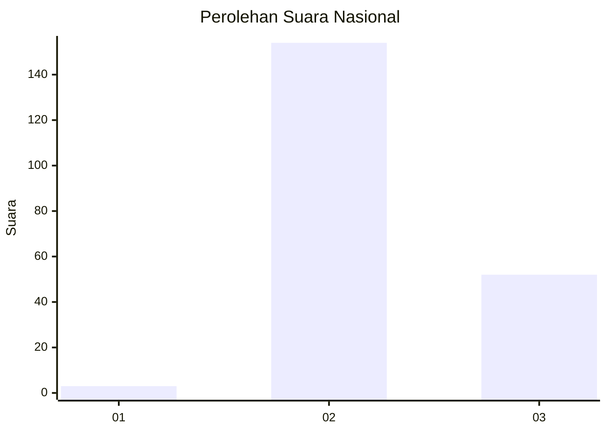
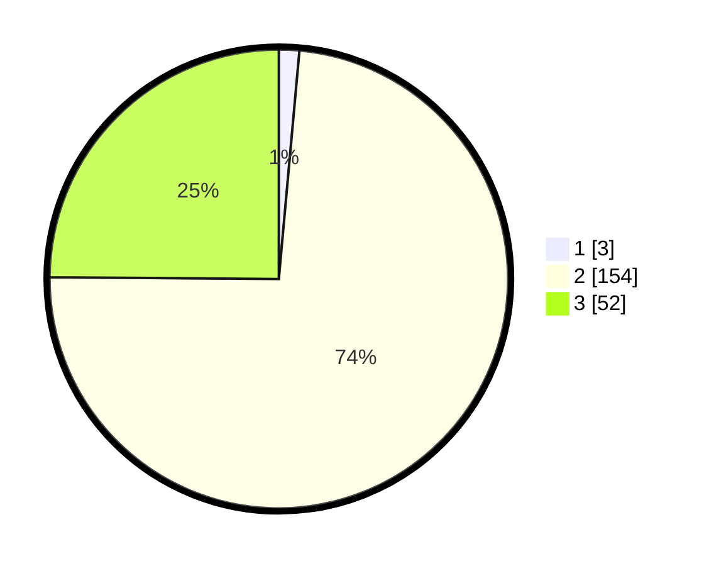

# Hasil

## Grafik

## Tabel

| No. | Nama Paslon    | Suara | Suara (raw) | Persentase |
|:--- |:-------------- | -----:| -----------:| ----------:|
| 1   | ANIES MUHAIMIN | 3     | [3][p-1]    | 1,44       |
| 2   | PRABOWO GIBRAN | 154   | [154][p-2]  | 73,68      |
| 3   | GANJAR MAHFUD  | 52    | [52][p-3]   | 24,88      |

[p-1]: https://github.com/gigit-pemilu/pemilu-2024/blob/main/pilpres/hitung-suara/sub/51-bali/sub/08-buleleng/sub/04-banjar/sub/2005-gesing/sub/005-tps/sub/paslon-1.txt
[p-2]: https://github.com/gigit-pemilu/pemilu-2024/blob/main/pilpres/hitung-suara/sub/51-bali/sub/08-buleleng/sub/04-banjar/sub/2005-gesing/sub/005-tps/sub/paslon-2.txt
[p-3]: https://github.com/gigit-pemilu/pemilu-2024/blob/main/pilpres/hitung-suara/sub/51-bali/sub/08-buleleng/sub/04-banjar/sub/2005-gesing/sub/005-tps/sub/paslon-3.txt

## Foto C Plano

https://sirekap-obj-formc.kpu.go.id/0d60/pemilu/ppwp/51/08/04/20/05/5108042005005-20240224-071937--67285383-32b3-4ee5-9e97-06b772f347eb.jpg

https://sirekap-obj-formc.kpu.go.id/0d60/pemilu/ppwp/51/08/04/20/05/5108042005005-20240224-071952--96013169-0af5-427e-8626-97311719959d.jpg

https://sirekap-obj-formc.kpu.go.id/0d60/pemilu/ppwp/51/08/04/20/05/5108042005005-20240224-072005--e75e9118-7654-427f-83b5-ec74ba60b993.jpg

## Metadata

| Key        | Value               |
| ---------- | ------------------- |
| Time Stamp | 2024-02-25 16:00:00 |

