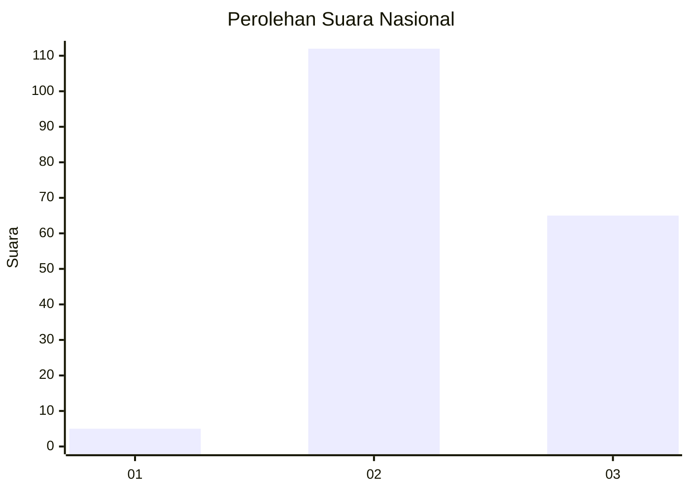
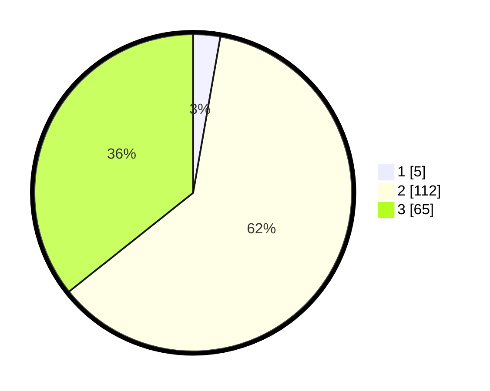

# Hasil

## Grafik

## Tabel

| No. | Nama Paslon    | Suara | Suara (raw) | Persentase |
|:--- |:-------------- | -----:| -----------:| ----------:|
| 1   | ANIES MUHAIMIN | 5     | [5][p-1]    | 2,75       |
| 2   | PRABOWO GIBRAN | 112   | [112][p-2]  | 61,54      |
| 3   | GANJAR MAHFUD  | 65    | [65][p-3]   | 35,71      |

[p-1]: https://github.com/gigit-pemilu/pemilu-2024/blob/main/pilpres/hitung-suara/sub/51-bali/sub/08-buleleng/sub/04-banjar/sub/2005-gesing/sub/008-tps/sub/paslon-1.txt
[p-2]: https://github.com/gigit-pemilu/pemilu-2024/blob/main/pilpres/hitung-suara/sub/51-bali/sub/08-buleleng/sub/04-banjar/sub/2005-gesing/sub/008-tps/sub/paslon-2.txt
[p-3]: https://github.com/gigit-pemilu/pemilu-2024/blob/main/pilpres/hitung-suara/sub/51-bali/sub/08-buleleng/sub/04-banjar/sub/2005-gesing/sub/008-tps/sub/paslon-3.txt

## Foto C Plano

https://sirekap-obj-formc.kpu.go.id/494e/pemilu/ppwp/51/08/04/20/05/5108042005008-20240224-072538--afb42c19-67d0-45a9-9930-277b81e2a02d.jpg

https://sirekap-obj-formc.kpu.go.id/494e/pemilu/ppwp/51/08/04/20/05/5108042005008-20240224-072550--1305b7ab-e8c1-4407-8f70-12590649c412.jpg

## Metadata

| Key        | Value               |
| ---------- | ------------------- |
| Time Stamp | 2024-02-24 22:31:28 |

