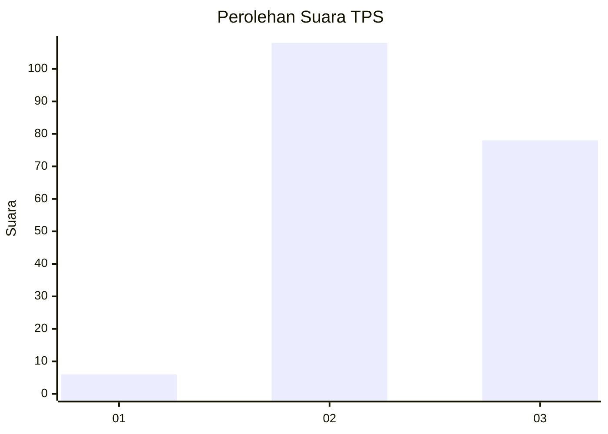
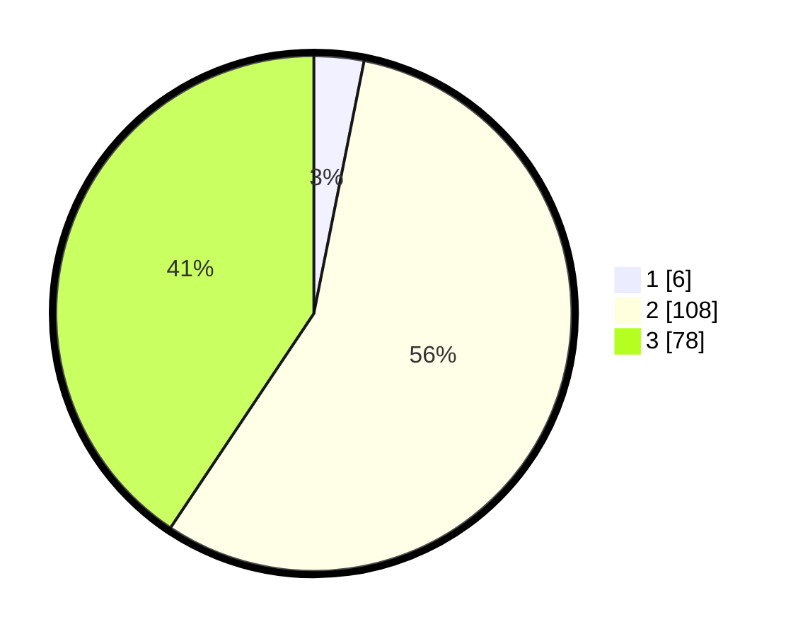

# Hasil

## Grafik

## Tabel

| No. | Nama Paslon    | Suara | Suara (raw) | Persentase |
|:--- |:-------------- | -----:| -----------:| ----------:|
| 1   | ANIES MUHAIMIN | 6     | [6][p-1]    | 3,13       |
| 2   | PRABOWO GIBRAN | 108   | [108][p-2]  | 56,25      |
| 3   | GANJAR MAHFUD  | 78    | [78][p-3]   | 40,63      |

[p-1]: https://github.com/gigit-pemilu/pemilu-2024-51-bali/blob/main/pilpres/hitung-suara/sub/51-bali/sub/08-buleleng/sub/04-banjar/sub/2005-gesing/sub/010-tps/sub/paslon-1.txt
[p-2]: https://github.com/gigit-pemilu/pemilu-2024-51-bali/blob/main/pilpres/hitung-suara/sub/51-bali/sub/08-buleleng/sub/04-banjar/sub/2005-gesing/sub/010-tps/sub/paslon-2.txt
[p-3]: https://github.com/gigit-pemilu/pemilu-2024-51-bali/blob/main/pilpres/hitung-suara/sub/51-bali/sub/08-buleleng/sub/04-banjar/sub/2005-gesing/sub/010-tps/sub/paslon-3.txt

## Foto C Plano

https://sirekap-obj-formc.kpu.go.id/3985/pemilu/ppwp/51/08/04/20/05/5108042005010-20240224-073628--4913967a-3a05-40a2-b9e1-c5de1427bf23.jpg

https://sirekap-obj-formc.kpu.go.id/3985/pemilu/ppwp/51/08/04/20/05/5108042005010-20240224-073640--10bb57d1-13e3-4af2-8523-86b57a3bb663.jpg

https://sirekap-obj-formc.kpu.go.id/3985/pemilu/ppwp/51/08/04/20/05/5108042005010-20240224-073654--069fe049-ac81-46ad-96d1-bc2e2d126814.jpg

## Metadata

| Key        | Value               |
| ---------- | ------------------- |
| Time Stamp | 2024-02-24 22:31:28 |

