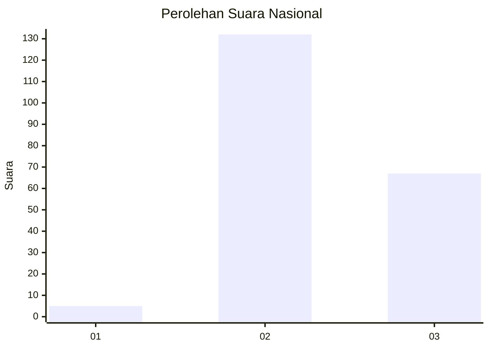
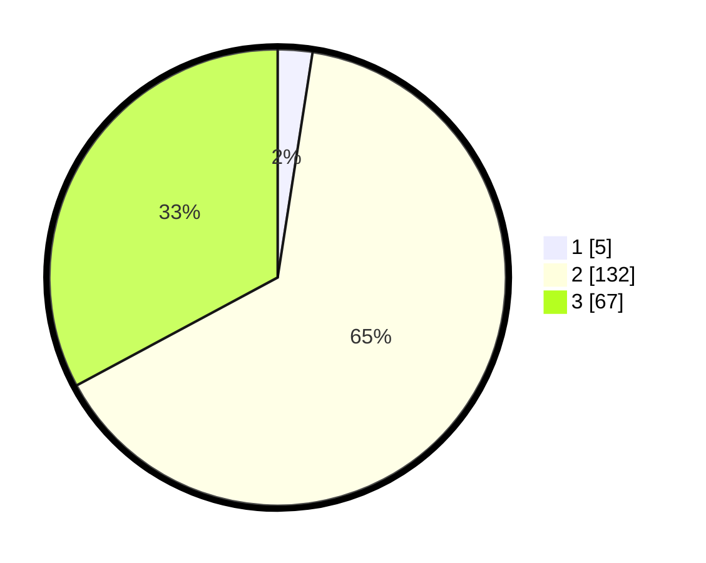

# Hasil

## Grafik

## Tabel

| No. | Nama Paslon    | Suara | Suara (raw) | Persentase |
|:--- |:-------------- | -----:| -----------:| ----------:|
| 1   | ANIES MUHAIMIN | 5     | [5][p-1]    | 2,45       |
| 2   | PRABOWO GIBRAN | 132   | [132][p-2]  | 64,71      |
| 3   | GANJAR MAHFUD  | 67    | [67][p-3]   | 32,84      |

[p-1]: https://github.com/gigit-pemilu/pemilu-2024/blob/main/pilpres/hitung-suara/sub/51-bali/sub/08-buleleng/sub/04-banjar/sub/2005-gesing/sub/012-tps/sub/paslon-1.txt
[p-2]: https://github.com/gigit-pemilu/pemilu-2024/blob/main/pilpres/hitung-suara/sub/51-bali/sub/08-buleleng/sub/04-banjar/sub/2005-gesing/sub/012-tps/sub/paslon-2.txt
[p-3]: https://github.com/gigit-pemilu/pemilu-2024/blob/main/pilpres/hitung-suara/sub/51-bali/sub/08-buleleng/sub/04-banjar/sub/2005-gesing/sub/012-tps/sub/paslon-3.txt

## Foto C Plano

https://sirekap-obj-formc.kpu.go.id/61cc/pemilu/ppwp/51/08/04/20/05/5108042005012-20240224-074049--040e8e7a-8dc5-4333-875a-4bc7e722d73a.jpg

https://sirekap-obj-formc.kpu.go.id/61cc/pemilu/ppwp/51/08/04/20/05/5108042005012-20240224-074101--fa9f9850-af7a-4bb6-98d4-f87d280bff67.jpg

https://sirekap-obj-formc.kpu.go.id/61cc/pemilu/ppwp/51/08/04/20/05/5108042005012-20240214-204529--96ec3931-76c3-4e7c-8504-b1f381f697d1.jpg

## Metadata

| Key        | Value               |
| ---------- | ------------------- |
| Time Stamp | 2024-02-24 22:31:28 |

