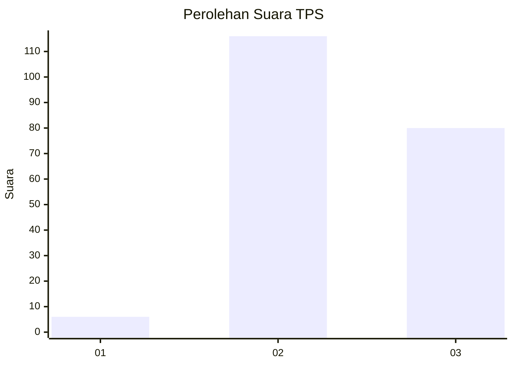
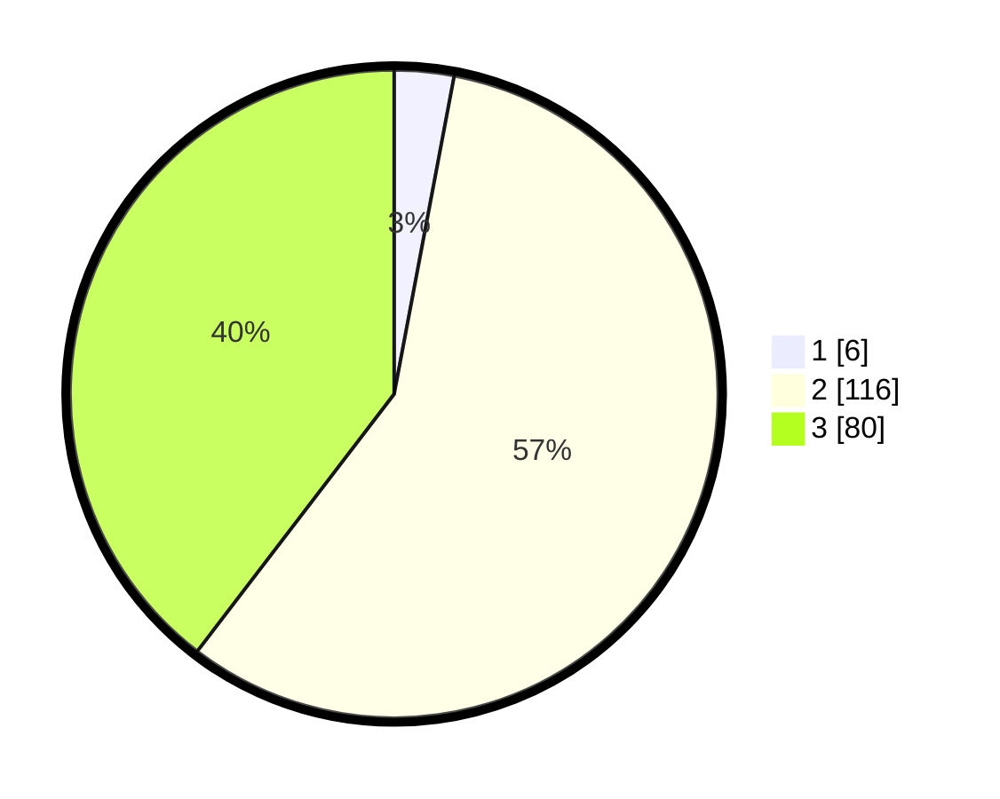

# Hasil

## Grafik

## Tabel

| No. | Nama Paslon    | Suara | Suara (raw) | Persentase |
|:--- |:-------------- | -----:| -----------:| ----------:|
| 1   | ANIES MUHAIMIN | 6     | [6][p-1]    | 2,97       |
| 2   | PRABOWO GIBRAN | 116   | [116][p-2]  | 57,43      |
| 3   | GANJAR MAHFUD  | 80    | [80][p-3]   | 39,60      |

[p-1]: https://github.com/gigit-pemilu/pemilu-2024-51-bali/blob/main/pilpres/hitung-suara/sub/51-bali/sub/08-buleleng/sub/04-banjar/sub/2006-munduk/sub/001-tps/sub/paslon-1.txt
[p-2]: https://github.com/gigit-pemilu/pemilu-2024-51-bali/blob/main/pilpres/hitung-suara/sub/51-bali/sub/08-buleleng/sub/04-banjar/sub/2006-munduk/sub/001-tps/sub/paslon-2.txt
[p-3]: https://github.com/gigit-pemilu/pemilu-2024-51-bali/blob/main/pilpres/hitung-suara/sub/51-bali/sub/08-buleleng/sub/04-banjar/sub/2006-munduk/sub/001-tps/sub/paslon-3.txt

## Foto C Plano

https://sirekap-obj-formc.kpu.go.id/39d0/pemilu/ppwp/51/08/04/20/06/5108042006001-20240214-131939--af6f79d4-e3b6-40af-9fd8-9e7e11c30953.jpg

https://sirekap-obj-formc.kpu.go.id/39d0/pemilu/ppwp/51/08/04/20/06/5108042006001-20240214-131451--2bbd5db8-8bb3-423b-9c71-d148abb30dfd.jpg

https://sirekap-obj-formc.kpu.go.id/39d0/pemilu/ppwp/51/08/04/20/06/5108042006001-20240318-112644--7b617489-faf4-4a07-be53-4db3ef9ebd8c.jpg

## Metadata

| Key        | Value               |
| ---------- | ------------------- |
| Time Stamp | 2024-03-18 11:30:00 |

