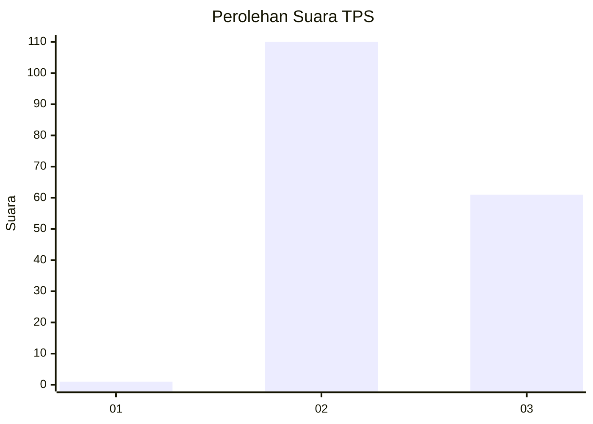
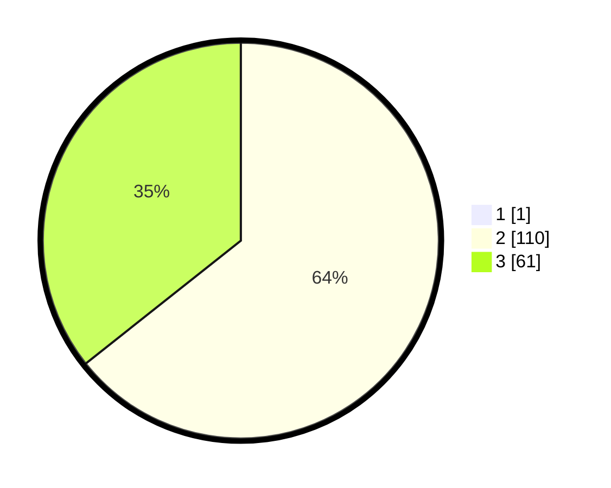

# Hasil

## Grafik

## Tabel

| No. | Nama Paslon    | Suara | Suara (raw) | Persentase |
|:--- |:-------------- | -----:| -----------:| ----------:|
| 1   | ANIES MUHAIMIN | 1     | [1][p-1]    | 0,58       |
| 2   | PRABOWO GIBRAN | 110   | [110][p-2]  | 63,95      |
| 3   | GANJAR MAHFUD  | 61    | [61][p-3]   | 35,47      |

[p-1]: https://github.com/gigit-pemilu/pemilu-2024-51-bali/blob/main/pilpres/hitung-suara/sub/51-bali/sub/08-buleleng/sub/04-banjar/sub/2006-munduk/sub/013-tps/sub/paslon-1.txt
[p-2]: https://github.com/gigit-pemilu/pemilu-2024-51-bali/blob/main/pilpres/hitung-suara/sub/51-bali/sub/08-buleleng/sub/04-banjar/sub/2006-munduk/sub/013-tps/sub/paslon-2.txt
[p-3]: https://github.com/gigit-pemilu/pemilu-2024-51-bali/blob/main/pilpres/hitung-suara/sub/51-bali/sub/08-buleleng/sub/04-banjar/sub/2006-munduk/sub/013-tps/sub/paslon-3.txt

## Foto C Plano

https://sirekap-obj-formc.kpu.go.id/423d/pemilu/ppwp/51/08/04/20/06/5108042006013-20240214-220225--fdda15b3-d8a0-4173-bc0e-32a72831453f.jpg

https://sirekap-obj-formc.kpu.go.id/423d/pemilu/ppwp/51/08/04/20/06/5108042006013-20240214-220829--72d9667d-fc9e-4947-ab4a-bda1e67c4999.jpg

https://sirekap-obj-formc.kpu.go.id/423d/pemilu/ppwp/51/08/04/20/06/5108042006013-20240214-221652--f6d76e85-a129-4239-9538-e7ced622a692.jpg

## Metadata

| Key        | Value               |
| ---------- | ------------------- |
| Time Stamp | 2024-02-24 22:31:28 |

