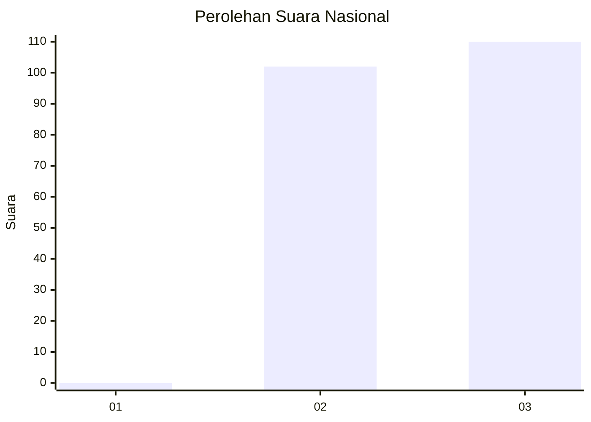
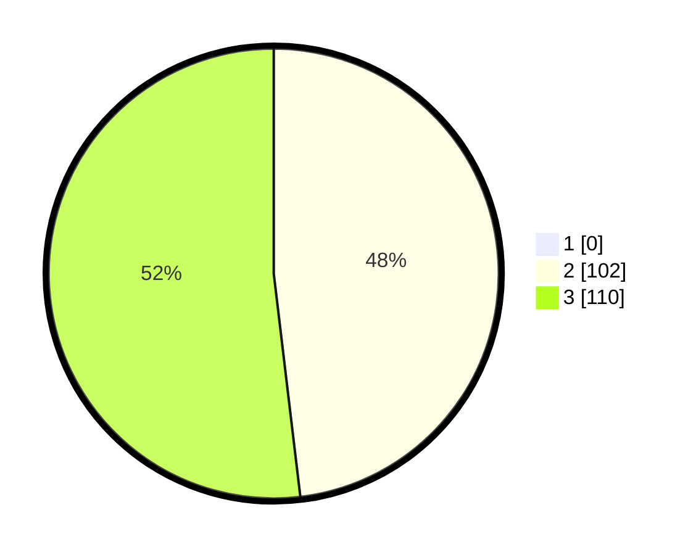

# Hasil

## Grafik

## Tabel

| No. | Nama Paslon    | Suara | Suara (raw) | Persentase |
|:--- |:-------------- | -----:| -----------:| ----------:|
| 1   | ANIES MUHAIMIN | 0     | [0][p-1]    | 0,00       |
| 2   | PRABOWO GIBRAN | 102   | [102][p-2]  | 48,11      |
| 3   | GANJAR MAHFUD  | 110   | [110][p-3]  | 51,89      |

[p-1]: https://github.com/gigit-pemilu/pemilu-2024/blob/main/pilpres/hitung-suara/sub/51-bali/sub/08-buleleng/sub/04-banjar/sub/2007-gobleg/sub/004-tps/sub/paslon-1.txt
[p-2]: https://github.com/gigit-pemilu/pemilu-2024/blob/main/pilpres/hitung-suara/sub/51-bali/sub/08-buleleng/sub/04-banjar/sub/2007-gobleg/sub/004-tps/sub/paslon-2.txt
[p-3]: https://github.com/gigit-pemilu/pemilu-2024/blob/main/pilpres/hitung-suara/sub/51-bali/sub/08-buleleng/sub/04-banjar/sub/2007-gobleg/sub/004-tps/sub/paslon-3.txt

## Foto C Plano

https://sirekap-obj-formc.kpu.go.id/d641/pemilu/ppwp/51/08/04/20/07/5108042007004-20240214-141553--4259534b-dd48-448d-839a-3dd3ebce4c4d.jpg

https://sirekap-obj-formc.kpu.go.id/d641/pemilu/ppwp/51/08/04/20/07/5108042007004-20240214-141621--048c3134-42b8-48f8-abab-323e8d358f8c.jpg

https://sirekap-obj-formc.kpu.go.id/d641/pemilu/ppwp/51/08/04/20/07/5108042007004-20240214-141630--dab263fb-b7ea-4a94-a313-d15abf71af44.jpg

## Metadata

| Key        | Value               |
| ---------- | ------------------- |
| Time Stamp | 2024-02-14 21:46:01 |

