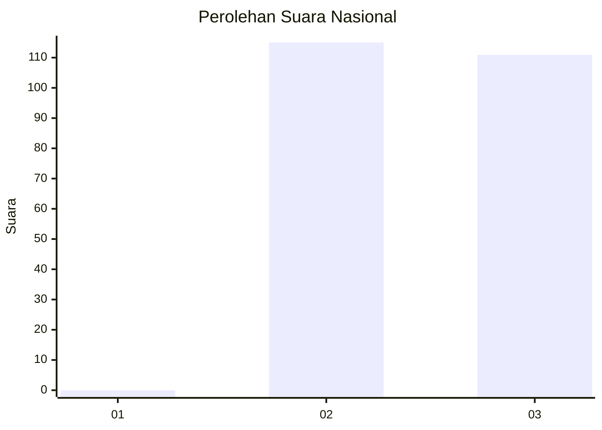
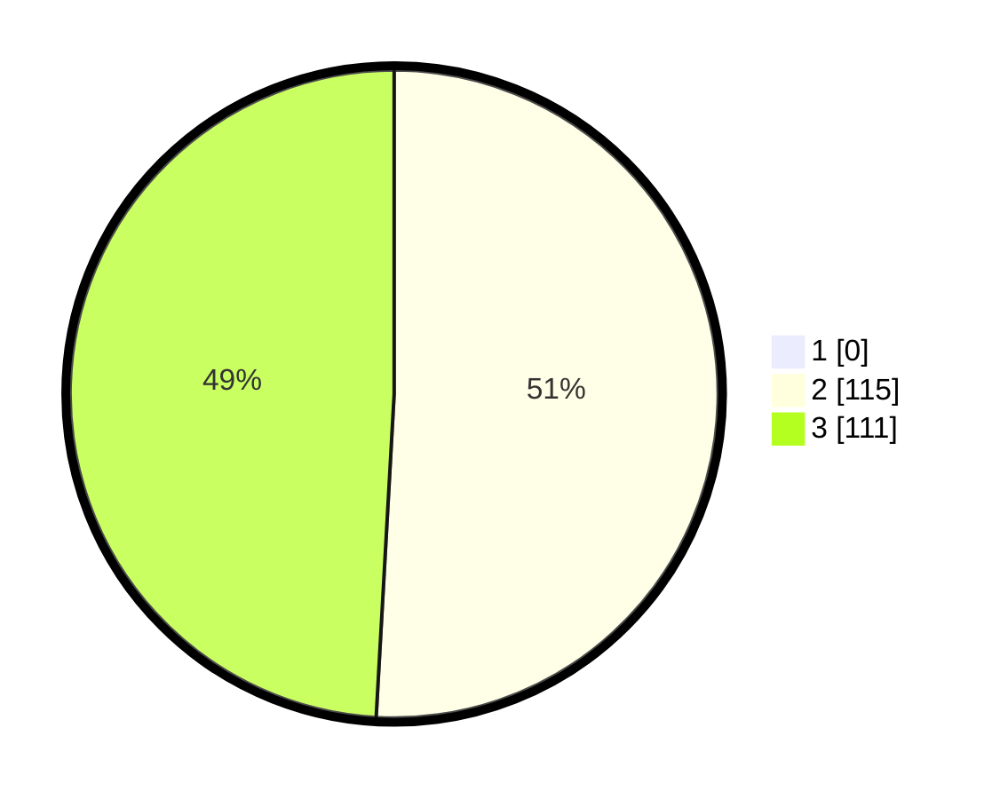

# Hasil

## Grafik

## Tabel

| No. | Nama Paslon    | Suara | Suara (raw) | Persentase |
|:--- |:-------------- | -----:| -----------:| ----------:|
| 1   | ANIES MUHAIMIN | 0     | [0][p-1]    | 0,00       |
| 2   | PRABOWO GIBRAN | 115   | [115][p-2]  | 50,88      |
| 3   | GANJAR MAHFUD  | 111   | [111][p-3]  | 49,12      |

[p-1]: https://github.com/gigit-pemilu/pemilu-2024/blob/main/pilpres/hitung-suara/sub/51-bali/sub/08-buleleng/sub/04-banjar/sub/2007-gobleg/sub/005-tps/sub/paslon-1.txt
[p-2]: https://github.com/gigit-pemilu/pemilu-2024/blob/main/pilpres/hitung-suara/sub/51-bali/sub/08-buleleng/sub/04-banjar/sub/2007-gobleg/sub/005-tps/sub/paslon-2.txt
[p-3]: https://github.com/gigit-pemilu/pemilu-2024/blob/main/pilpres/hitung-suara/sub/51-bali/sub/08-buleleng/sub/04-banjar/sub/2007-gobleg/sub/005-tps/sub/paslon-3.txt

## Foto C Plano

https://sirekap-obj-formc.kpu.go.id/ce67/pemilu/ppwp/51/08/04/20/07/5108042007005-20240214-223543--3e9cd65e-c8cd-4365-94a4-42e1fd84e84b.jpg

https://sirekap-obj-formc.kpu.go.id/ce67/pemilu/ppwp/51/08/04/20/07/5108042007005-20240214-223855--ddaaf3ee-46e0-4153-bd16-fc5cf0d56f96.jpg

https://sirekap-obj-formc.kpu.go.id/ce67/pemilu/ppwp/51/08/04/20/07/5108042007005-20240214-223949--5ffaeb79-a5bd-4eb0-99af-e946d5a044a1.jpg

## Metadata

| Key        | Value               |
| ---------- | ------------------- |
| Time Stamp | 2024-02-24 22:31:28 |

