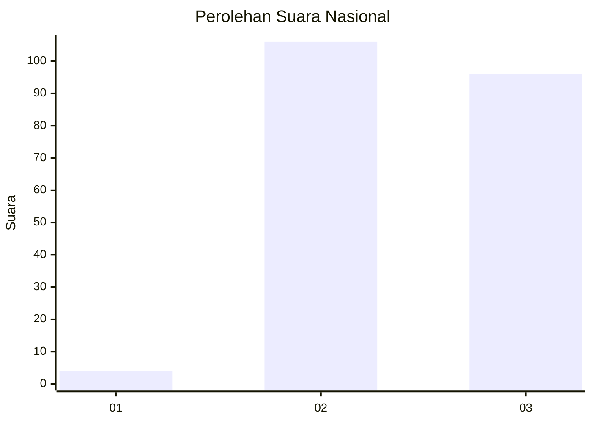
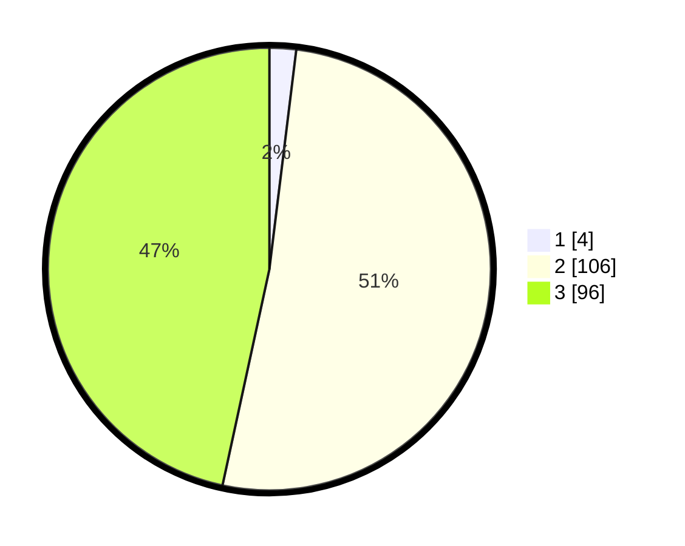

# Hasil

## Grafik

## Tabel

| No. | Nama Paslon    | Suara | Suara (raw) | Persentase |
|:--- |:-------------- | -----:| -----------:| ----------:|
| 1   | ANIES MUHAIMIN | 4     | [4][p-1]    | 1,94       |
| 2   | PRABOWO GIBRAN | 106   | [106][p-2]  | 51,46      |
| 3   | GANJAR MAHFUD  | 96    | [96][p-3]   | 46,60      |

[p-1]: https://github.com/gigit-pemilu/pemilu-2024/blob/main/pilpres/hitung-suara/sub/51-bali/sub/08-buleleng/sub/04-banjar/sub/2007-gobleg/sub/006-tps/sub/paslon-1.txt
[p-2]: https://github.com/gigit-pemilu/pemilu-2024/blob/main/pilpres/hitung-suara/sub/51-bali/sub/08-buleleng/sub/04-banjar/sub/2007-gobleg/sub/006-tps/sub/paslon-2.txt
[p-3]: https://github.com/gigit-pemilu/pemilu-2024/blob/main/pilpres/hitung-suara/sub/51-bali/sub/08-buleleng/sub/04-banjar/sub/2007-gobleg/sub/006-tps/sub/paslon-3.txt

## Foto C Plano

https://sirekap-obj-formc.kpu.go.id/d6ad/pemilu/ppwp/51/08/04/20/07/5108042007006-20240215-000557--7d69c3c3-489a-4a6f-830b-49b4d9bcf558.jpg

https://sirekap-obj-formc.kpu.go.id/d6ad/pemilu/ppwp/51/08/04/20/07/5108042007006-20240215-000659--f4eb1536-0a3b-4ec4-8da8-f97d2b84a119.jpg

https://sirekap-obj-formc.kpu.go.id/d6ad/pemilu/ppwp/51/08/04/20/07/5108042007006-20240215-000713--2dd35461-068a-4695-8ae1-16a5feb41cc7.jpg

## Metadata

| Key        | Value               |
| ---------- | ------------------- |
| Time Stamp | 2024-02-24 22:31:28 |

