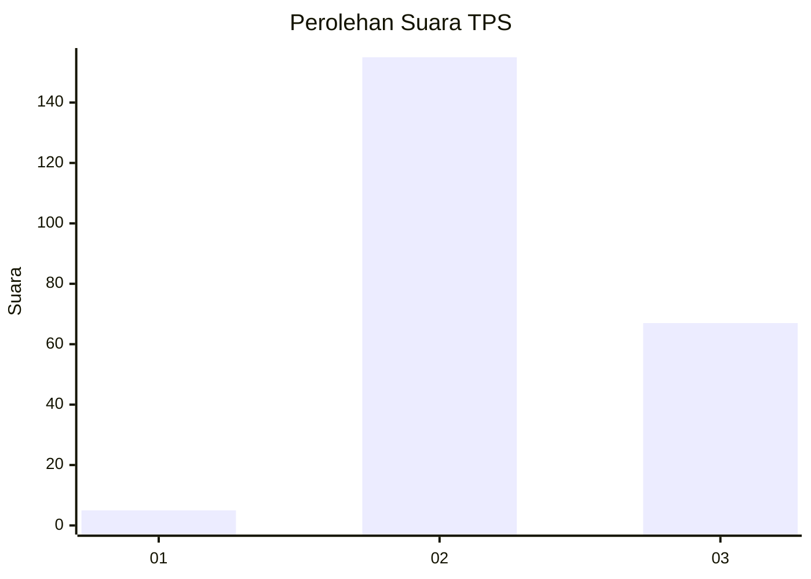

# Hasil

## Grafik

## Tabel

| No. | Nama Paslon    | Suara | Suara (raw) | Persentase |
|:--- |:-------------- | -----:| -----------:| ----------:|
| 1   | ANIES MUHAIMIN | 5     | [5][p-1]    | 2,20       |
| 2   | PRABOWO GIBRAN | 155   | [155][p-2]  | 68,28      |
| 3   | GANJAR MAHFUD  | 67    | [67][p-3]   | 29,52      |

[p-1]: https://github.com/gigit-pemilu/pemilu-2024-51-bali/blob/main/pilpres/hitung-suara/sub/51-bali/sub/08-buleleng/sub/04-banjar/sub/2007-gobleg/sub/008-tps/sub/paslon-1.txt
[p-2]: https://github.com/gigit-pemilu/pemilu-2024-51-bali/blob/main/pilpres/hitung-suara/sub/51-bali/sub/08-buleleng/sub/04-banjar/sub/2007-gobleg/sub/008-tps/sub/paslon-2.txt
[p-3]: https://github.com/gigit-pemilu/pemilu-2024-51-bali/blob/main/pilpres/hitung-suara/sub/51-bali/sub/08-buleleng/sub/04-banjar/sub/2007-gobleg/sub/008-tps/sub/paslon-3.txt

## Foto C Plano

https://sirekap-obj-formc.kpu.go.id/8d86/pemilu/ppwp/51/08/04/20/07/5108042007008-20240214-223926--6e1d9368-e7f4-4f76-ba57-6d97a4ad3da6.jpg

https://sirekap-obj-formc.kpu.go.id/8d86/pemilu/ppwp/51/08/04/20/07/5108042007008-20240214-224041--f972fafe-a8f9-4b33-8bec-dddb621cba1d.jpg

https://sirekap-obj-formc.kpu.go.id/8d86/pemilu/ppwp/51/08/04/20/07/5108042007008-20240214-224125--a1e61b34-170f-4a51-825e-d406bc219b79.jpg

## Metadata

| Key        | Value               |
| ---------- | ------------------- |
| Time Stamp | 2024-02-24 22:31:28 |

