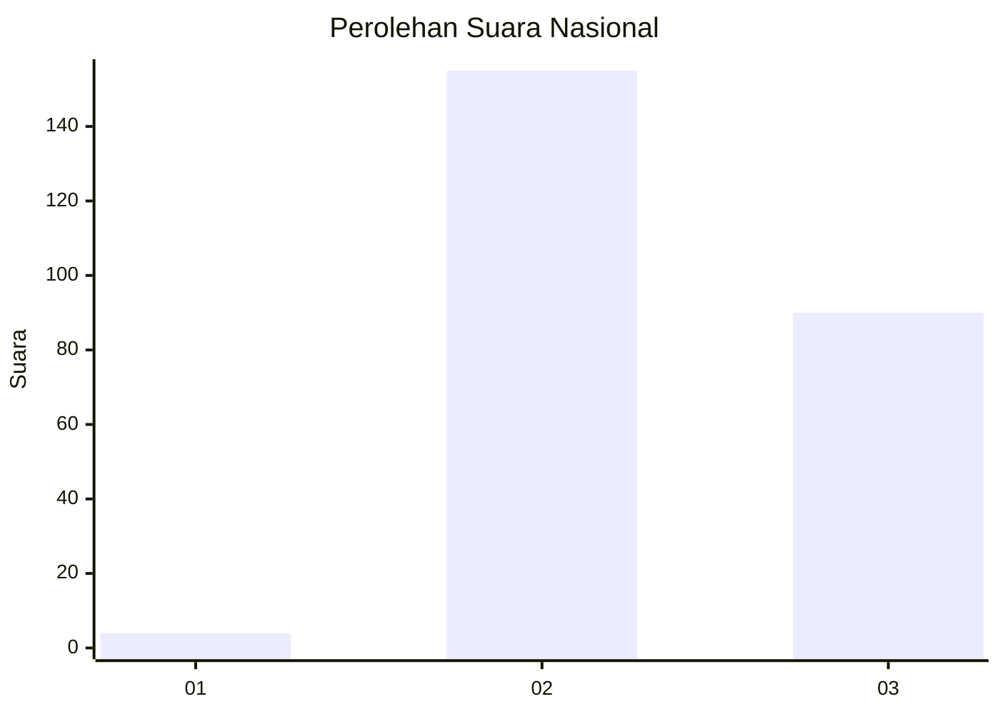
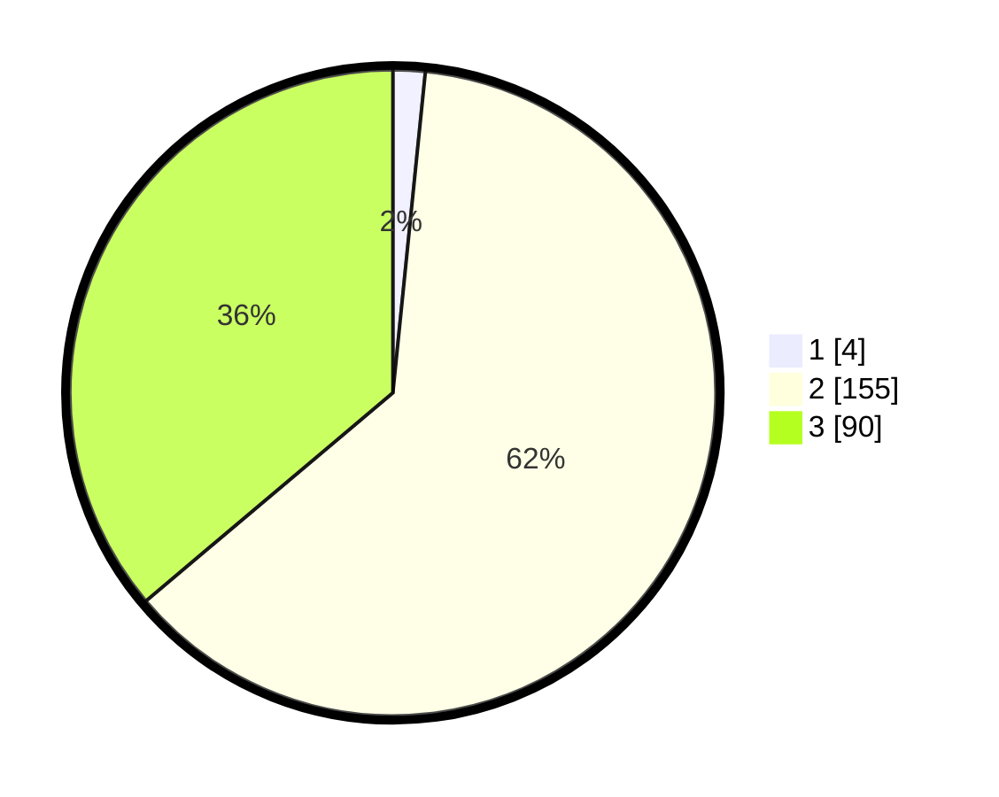

# Hasil

## Grafik

## Tabel

| No. | Nama Paslon    | Suara | Suara (raw) | Persentase |
|:--- |:-------------- | -----:| -----------:| ----------:|
| 1   | ANIES MUHAIMIN | 4     | [4][p-1]    | 1,61       |
| 2   | PRABOWO GIBRAN | 155   | [155][p-2]  | 62,25      |
| 3   | GANJAR MAHFUD  | 90    | [90][p-3]   | 36,14      |

[p-1]: https://github.com/gigit-pemilu/pemilu-2024/blob/main/pilpres/hitung-suara/sub/51-bali/sub/08-buleleng/sub/04-banjar/sub/2007-gobleg/sub/011-tps/sub/paslon-1.txt
[p-2]: https://github.com/gigit-pemilu/pemilu-2024/blob/main/pilpres/hitung-suara/sub/51-bali/sub/08-buleleng/sub/04-banjar/sub/2007-gobleg/sub/011-tps/sub/paslon-2.txt
[p-3]: https://github.com/gigit-pemilu/pemilu-2024/blob/main/pilpres/hitung-suara/sub/51-bali/sub/08-buleleng/sub/04-banjar/sub/2007-gobleg/sub/011-tps/sub/paslon-3.txt

## Foto C Plano

https://sirekap-obj-formc.kpu.go.id/4518/pemilu/ppwp/51/08/04/20/07/5108042007011-20240214-235312--a17c7b2d-5b09-44a4-b4b9-b63f3c2c6d9d.jpg

https://sirekap-obj-formc.kpu.go.id/4518/pemilu/ppwp/51/08/04/20/07/5108042007011-20240214-235558--e574e4f7-005a-4cab-94c4-3db835d2139a.jpg

https://sirekap-obj-formc.kpu.go.id/4518/pemilu/ppwp/51/08/04/20/07/5108042007011-20240214-235748--3979469d-b8e8-4f1c-a5cb-1b6880ab6f9f.jpg

## Metadata

| Key        | Value               |
| ---------- | ------------------- |
| Time Stamp | 2024-02-24 22:31:28 |

