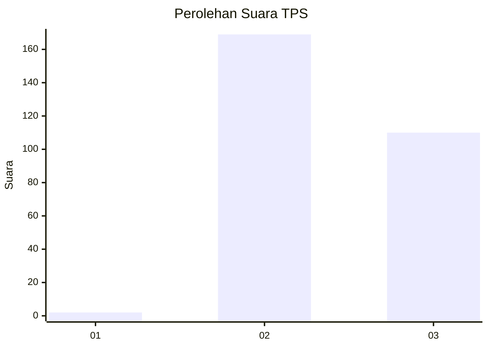
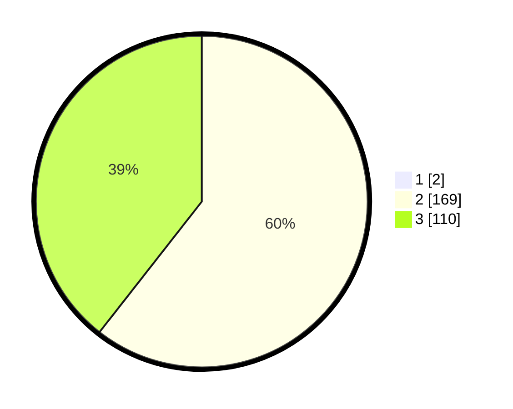

# Hasil

## Grafik

## Tabel

| No. | Nama Paslon    | Suara | Suara (raw) | Persentase |
|:--- |:-------------- | -----:| -----------:| ----------:|
| 1   | ANIES MUHAIMIN | 2     | [2][p-1]    | 0,71       |
| 2   | PRABOWO GIBRAN | 169   | [169][p-2]  | 60,14      |
| 3   | GANJAR MAHFUD  | 110   | [110][p-3]  | 39,15      |

[p-1]: https://github.com/gigit-pemilu/pemilu-2024-51-bali/blob/main/pilpres/hitung-suara/sub/51-bali/sub/08-buleleng/sub/04-banjar/sub/2007-gobleg/sub/012-tps/sub/paslon-1.txt
[p-2]: https://github.com/gigit-pemilu/pemilu-2024-51-bali/blob/main/pilpres/hitung-suara/sub/51-bali/sub/08-buleleng/sub/04-banjar/sub/2007-gobleg/sub/012-tps/sub/paslon-2.txt
[p-3]: https://github.com/gigit-pemilu/pemilu-2024-51-bali/blob/main/pilpres/hitung-suara/sub/51-bali/sub/08-buleleng/sub/04-banjar/sub/2007-gobleg/sub/012-tps/sub/paslon-3.txt

## Foto C Plano

https://sirekap-obj-formc.kpu.go.id/ea53/pemilu/ppwp/51/08/04/20/07/5108042007012-20240215-002139--593e47d9-f2de-4b58-85dd-c25b085354e3.jpg

https://sirekap-obj-formc.kpu.go.id/ea53/pemilu/ppwp/51/08/04/20/07/5108042007012-20240215-002315--113f66c7-9c6a-4190-9da9-e94eab3f8d7c.jpg

https://sirekap-obj-formc.kpu.go.id/ea53/pemilu/ppwp/51/08/04/20/07/5108042007012-20240215-002443--1ec76055-207a-41a9-92a6-b75b1bdb53f0.jpg

## Metadata

| Key        | Value               |
| ---------- | ------------------- |
| Time Stamp | 2024-02-25 15:00:00 |

