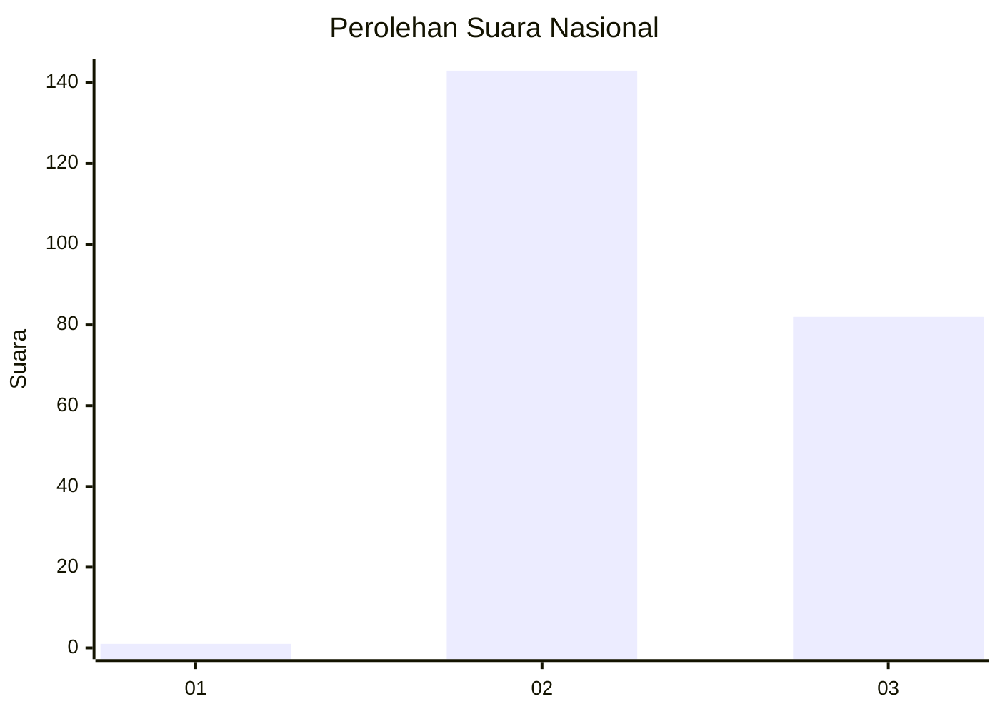
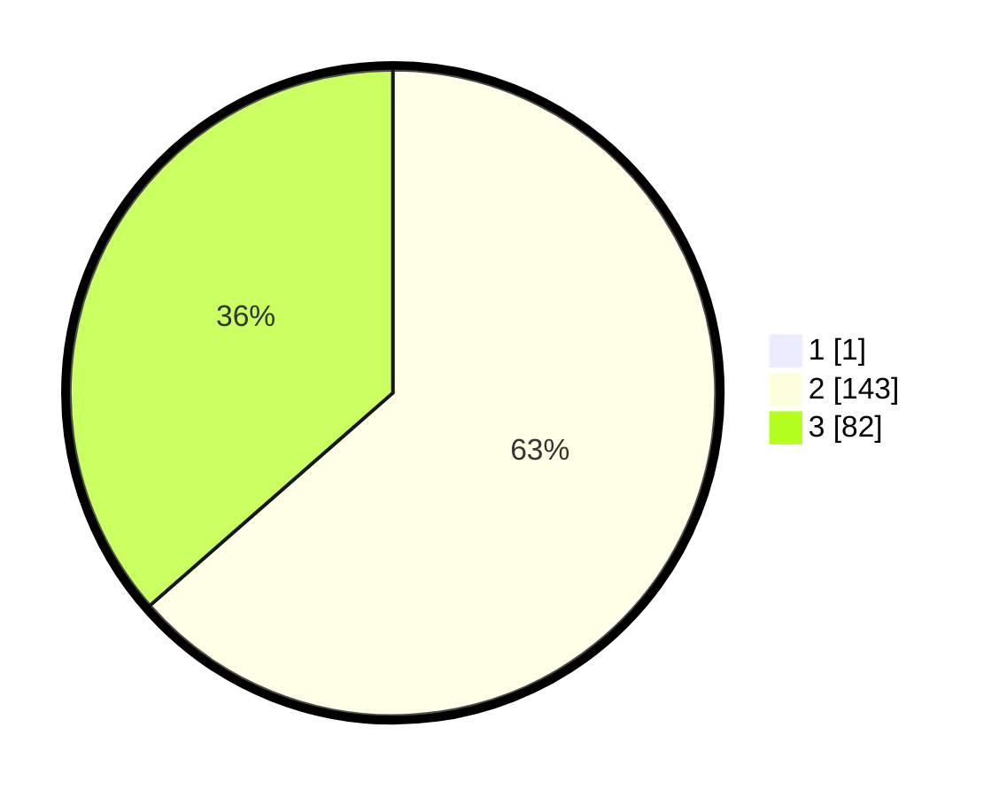

# Hasil

## Grafik

## Tabel

| No. | Nama Paslon    | Suara | Suara (raw) | Persentase |
|:--- |:-------------- | -----:| -----------:| ----------:|
| 1   | ANIES MUHAIMIN | 1     | [1][p-1]    | 0,44       |
| 2   | PRABOWO GIBRAN | 143   | [143][p-2]  | 63,27      |
| 3   | GANJAR MAHFUD  | 82    | [82][p-3]   | 36,28      |

[p-1]: https://github.com/gigit-pemilu/pemilu-2024/blob/main/pilpres/hitung-suara/sub/51-bali/sub/08-buleleng/sub/04-banjar/sub/2007-gobleg/sub/014-tps/sub/paslon-1.txt
[p-2]: https://github.com/gigit-pemilu/pemilu-2024/blob/main/pilpres/hitung-suara/sub/51-bali/sub/08-buleleng/sub/04-banjar/sub/2007-gobleg/sub/014-tps/sub/paslon-2.txt
[p-3]: https://github.com/gigit-pemilu/pemilu-2024/blob/main/pilpres/hitung-suara/sub/51-bali/sub/08-buleleng/sub/04-banjar/sub/2007-gobleg/sub/014-tps/sub/paslon-3.txt

## Foto C Plano

https://sirekap-obj-formc.kpu.go.id/cebb/pemilu/ppwp/51/08/04/20/07/5108042007014-20240214-213200--8d6b81c9-66a7-4cfd-9451-ac94fb98b444.jpg

https://sirekap-obj-formc.kpu.go.id/cebb/pemilu/ppwp/51/08/04/20/07/5108042007014-20240214-213443--fa3542a7-c1e8-4fde-ab8a-977a96e7057e.jpg

https://sirekap-obj-formc.kpu.go.id/cebb/pemilu/ppwp/51/08/04/20/07/5108042007014-20240214-214430--0644f333-e8ef-4e1c-aacf-006dfab98234.jpg

## Metadata

| Key        | Value               |
| ---------- | ------------------- |
| Time Stamp | 2024-02-24 22:31:28 |

