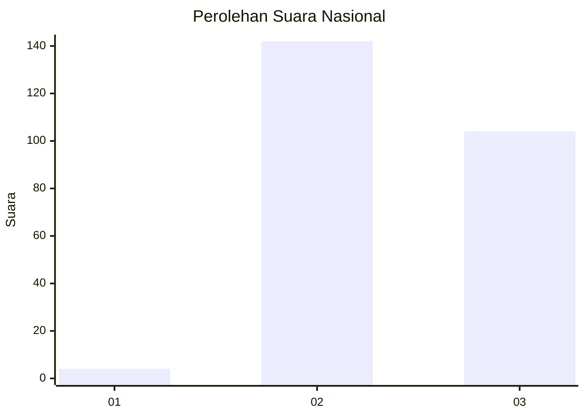
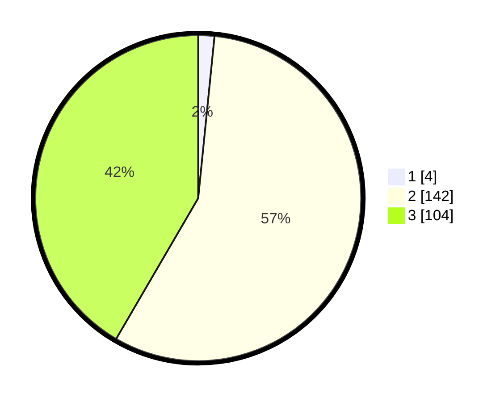

# Hasil

## Grafik

## Tabel

| No. | Nama Paslon    | Suara | Suara (raw) | Persentase |
|:--- |:-------------- | -----:| -----------:| ----------:|
| 1   | ANIES MUHAIMIN | 4     | [4][p-1]    | 1,60       |
| 2   | PRABOWO GIBRAN | 142   | [142][p-2]  | 56,80      |
| 3   | GANJAR MAHFUD  | 104   | [104][p-3]  | 41,60      |

[p-1]: https://github.com/gigit-pemilu/pemilu-2024/blob/main/pilpres/hitung-suara/sub/51-bali/sub/08-buleleng/sub/04-banjar/sub/2007-gobleg/sub/016-tps/sub/paslon-1.txt
[p-2]: https://github.com/gigit-pemilu/pemilu-2024/blob/main/pilpres/hitung-suara/sub/51-bali/sub/08-buleleng/sub/04-banjar/sub/2007-gobleg/sub/016-tps/sub/paslon-2.txt
[p-3]: https://github.com/gigit-pemilu/pemilu-2024/blob/main/pilpres/hitung-suara/sub/51-bali/sub/08-buleleng/sub/04-banjar/sub/2007-gobleg/sub/016-tps/sub/paslon-3.txt

## Foto C Plano

https://sirekap-obj-formc.kpu.go.id/de02/pemilu/ppwp/51/08/04/20/07/5108042007016-20240214-214753--5bf3fb9c-8d6c-48cf-a251-79f2d02fd10d.jpg

https://sirekap-obj-formc.kpu.go.id/de02/pemilu/ppwp/51/08/04/20/07/5108042007016-20240214-235652--5b4b19f6-4009-4010-9ca8-26affa5b335e.jpg

https://sirekap-obj-formc.kpu.go.id/de02/pemilu/ppwp/51/08/04/20/07/5108042007016-20240214-215053--a38b38e0-7634-4b6f-a5c1-17522169f1fb.jpg

## Metadata

| Key        | Value               |
| ---------- | ------------------- |
| Time Stamp | 2024-02-24 22:31:28 |

