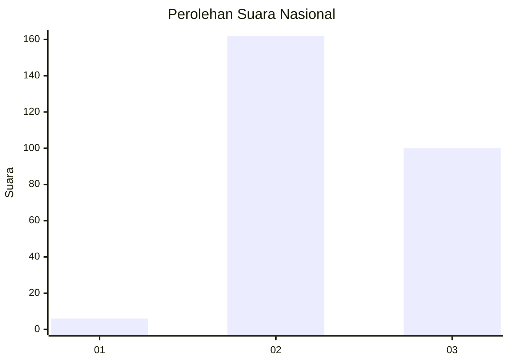
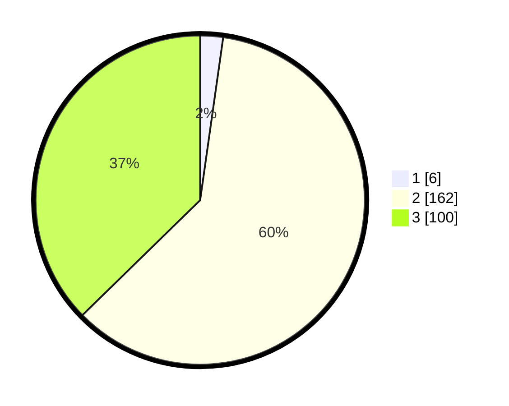

# Hasil

## Grafik

## Tabel

| No. | Nama Paslon    | Suara | Suara (raw) | Persentase |
|:--- |:-------------- | -----:| -----------:| ----------:|
| 1   | ANIES MUHAIMIN | 6     | [6][p-1]    | 2,24       |
| 2   | PRABOWO GIBRAN | 162   | [162][p-2]  | 60,45      |
| 3   | GANJAR MAHFUD  | 100   | [100][p-3]  | 37,31      |

[p-1]: https://github.com/gigit-pemilu/pemilu-2024/blob/main/pilpres/hitung-suara/sub/51-bali/sub/08-buleleng/sub/04-banjar/sub/2007-gobleg/sub/019-tps/sub/paslon-1.txt
[p-2]: https://github.com/gigit-pemilu/pemilu-2024/blob/main/pilpres/hitung-suara/sub/51-bali/sub/08-buleleng/sub/04-banjar/sub/2007-gobleg/sub/019-tps/sub/paslon-2.txt
[p-3]: https://github.com/gigit-pemilu/pemilu-2024/blob/main/pilpres/hitung-suara/sub/51-bali/sub/08-buleleng/sub/04-banjar/sub/2007-gobleg/sub/019-tps/sub/paslon-3.txt

## Foto C Plano

https://sirekap-obj-formc.kpu.go.id/421e/pemilu/ppwp/51/08/04/20/07/5108042007019-20240214-235139--ceccef29-c78a-465d-ab7b-46787a22c4d0.jpg

https://sirekap-obj-formc.kpu.go.id/421e/pemilu/ppwp/51/08/04/20/07/5108042007019-20240214-235336--3b29eb87-6fb8-4174-a736-d378d517df38.jpg

https://sirekap-obj-formc.kpu.go.id/421e/pemilu/ppwp/51/08/04/20/07/5108042007019-20240214-235522--0538f13f-a7ca-4650-8f9a-9b5824b236fd.jpg

## Metadata

| Key        | Value               |
| ---------- | ------------------- |
| Time Stamp | 2024-02-24 22:31:28 |

