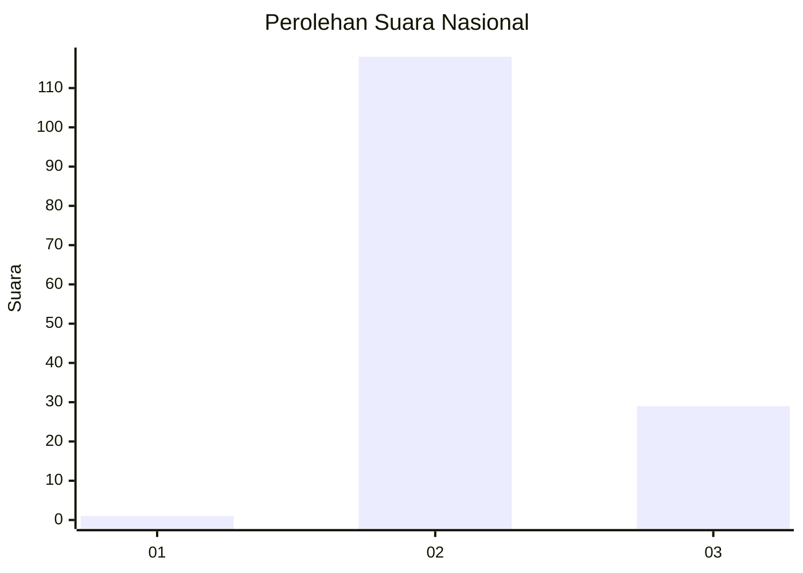
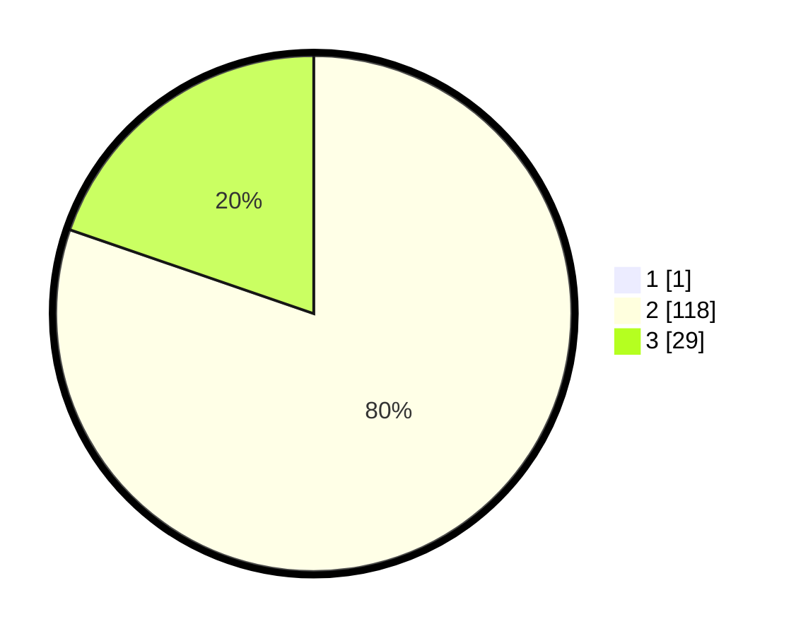

# Hasil

## Grafik

## Tabel

| No. | Nama Paslon    | Suara | Suara (raw) | Persentase |
|:--- |:-------------- | -----:| -----------:| ----------:|
| 1   | ANIES MUHAIMIN | 1     | [1][p-1]    | 0,68       |
| 2   | PRABOWO GIBRAN | 118   | [118][p-2]  | 79,73      |
| 3   | GANJAR MAHFUD  | 29    | [29][p-3]   | 19,59      |

[p-1]: https://github.com/gigit-pemilu/pemilu-2024/blob/main/pilpres/hitung-suara/sub/51-bali/sub/08-buleleng/sub/04-banjar/sub/2008-pedawa/sub/005-tps/sub/paslon-1.txt
[p-2]: https://github.com/gigit-pemilu/pemilu-2024/blob/main/pilpres/hitung-suara/sub/51-bali/sub/08-buleleng/sub/04-banjar/sub/2008-pedawa/sub/005-tps/sub/paslon-2.txt
[p-3]: https://github.com/gigit-pemilu/pemilu-2024/blob/main/pilpres/hitung-suara/sub/51-bali/sub/08-buleleng/sub/04-banjar/sub/2008-pedawa/sub/005-tps/sub/paslon-3.txt

## Foto C Plano

https://sirekap-obj-formc.kpu.go.id/0f80/pemilu/ppwp/51/08/04/20/08/5108042008005-20240215-005334--d43f980a-b16a-4a01-801c-e42533edebc1.jpg

https://sirekap-obj-formc.kpu.go.id/0f80/pemilu/ppwp/51/08/04/20/08/5108042008005-20240214-221212--f79b979b-de64-4fd5-aca5-09ea060404c0.jpg

https://sirekap-obj-formc.kpu.go.id/0f80/pemilu/ppwp/51/08/04/20/08/5108042008005-20240214-221508--f8d20330-4e70-491a-9d1c-e479e078ea94.jpg

## Metadata

| Key        | Value               |
| ---------- | ------------------- |
| Time Stamp | 2024-02-15 17:00:25 |

