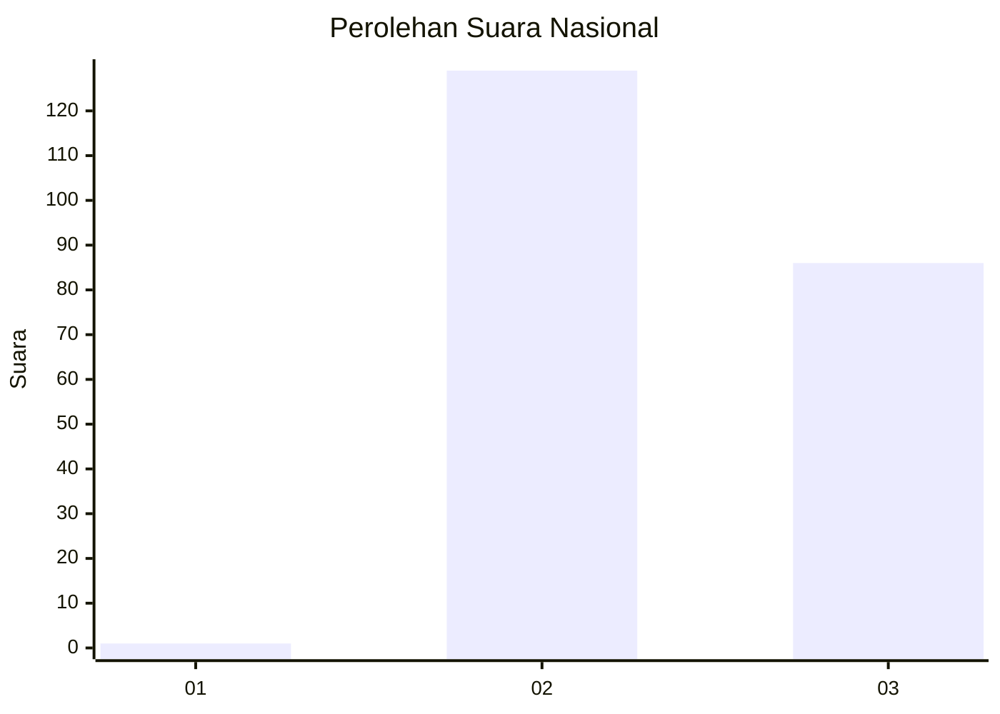
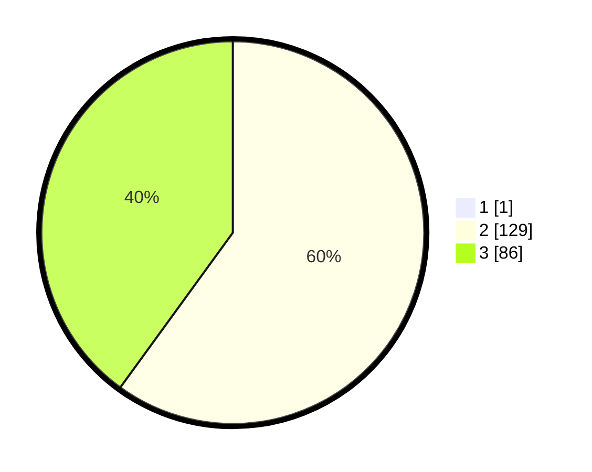

# Hasil

## Grafik

## Tabel

| No. | Nama Paslon    | Suara | Suara (raw) | Persentase |
|:--- |:-------------- | -----:| -----------:| ----------:|
| 1   | ANIES MUHAIMIN | 1     | [1][p-1]    | 0,46       |
| 2   | PRABOWO GIBRAN | 129   | [129][p-2]  | 59,72      |
| 3   | GANJAR MAHFUD  | 86    | [86][p-3]   | 39,81      |

[p-1]: https://github.com/gigit-pemilu/pemilu-2024/blob/main/pilpres/hitung-suara/sub/51-bali/sub/08-buleleng/sub/04-banjar/sub/2008-pedawa/sub/006-tps/sub/paslon-1.txt
[p-2]: https://github.com/gigit-pemilu/pemilu-2024/blob/main/pilpres/hitung-suara/sub/51-bali/sub/08-buleleng/sub/04-banjar/sub/2008-pedawa/sub/006-tps/sub/paslon-2.txt
[p-3]: https://github.com/gigit-pemilu/pemilu-2024/blob/main/pilpres/hitung-suara/sub/51-bali/sub/08-buleleng/sub/04-banjar/sub/2008-pedawa/sub/006-tps/sub/paslon-3.txt

## Foto C Plano

https://sirekap-obj-formc.kpu.go.id/3abc/pemilu/ppwp/51/08/04/20/08/5108042008006-20240214-223502--5e793ab4-6c5b-479d-9366-d9bacb57580c.jpg

https://sirekap-obj-formc.kpu.go.id/3abc/pemilu/ppwp/51/08/04/20/08/5108042008006-20240214-223904--1d6f2edc-6ec3-4efc-854e-4f49209e6c9e.jpg

https://sirekap-obj-formc.kpu.go.id/3abc/pemilu/ppwp/51/08/04/20/08/5108042008006-20240214-224415--a1444d7c-e828-4534-97da-962f9d2a94a5.jpg

## Metadata

| Key        | Value               |
| ---------- | ------------------- |
| Time Stamp | 2024-02-24 22:31:28 |

