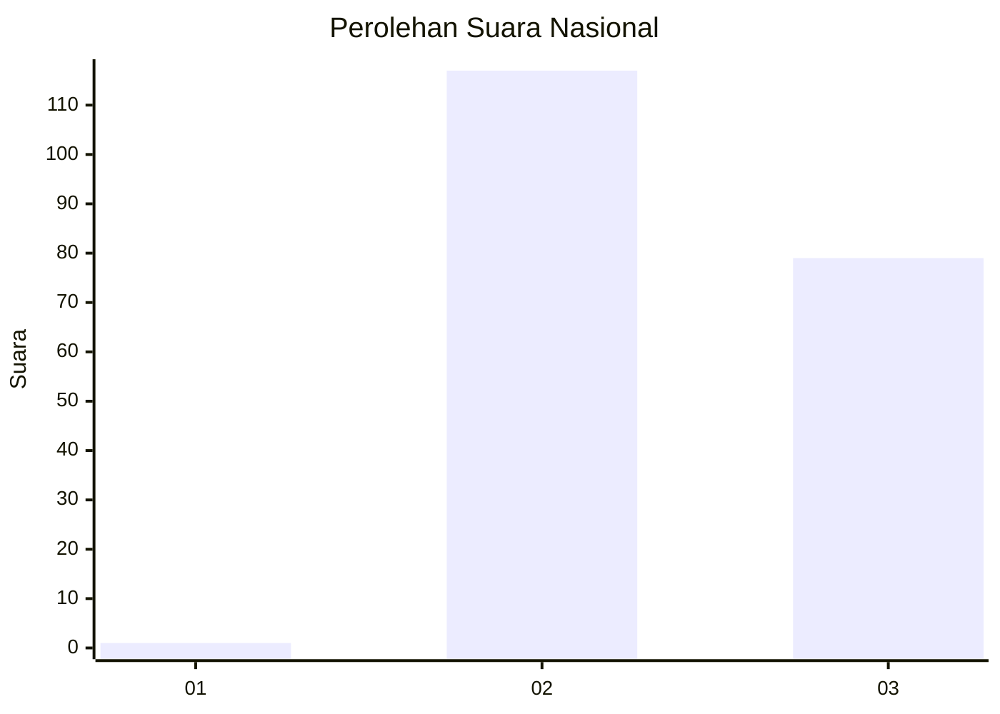
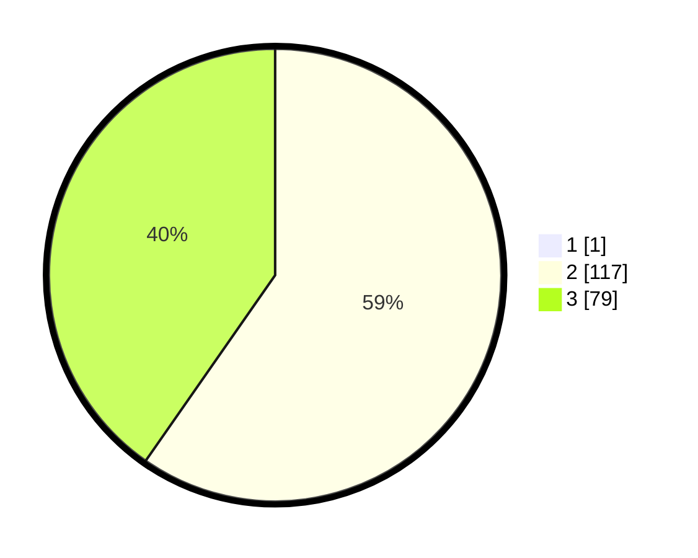

# Hasil

## Grafik

## Tabel

| No. | Nama Paslon    | Suara | Suara (raw) | Persentase |
|:--- |:-------------- | -----:| -----------:| ----------:|
| 1   | ANIES MUHAIMIN | 1     | [1][p-1]    | 0,51       |
| 2   | PRABOWO GIBRAN | 117   | [117][p-2]  | 59,39      |
| 3   | GANJAR MAHFUD  | 79    | [79][p-3]   | 40,10      |

[p-1]: https://github.com/gigit-pemilu/pemilu-2024/blob/main/pilpres/hitung-suara/sub/51-bali/sub/08-buleleng/sub/04-banjar/sub/2008-pedawa/sub/008-tps/sub/paslon-1.txt
[p-2]: https://github.com/gigit-pemilu/pemilu-2024/blob/main/pilpres/hitung-suara/sub/51-bali/sub/08-buleleng/sub/04-banjar/sub/2008-pedawa/sub/008-tps/sub/paslon-2.txt
[p-3]: https://github.com/gigit-pemilu/pemilu-2024/blob/main/pilpres/hitung-suara/sub/51-bali/sub/08-buleleng/sub/04-banjar/sub/2008-pedawa/sub/008-tps/sub/paslon-3.txt

## Foto C Plano

https://sirekap-obj-formc.kpu.go.id/fd86/pemilu/ppwp/51/08/04/20/08/5108042008008-20240217-124508--790d40a0-ff7b-454d-8b4e-142d66794ed1.jpg

https://sirekap-obj-formc.kpu.go.id/fd86/pemilu/ppwp/51/08/04/20/08/5108042008008-20240214-201118--7dc7c3ab-1792-439c-9284-946c9d66085c.jpg

https://sirekap-obj-formc.kpu.go.id/fd86/pemilu/ppwp/51/08/04/20/08/5108042008008-20240214-201205--3a9e213b-9221-4c0a-9282-a7d4b75fa786.jpg

## Metadata

| Key        | Value               |
| ---------- | ------------------- |
| Time Stamp | 2024-02-17 13:37:34 |

