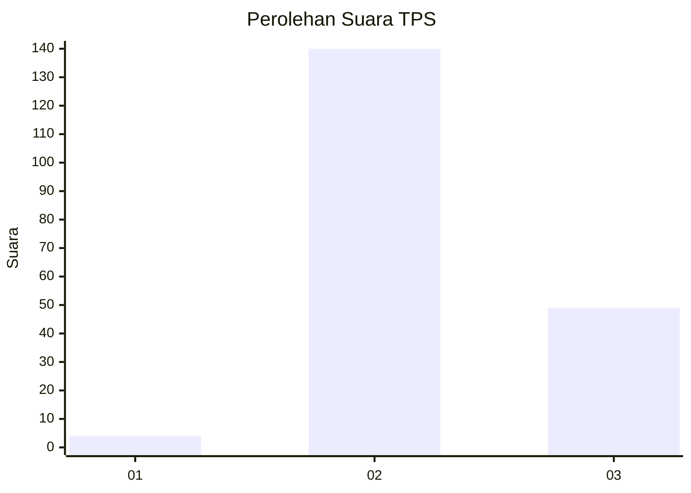
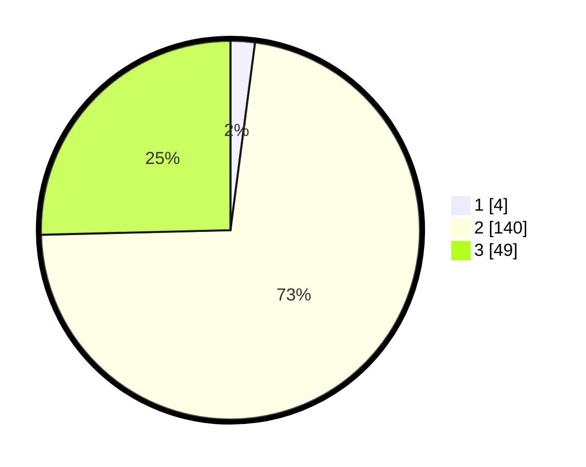

# Hasil

## Grafik

## Tabel

| No. | Nama Paslon    | Suara | Suara (raw) | Persentase |
|:--- |:-------------- | -----:| -----------:| ----------:|
| 1   | ANIES MUHAIMIN | 4     | [4][p-1]    | 2,07       |
| 2   | PRABOWO GIBRAN | 140   | [140][p-2]  | 72,54      |
| 3   | GANJAR MAHFUD  | 49    | [49][p-3]   | 25,39      |

[p-1]: https://github.com/gigit-pemilu/pemilu-2024-51-bali/blob/main/pilpres/hitung-suara/sub/51-bali/sub/08-buleleng/sub/04-banjar/sub/2008-pedawa/sub/009-tps/sub/paslon-1.txt
[p-2]: https://github.com/gigit-pemilu/pemilu-2024-51-bali/blob/main/pilpres/hitung-suara/sub/51-bali/sub/08-buleleng/sub/04-banjar/sub/2008-pedawa/sub/009-tps/sub/paslon-2.txt
[p-3]: https://github.com/gigit-pemilu/pemilu-2024-51-bali/blob/main/pilpres/hitung-suara/sub/51-bali/sub/08-buleleng/sub/04-banjar/sub/2008-pedawa/sub/009-tps/sub/paslon-3.txt

## Foto C Plano

https://sirekap-obj-formc.kpu.go.id/8aac/pemilu/ppwp/51/08/04/20/08/5108042008009-20240214-221345--f6a1f3bf-ef95-4bc2-b587-2a0c2761b4ae.jpg

https://sirekap-obj-formc.kpu.go.id/8aac/pemilu/ppwp/51/08/04/20/08/5108042008009-20240215-025559--3b293361-d22d-48e0-9a10-78858586ed62.jpg

https://sirekap-obj-formc.kpu.go.id/8aac/pemilu/ppwp/51/08/04/20/08/5108042008009-20240318-095420--9be3bedc-39a5-438e-a732-2ef1e8d364ed.jpg

## Metadata

| Key        | Value               |
| ---------- | ------------------- |
| Time Stamp | 2024-03-18 10:00:00 |

