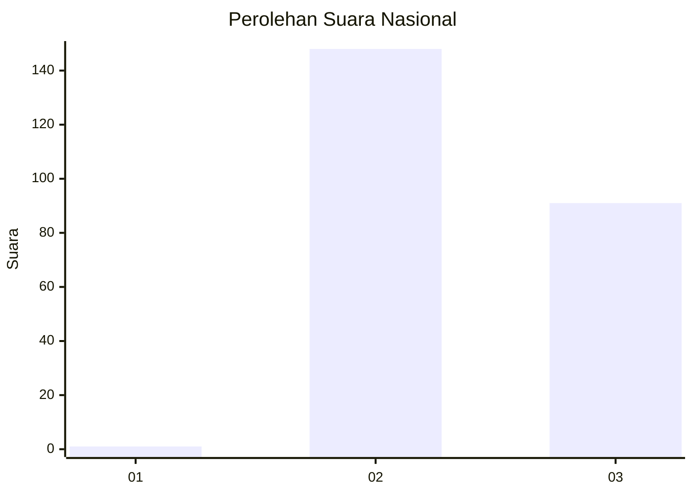
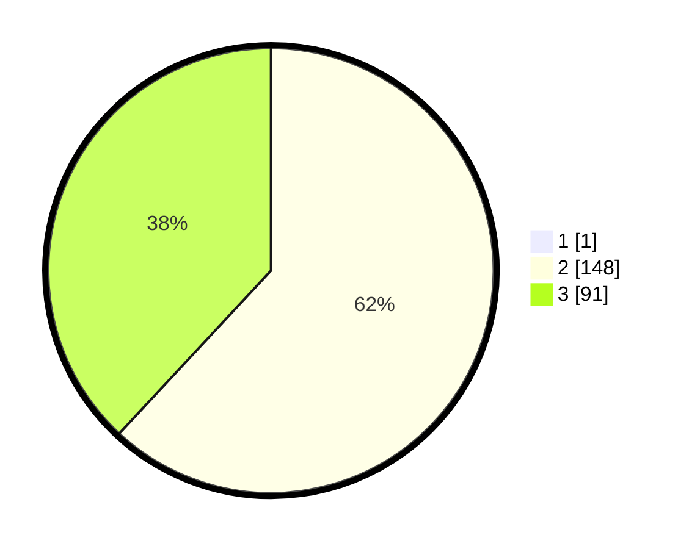

# Hasil

## Grafik

## Tabel

| No. | Nama Paslon    | Suara | Suara (raw) | Persentase |
|:--- |:-------------- | -----:| -----------:| ----------:|
| 1   | ANIES MUHAIMIN | 1     | [1][p-1]    | 0,42       |
| 2   | PRABOWO GIBRAN | 148   | [148][p-2]  | 61,67      |
| 3   | GANJAR MAHFUD  | 91    | [91][p-3]   | 37,92      |

[p-1]: https://github.com/gigit-pemilu/pemilu-2024/blob/main/pilpres/hitung-suara/sub/51-bali/sub/08-buleleng/sub/04-banjar/sub/2008-pedawa/sub/012-tps/sub/paslon-1.txt
[p-2]: https://github.com/gigit-pemilu/pemilu-2024/blob/main/pilpres/hitung-suara/sub/51-bali/sub/08-buleleng/sub/04-banjar/sub/2008-pedawa/sub/012-tps/sub/paslon-2.txt
[p-3]: https://github.com/gigit-pemilu/pemilu-2024/blob/main/pilpres/hitung-suara/sub/51-bali/sub/08-buleleng/sub/04-banjar/sub/2008-pedawa/sub/012-tps/sub/paslon-3.txt

## Foto C Plano

https://sirekap-obj-formc.kpu.go.id/25cd/pemilu/ppwp/51/08/04/20/08/5108042008012-20240214-141645--bcd45ff5-ad64-4a68-a1d5-a3099e652cc0.jpg

https://sirekap-obj-formc.kpu.go.id/25cd/pemilu/ppwp/51/08/04/20/08/5108042008012-20240214-141432--d3a9e299-23fa-4b64-b576-57cea16ca127.jpg

https://sirekap-obj-formc.kpu.go.id/25cd/pemilu/ppwp/51/08/04/20/08/5108042008012-20240214-141200--7251e336-e742-47f6-a0ea-1f3442234838.jpg

## Metadata

| Key        | Value               |
| ---------- | ------------------- |
| Time Stamp | 2024-02-15 19:00:26 |

