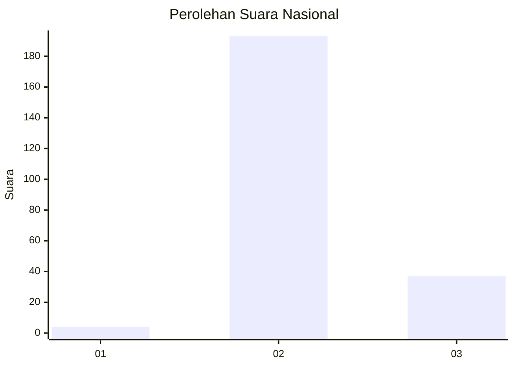
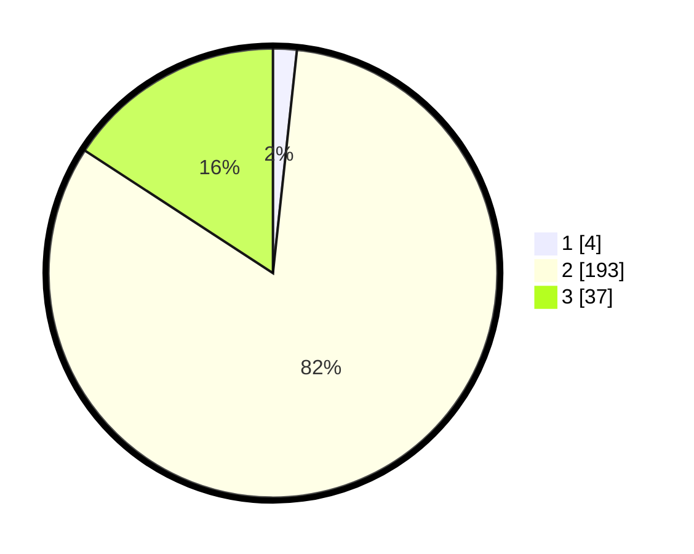

# Hasil

## Grafik

## Tabel

| No. | Nama Paslon    | Suara | Suara (raw) | Persentase |
|:--- |:-------------- | -----:| -----------:| ----------:|
| 1   | ANIES MUHAIMIN | 4     | [4][p-1]    | 1,71       |
| 2   | PRABOWO GIBRAN | 193   | [193][p-2]  | 82,48      |
| 3   | GANJAR MAHFUD  | 37    | [37][p-3]   | 15,81      |

[p-1]: https://github.com/gigit-pemilu/pemilu-2024/blob/main/pilpres/hitung-suara/sub/51-bali/sub/08-buleleng/sub/04-banjar/sub/2009-cempaga/sub/002-tps/sub/paslon-1.txt
[p-2]: https://github.com/gigit-pemilu/pemilu-2024/blob/main/pilpres/hitung-suara/sub/51-bali/sub/08-buleleng/sub/04-banjar/sub/2009-cempaga/sub/002-tps/sub/paslon-2.txt
[p-3]: https://github.com/gigit-pemilu/pemilu-2024/blob/main/pilpres/hitung-suara/sub/51-bali/sub/08-buleleng/sub/04-banjar/sub/2009-cempaga/sub/002-tps/sub/paslon-3.txt

## Foto C Plano

https://sirekap-obj-formc.kpu.go.id/a3b9/pemilu/ppwp/51/08/04/20/09/5108042009002-20240214-233130--d5f02077-3492-4e19-b8b8-5b084586053a.jpg

https://sirekap-obj-formc.kpu.go.id/a3b9/pemilu/ppwp/51/08/04/20/09/5108042009002-20240214-233342--9af170d6-6b8b-4eba-ab00-33c49dcc7e48.jpg

https://sirekap-obj-formc.kpu.go.id/a3b9/pemilu/ppwp/51/08/04/20/09/5108042009002-20240214-233514--348c2b06-e9bd-448e-a9eb-bcd9c623676b.jpg

## Metadata

| Key        | Value               |
| ---------- | ------------------- |
| Time Stamp | 2024-02-24 22:31:28 |

