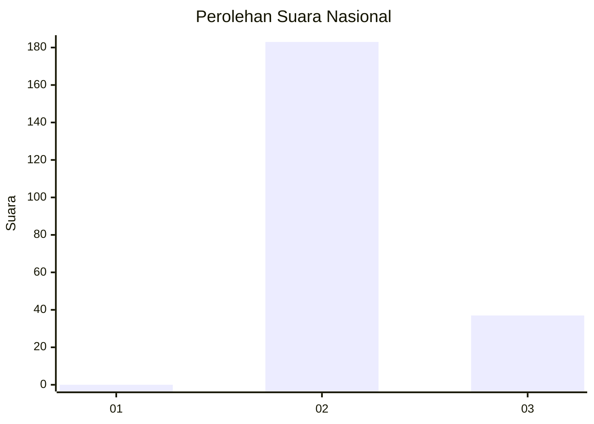
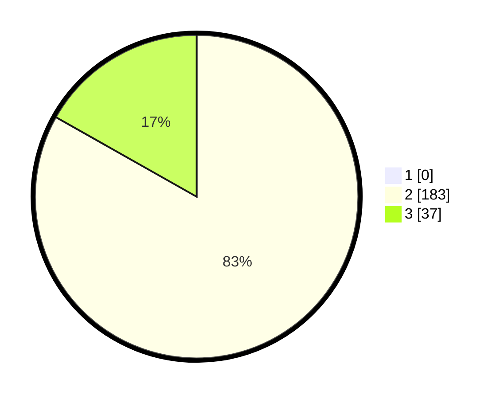

# Hasil

## Grafik

## Tabel

| No. | Nama Paslon    | Suara | Suara (raw) | Persentase |
|:--- |:-------------- | -----:| -----------:| ----------:|
| 1   | ANIES MUHAIMIN | 0     | [0][p-1]    | 0,00       |
| 2   | PRABOWO GIBRAN | 183   | [183][p-2]  | 83,18      |
| 3   | GANJAR MAHFUD  | 37    | [37][p-3]   | 16,82      |

[p-1]: https://github.com/gigit-pemilu/pemilu-2024/blob/main/pilpres/hitung-suara/sub/51-bali/sub/08-buleleng/sub/04-banjar/sub/2009-cempaga/sub/006-tps/sub/paslon-1.txt
[p-2]: https://github.com/gigit-pemilu/pemilu-2024/blob/main/pilpres/hitung-suara/sub/51-bali/sub/08-buleleng/sub/04-banjar/sub/2009-cempaga/sub/006-tps/sub/paslon-2.txt
[p-3]: https://github.com/gigit-pemilu/pemilu-2024/blob/main/pilpres/hitung-suara/sub/51-bali/sub/08-buleleng/sub/04-banjar/sub/2009-cempaga/sub/006-tps/sub/paslon-3.txt

## Foto C Plano

https://sirekap-obj-formc.kpu.go.id/3b12/pemilu/ppwp/51/08/04/20/09/5108042009006-20240214-203736--87d01134-f8ed-4529-8a42-b55389fb6e37.jpg

https://sirekap-obj-formc.kpu.go.id/3b12/pemilu/ppwp/51/08/04/20/09/5108042009006-20240214-203913--a8ef8ed1-b89a-4716-8c9b-29a8ce429f87.jpg

https://sirekap-obj-formc.kpu.go.id/3b12/pemilu/ppwp/51/08/04/20/09/5108042009006-20240214-204106--059964c1-fc19-49bc-a36d-e2c98edf50e5.jpg

## Metadata

| Key        | Value               |
| ---------- | ------------------- |
| Time Stamp | 2024-02-24 22:31:28 |

