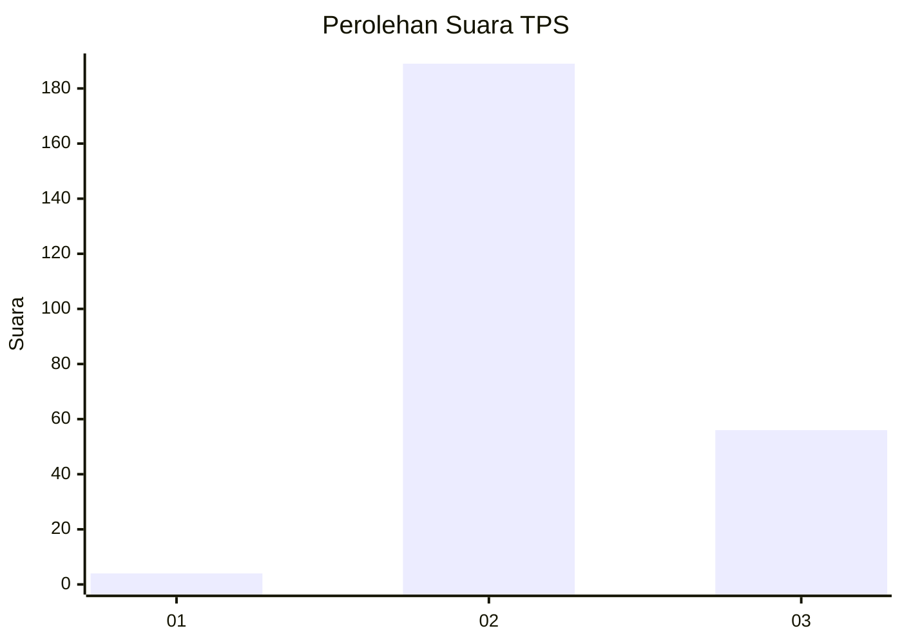
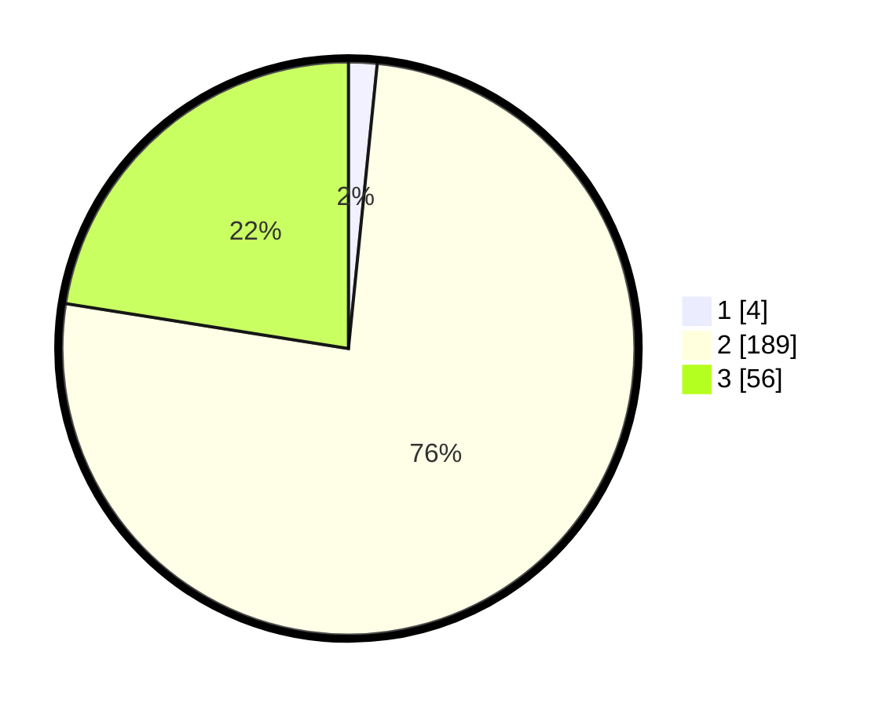

# Hasil

## Grafik

## Tabel

| No. | Nama Paslon    | Suara | Suara (raw) | Persentase |
|:--- |:-------------- | -----:| -----------:| ----------:|
| 1   | ANIES MUHAIMIN | 4     | [4][p-1]    | 1,61       |
| 2   | PRABOWO GIBRAN | 189   | [189][p-2]  | 75,90      |
| 3   | GANJAR MAHFUD  | 56    | [56][p-3]   | 22,49      |

[p-1]: https://github.com/gigit-pemilu/pemilu-2024-51-bali/blob/main/pilpres/hitung-suara/sub/51-bali/sub/08-buleleng/sub/04-banjar/sub/2010-sidetapa/sub/002-tps/sub/paslon-1.txt
[p-2]: https://github.com/gigit-pemilu/pemilu-2024-51-bali/blob/main/pilpres/hitung-suara/sub/51-bali/sub/08-buleleng/sub/04-banjar/sub/2010-sidetapa/sub/002-tps/sub/paslon-2.txt
[p-3]: https://github.com/gigit-pemilu/pemilu-2024-51-bali/blob/main/pilpres/hitung-suara/sub/51-bali/sub/08-buleleng/sub/04-banjar/sub/2010-sidetapa/sub/002-tps/sub/paslon-3.txt

## Foto C Plano

https://sirekap-obj-formc.kpu.go.id/fd6f/pemilu/ppwp/51/08/04/20/10/5108042010002-20240215-003238--501818e2-40aa-4a25-bd00-35d570ac2447.jpg

https://sirekap-obj-formc.kpu.go.id/fd6f/pemilu/ppwp/51/08/04/20/10/5108042010002-20240215-003434--d570842d-9f1d-4e5d-827d-8a89361f42a1.jpg

https://sirekap-obj-formc.kpu.go.id/fd6f/pemilu/ppwp/51/08/04/20/10/5108042010002-20240318-122354--29e60825-c2e0-4a38-a9aa-8283f000cac9.jpg

## Metadata

| Key        | Value               |
| ---------- | ------------------- |
| Time Stamp | 2024-03-18 12:30:00 |

