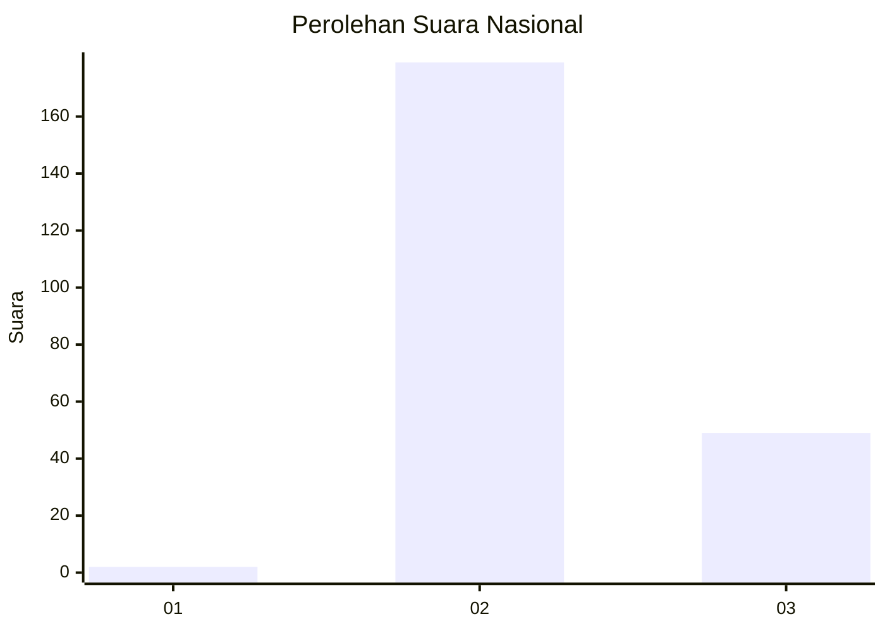
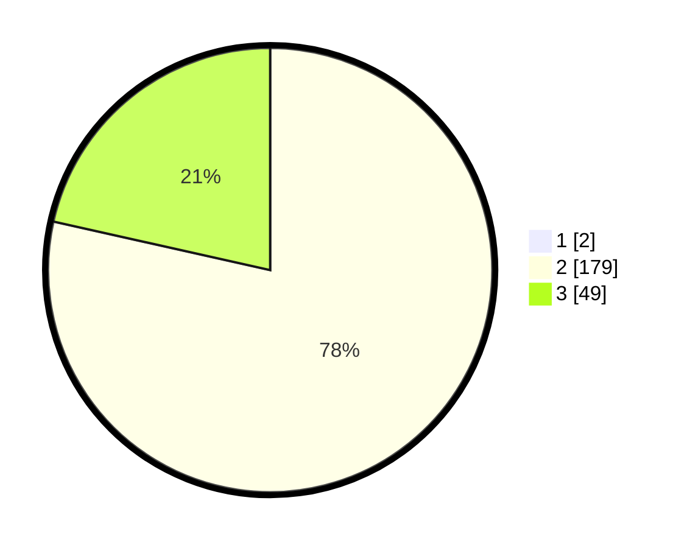

# Hasil

## Grafik

## Tabel

| No. | Nama Paslon    | Suara | Suara (raw) | Persentase |
|:--- |:-------------- | -----:| -----------:| ----------:|
| 1   | ANIES MUHAIMIN | 2     | [2][p-1]    | 0,87       |
| 2   | PRABOWO GIBRAN | 179   | [179][p-2]  | 77,83      |
| 3   | GANJAR MAHFUD  | 49    | [49][p-3]   | 21,30      |

[p-1]: https://github.com/gigit-pemilu/pemilu-2024/blob/main/pilpres/hitung-suara/sub/51-bali/sub/08-buleleng/sub/04-banjar/sub/2010-sidetapa/sub/016-tps/sub/paslon-1.txt
[p-2]: https://github.com/gigit-pemilu/pemilu-2024/blob/main/pilpres/hitung-suara/sub/51-bali/sub/08-buleleng/sub/04-banjar/sub/2010-sidetapa/sub/016-tps/sub/paslon-2.txt
[p-3]: https://github.com/gigit-pemilu/pemilu-2024/blob/main/pilpres/hitung-suara/sub/51-bali/sub/08-buleleng/sub/04-banjar/sub/2010-sidetapa/sub/016-tps/sub/paslon-3.txt

## Foto C Plano

https://sirekap-obj-formc.kpu.go.id/b079/pemilu/ppwp/51/08/04/20/10/5108042010016-20240215-003344--9a8752f1-ddf8-4bcf-a0cb-91d9313d94b6.jpg

https://sirekap-obj-formc.kpu.go.id/b079/pemilu/ppwp/51/08/04/20/10/5108042010016-20240215-002104--10266fa5-2a9a-4735-ac7a-df82cd93c33c.jpg

https://sirekap-obj-formc.kpu.go.id/b079/pemilu/ppwp/51/08/04/20/10/5108042010016-20240215-002243--25d23916-b9be-41df-b61d-57f07bcc197f.jpg

## Metadata

| Key        | Value               |
| ---------- | ------------------- |
| Time Stamp | 2024-02-25 16:00:00 |

