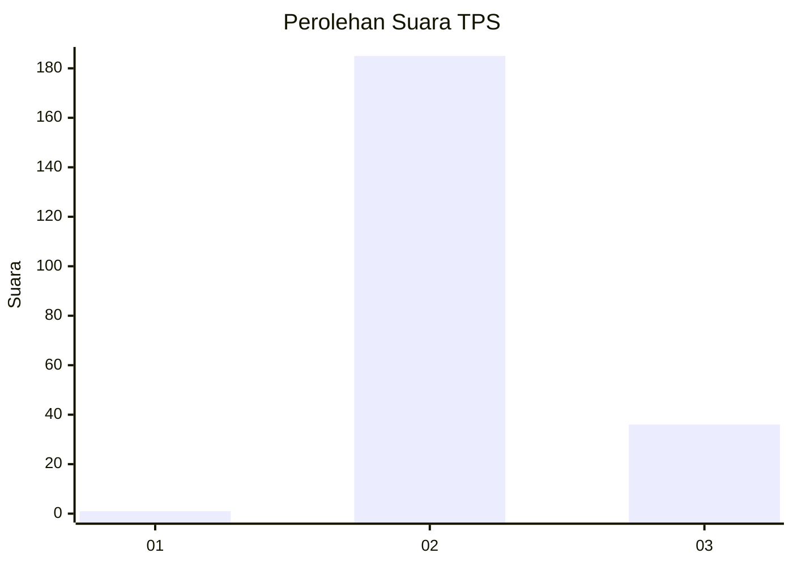
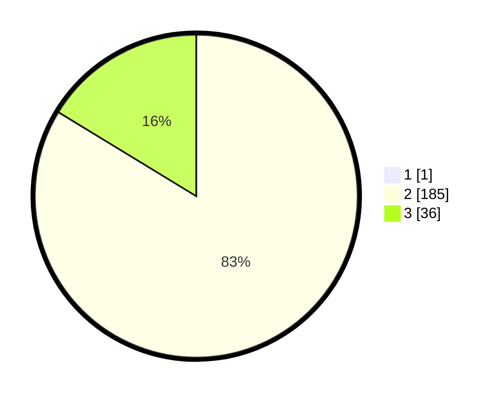

# Hasil

## Grafik

## Tabel

| No. | Nama Paslon    | Suara | Suara (raw) | Persentase |
|:--- |:-------------- | -----:| -----------:| ----------:|
| 1   | ANIES MUHAIMIN | 1     | [1][p-1]    | 0,45       |
| 2   | PRABOWO GIBRAN | 185   | [185][p-2]  | 83,33      |
| 3   | GANJAR MAHFUD  | 36    | [36][p-3]   | 16,22      |

[p-1]: https://github.com/gigit-pemilu/pemilu-2024-51-bali/blob/main/pilpres/hitung-suara/sub/51-bali/sub/08-buleleng/sub/04-banjar/sub/2011-tampekan/sub/001-tps/sub/paslon-1.txt
[p-2]: https://github.com/gigit-pemilu/pemilu-2024-51-bali/blob/main/pilpres/hitung-suara/sub/51-bali/sub/08-buleleng/sub/04-banjar/sub/2011-tampekan/sub/001-tps/sub/paslon-2.txt
[p-3]: https://github.com/gigit-pemilu/pemilu-2024-51-bali/blob/main/pilpres/hitung-suara/sub/51-bali/sub/08-buleleng/sub/04-banjar/sub/2011-tampekan/sub/001-tps/sub/paslon-3.txt

## Foto C Plano

https://sirekap-obj-formc.kpu.go.id/f16d/pemilu/ppwp/51/08/04/20/11/5108042011001-20240215-002057--4eb98092-a949-4969-85b4-69a09eadf9ee.jpg

https://sirekap-obj-formc.kpu.go.id/f16d/pemilu/ppwp/51/08/04/20/11/5108042011001-20240215-002237--fc5ea63b-a006-4996-ad48-6e4b23362641.jpg

https://sirekap-obj-formc.kpu.go.id/f16d/pemilu/ppwp/51/08/04/20/11/5108042011001-20240215-002139--58af3c45-eb00-4a11-bc21-de8f4ce4955e.jpg

## Metadata

| Key        | Value               |
| ---------- | ------------------- |
| Time Stamp | 2024-02-24 22:31:28 |

