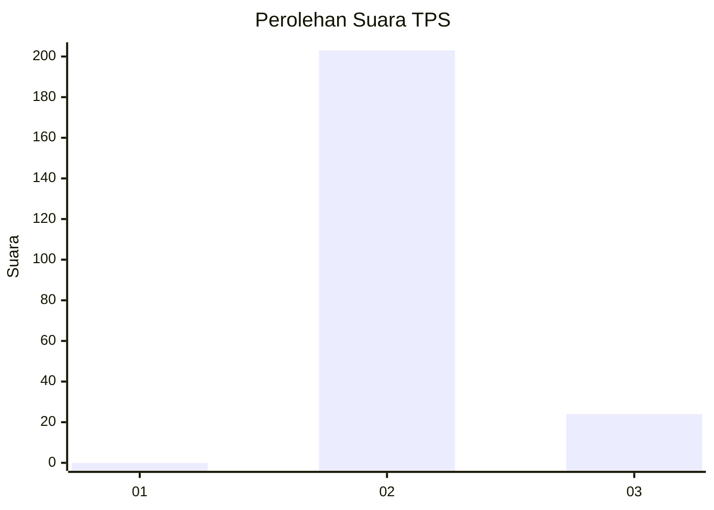
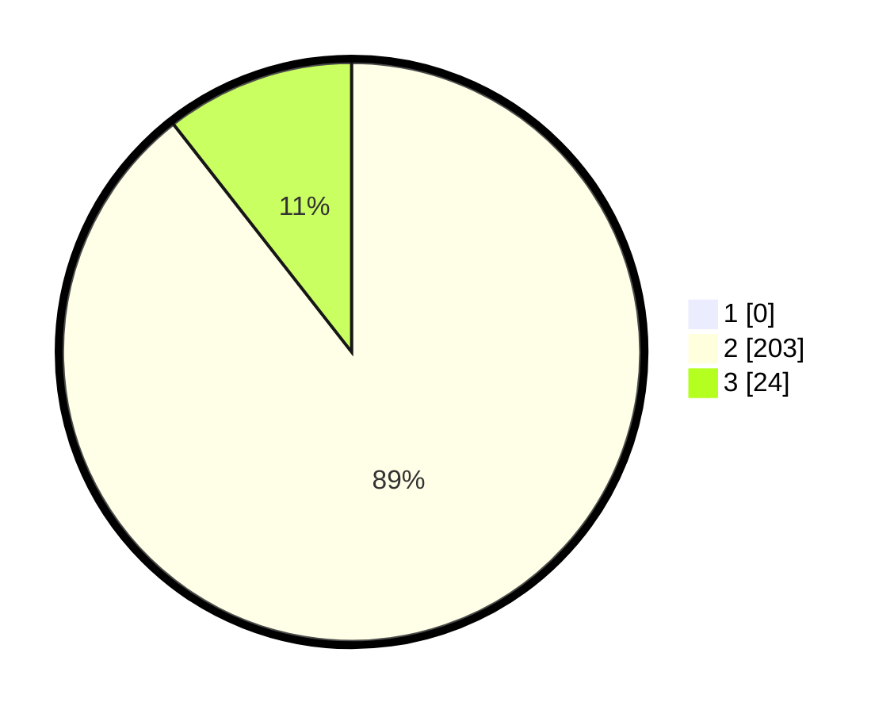

# Hasil

## Grafik

## Tabel

| No. | Nama Paslon    | Suara | Suara (raw) | Persentase |
|:--- |:-------------- | -----:| -----------:| ----------:|
| 1   | ANIES MUHAIMIN | 0     | [0][p-1]    | 0,00       |
| 2   | PRABOWO GIBRAN | 203   | [203][p-2]  | 89,43      |
| 3   | GANJAR MAHFUD  | 24    | [24][p-3]   | 10,57      |

[p-1]: https://github.com/gigit-pemilu/pemilu-2024-51-bali/blob/main/pilpres/hitung-suara/sub/51-bali/sub/08-buleleng/sub/04-banjar/sub/2011-tampekan/sub/002-tps/sub/paslon-1.txt
[p-2]: https://github.com/gigit-pemilu/pemilu-2024-51-bali/blob/main/pilpres/hitung-suara/sub/51-bali/sub/08-buleleng/sub/04-banjar/sub/2011-tampekan/sub/002-tps/sub/paslon-2.txt
[p-3]: https://github.com/gigit-pemilu/pemilu-2024-51-bali/blob/main/pilpres/hitung-suara/sub/51-bali/sub/08-buleleng/sub/04-banjar/sub/2011-tampekan/sub/002-tps/sub/paslon-3.txt

## Foto C Plano

https://sirekap-obj-formc.kpu.go.id/cf45/pemilu/ppwp/51/08/04/20/11/5108042011002-20240318-111819--d7fd925c-c269-46af-a509-ee6fc7a6199a.jpg

https://sirekap-obj-formc.kpu.go.id/cf45/pemilu/ppwp/51/08/04/20/11/5108042011002-20240215-022512--113a9a9f-eb72-4c80-a91b-f935516974fc.jpg

https://sirekap-obj-formc.kpu.go.id/cf45/pemilu/ppwp/51/08/04/20/11/5108042011002-20240215-020118--12e8b10c-f186-405e-bafe-bc261002d1da.jpg

## Metadata

| Key        | Value               |
| ---------- | ------------------- |
| Time Stamp | 2024-03-18 11:30:00 |

