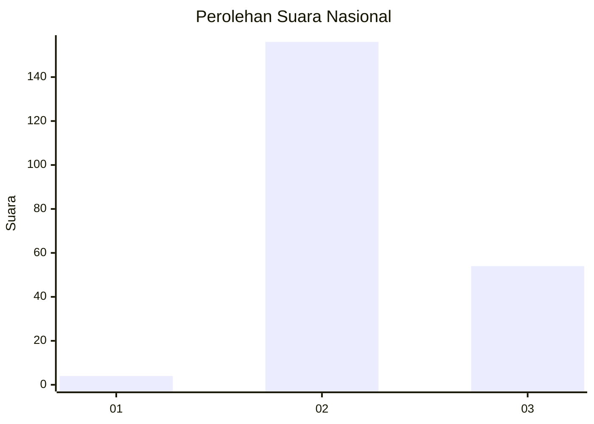
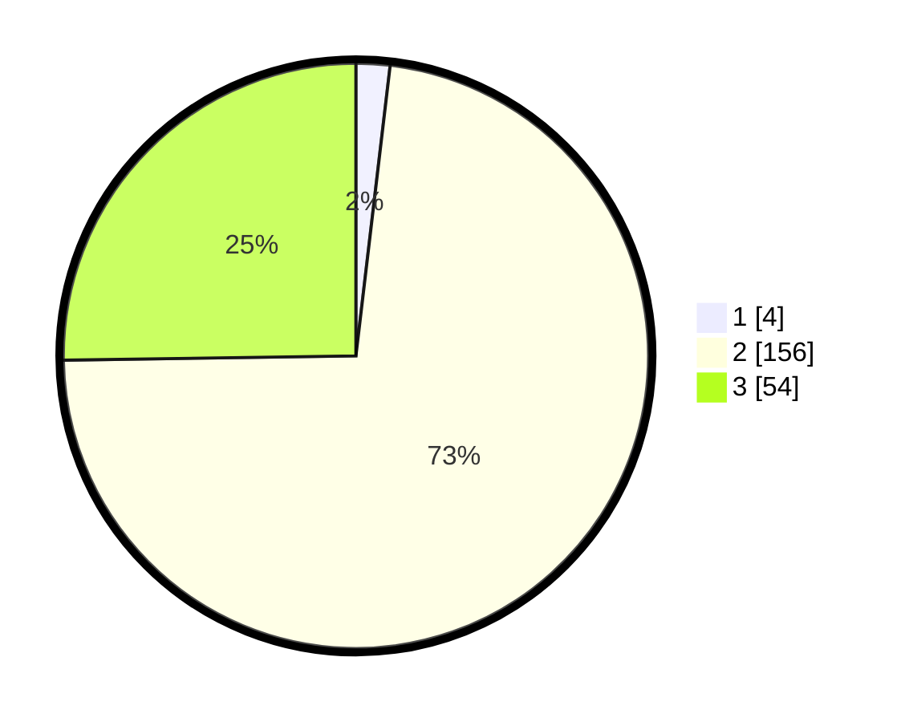

# Hasil

## Grafik

## Tabel

| No. | Nama Paslon    | Suara | Suara (raw) | Persentase |
|:--- |:-------------- | -----:| -----------:| ----------:|
| 1   | ANIES MUHAIMIN | 4     | [4][p-1]    | 1,87       |
| 2   | PRABOWO GIBRAN | 156   | [156][p-2]  | 72,90      |
| 3   | GANJAR MAHFUD  | 54    | [54][p-3]   | 25,23      |

[p-1]: https://github.com/gigit-pemilu/pemilu-2024/blob/main/pilpres/hitung-suara/sub/51-bali/sub/08-buleleng/sub/04-banjar/sub/2012-banjar-tegeha/sub/002-tps/sub/paslon-1.txt
[p-2]: https://github.com/gigit-pemilu/pemilu-2024/blob/main/pilpres/hitung-suara/sub/51-bali/sub/08-buleleng/sub/04-banjar/sub/2012-banjar-tegeha/sub/002-tps/sub/paslon-2.txt
[p-3]: https://github.com/gigit-pemilu/pemilu-2024/blob/main/pilpres/hitung-suara/sub/51-bali/sub/08-buleleng/sub/04-banjar/sub/2012-banjar-tegeha/sub/002-tps/sub/paslon-3.txt

## Foto C Plano

https://sirekap-obj-formc.kpu.go.id/c6a7/pemilu/ppwp/51/08/04/20/12/5108042012002-20240214-235225--d9d3d81a-107d-4900-b2d6-9da8388f79b2.jpg

https://sirekap-obj-formc.kpu.go.id/c6a7/pemilu/ppwp/51/08/04/20/12/5108042012002-20240214-235324--0db1111d-6bb3-4e05-949e-398b8f94f5d2.jpg

https://sirekap-obj-formc.kpu.go.id/c6a7/pemilu/ppwp/51/08/04/20/12/5108042012002-20240214-235415--b2e0597b-75cf-49d6-8d44-0b7698b9bc2e.jpg

## Metadata

| Key        | Value               |
| ---------- | ------------------- |
| Time Stamp | 2024-02-17 13:37:34 |

