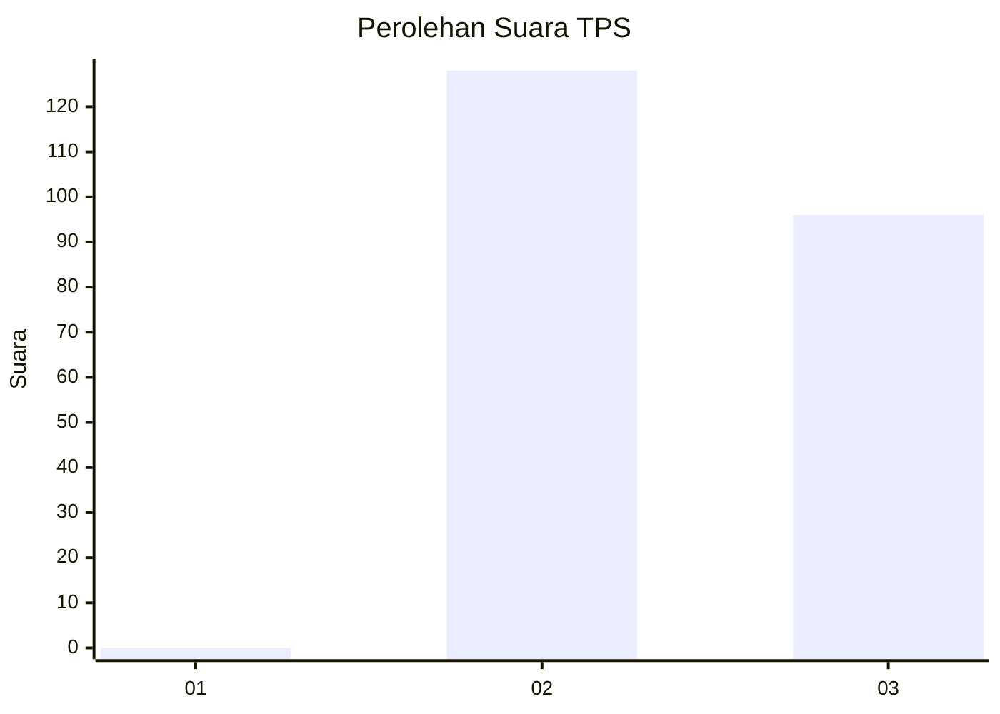
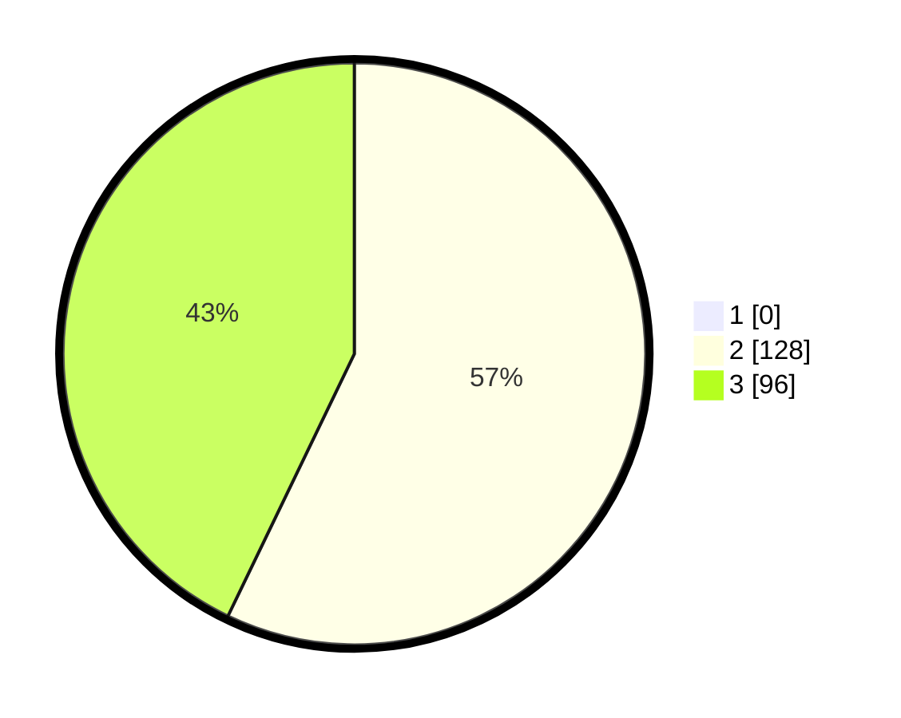

# Hasil

## Grafik

## Tabel

| No. | Nama Paslon    | Suara | Suara (raw) | Persentase |
|:--- |:-------------- | -----:| -----------:| ----------:|
| 1   | ANIES MUHAIMIN | 0     | [0][p-1]    | 0,00       |
| 2   | PRABOWO GIBRAN | 128   | [128][p-2]  | 57,14      |
| 3   | GANJAR MAHFUD  | 96    | [96][p-3]   | 42,86      |

[p-1]: https://github.com/gigit-pemilu/pemilu-2024-51-bali/blob/main/pilpres/hitung-suara/sub/51-bali/sub/08-buleleng/sub/04-banjar/sub/2012-banjar-tegeha/sub/003-tps/sub/paslon-1.txt
[p-2]: https://github.com/gigit-pemilu/pemilu-2024-51-bali/blob/main/pilpres/hitung-suara/sub/51-bali/sub/08-buleleng/sub/04-banjar/sub/2012-banjar-tegeha/sub/003-tps/sub/paslon-2.txt
[p-3]: https://github.com/gigit-pemilu/pemilu-2024-51-bali/blob/main/pilpres/hitung-suara/sub/51-bali/sub/08-buleleng/sub/04-banjar/sub/2012-banjar-tegeha/sub/003-tps/sub/paslon-3.txt

## Foto C Plano

https://sirekap-obj-formc.kpu.go.id/49f4/pemilu/ppwp/51/08/04/20/12/5108042012003-20240215-000529--42b01e6b-1b6a-40e5-af46-0895a5913e88.jpg

https://sirekap-obj-formc.kpu.go.id/49f4/pemilu/ppwp/51/08/04/20/12/5108042012003-20240214-224033--f8e963de-7e12-4c0a-b772-fea1a9d93787.jpg

https://sirekap-obj-formc.kpu.go.id/49f4/pemilu/ppwp/51/08/04/20/12/5108042012003-20240214-224213--226d00ca-5769-41f7-8bb0-144166c1b8ba.jpg

## Metadata

| Key        | Value               |
| ---------- | ------------------- |
| Time Stamp | 2024-02-25 12:00:00 |

