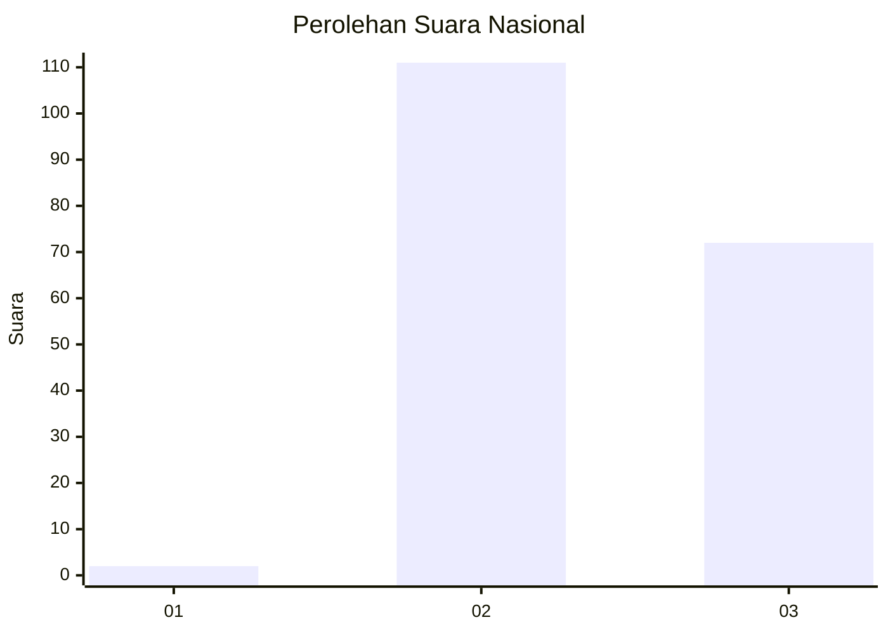
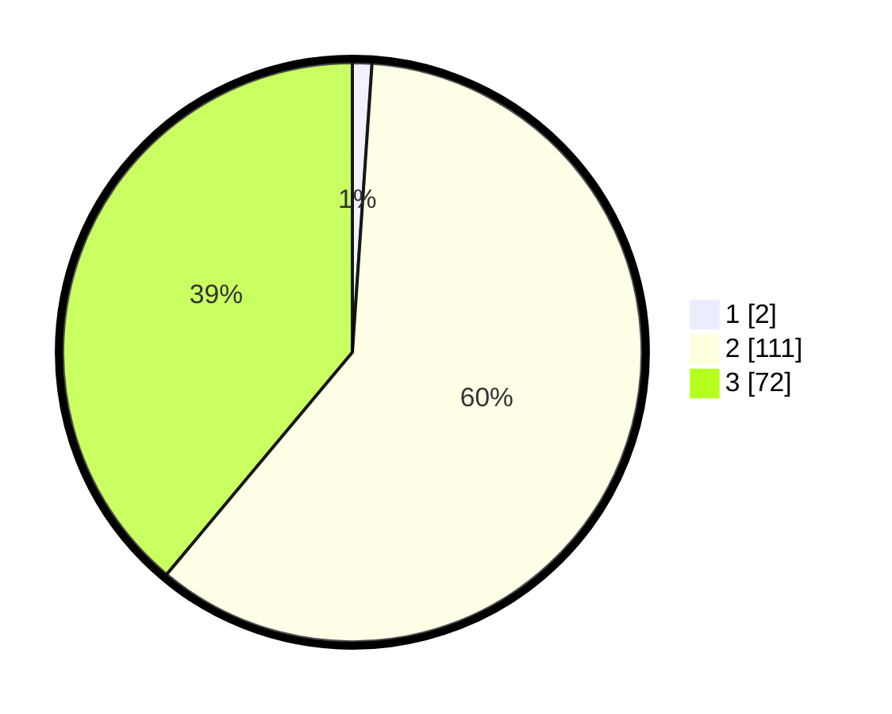

# Hasil

## Grafik

## Tabel

| No. | Nama Paslon    | Suara | Suara (raw) | Persentase |
|:--- |:-------------- | -----:| -----------:| ----------:|
| 1   | ANIES MUHAIMIN | 2     | [2][p-1]    | 1,08       |
| 2   | PRABOWO GIBRAN | 111   | [111][p-2]  | 60,00      |
| 3   | GANJAR MAHFUD  | 72    | [72][p-3]   | 38,92      |

[p-1]: https://github.com/gigit-pemilu/pemilu-2024/blob/main/pilpres/hitung-suara/sub/51-bali/sub/08-buleleng/sub/04-banjar/sub/2012-banjar-tegeha/sub/006-tps/sub/paslon-1.txt
[p-2]: https://github.com/gigit-pemilu/pemilu-2024/blob/main/pilpres/hitung-suara/sub/51-bali/sub/08-buleleng/sub/04-banjar/sub/2012-banjar-tegeha/sub/006-tps/sub/paslon-2.txt
[p-3]: https://github.com/gigit-pemilu/pemilu-2024/blob/main/pilpres/hitung-suara/sub/51-bali/sub/08-buleleng/sub/04-banjar/sub/2012-banjar-tegeha/sub/006-tps/sub/paslon-3.txt

## Foto C Plano

https://sirekap-obj-formc.kpu.go.id/6ff2/pemilu/ppwp/51/08/04/20/12/5108042012006-20240214-224951--56bc0870-00db-464a-90ab-2a24ee45309f.jpg

https://sirekap-obj-formc.kpu.go.id/6ff2/pemilu/ppwp/51/08/04/20/12/5108042012006-20240214-225444--376e7548-e52c-43ca-ba75-069634ca5f76.jpg

https://sirekap-obj-formc.kpu.go.id/6ff2/pemilu/ppwp/51/08/04/20/12/5108042012006-20240214-225641--e46d2064-0c60-497b-b2cb-0412d0f3ac04.jpg

## Metadata

| Key        | Value               |
| ---------- | ------------------- |
| Time Stamp | 2024-02-24 22:31:28 |

