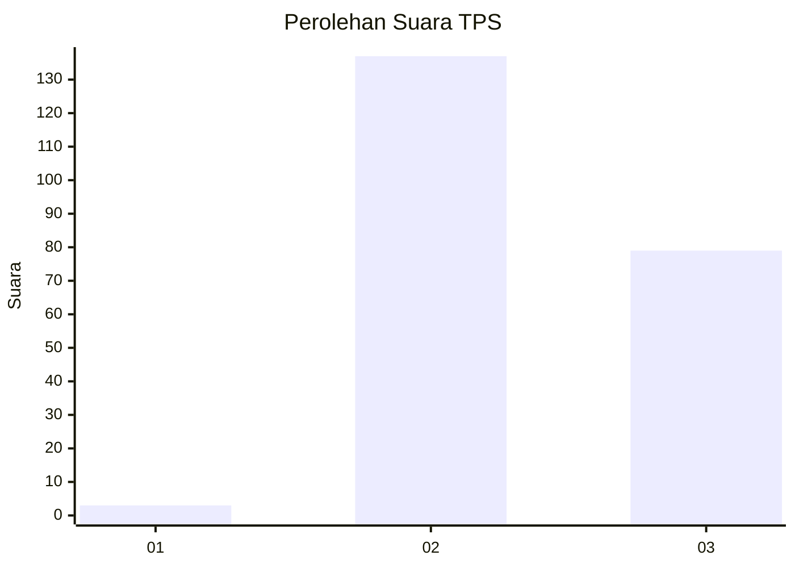
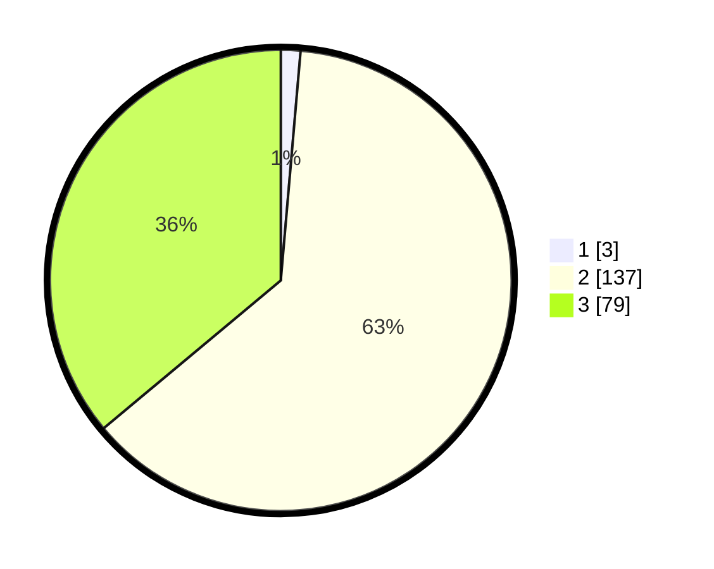

# Hasil

## Grafik

## Tabel

| No. | Nama Paslon    | Suara | Suara (raw) | Persentase |
|:--- |:-------------- | -----:| -----------:| ----------:|
| 1   | ANIES MUHAIMIN | 3     | [3][p-1]    | 1,37       |
| 2   | PRABOWO GIBRAN | 137   | [137][p-2]  | 62,56      |
| 3   | GANJAR MAHFUD  | 79    | [79][p-3]   | 36,07      |

[p-1]: https://github.com/gigit-pemilu/pemilu-2024-51-bali/blob/main/pilpres/hitung-suara/sub/51-bali/sub/08-buleleng/sub/04-banjar/sub/2013-banjar/sub/001-tps/sub/paslon-1.txt
[p-2]: https://github.com/gigit-pemilu/pemilu-2024-51-bali/blob/main/pilpres/hitung-suara/sub/51-bali/sub/08-buleleng/sub/04-banjar/sub/2013-banjar/sub/001-tps/sub/paslon-2.txt
[p-3]: https://github.com/gigit-pemilu/pemilu-2024-51-bali/blob/main/pilpres/hitung-suara/sub/51-bali/sub/08-buleleng/sub/04-banjar/sub/2013-banjar/sub/001-tps/sub/paslon-3.txt

## Foto C Plano

https://sirekap-obj-formc.kpu.go.id/c4b1/pemilu/ppwp/51/08/04/20/13/5108042013001-20240215-000254--09daec18-33f4-4181-8f33-945aec459e18.jpg

https://sirekap-obj-formc.kpu.go.id/c4b1/pemilu/ppwp/51/08/04/20/13/5108042013001-20240215-000521--71703619-952a-4dc7-b202-2d16a68e21a6.jpg

https://sirekap-obj-formc.kpu.go.id/c4b1/pemilu/ppwp/51/08/04/20/13/5108042013001-20240215-000626--01828fbe-2700-4854-acdf-2c77b1324f8a.jpg

## Metadata

| Key        | Value               |
| ---------- | ------------------- |
| Time Stamp | 2024-02-24 22:31:28 |

