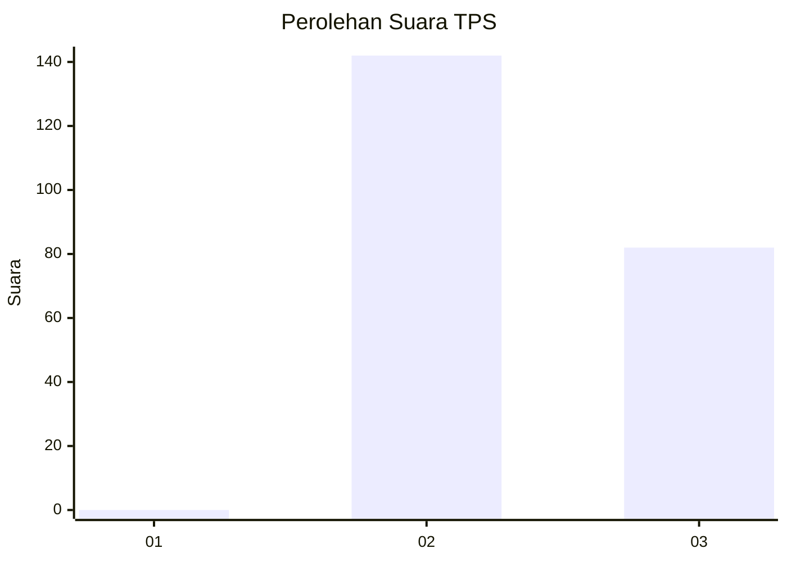
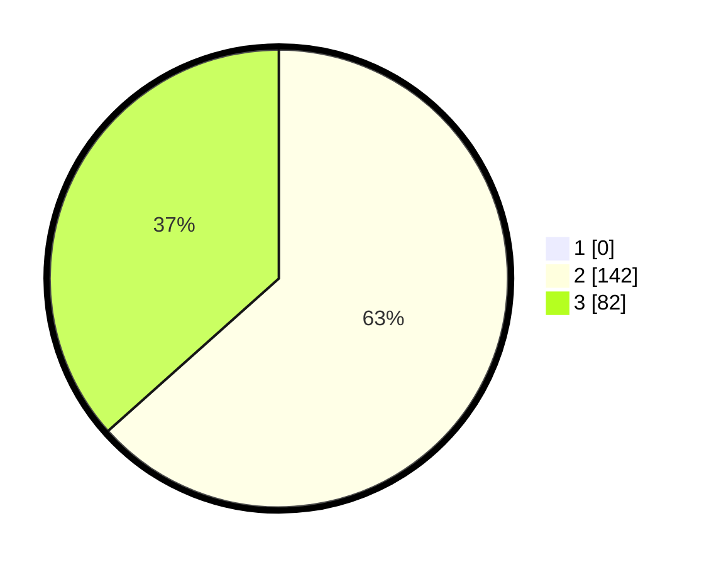

# Hasil

## Grafik

## Tabel

| No. | Nama Paslon    | Suara | Suara (raw) | Persentase |
|:--- |:-------------- | -----:| -----------:| ----------:|
| 1   | ANIES MUHAIMIN | 0     | [0][p-1]    | 0,00       |
| 2   | PRABOWO GIBRAN | 142   | [142][p-2]  | 63,39      |
| 3   | GANJAR MAHFUD  | 82    | [82][p-3]   | 36,61      |

[p-1]: https://github.com/gigit-pemilu/pemilu-2024-51-bali/blob/main/pilpres/hitung-suara/sub/51-bali/sub/08-buleleng/sub/04-banjar/sub/2013-banjar/sub/002-tps/sub/paslon-1.txt
[p-2]: https://github.com/gigit-pemilu/pemilu-2024-51-bali/blob/main/pilpres/hitung-suara/sub/51-bali/sub/08-buleleng/sub/04-banjar/sub/2013-banjar/sub/002-tps/sub/paslon-2.txt
[p-3]: https://github.com/gigit-pemilu/pemilu-2024-51-bali/blob/main/pilpres/hitung-suara/sub/51-bali/sub/08-buleleng/sub/04-banjar/sub/2013-banjar/sub/002-tps/sub/paslon-3.txt

## Foto C Plano

https://sirekap-obj-formc.kpu.go.id/1d2f/pemilu/ppwp/51/08/04/20/13/5108042013002-20240318-084458--12b8b04a-3fcf-4dc0-8247-46d65996cd80.jpg

https://sirekap-obj-formc.kpu.go.id/1d2f/pemilu/ppwp/51/08/04/20/13/5108042013002-20240214-234832--2483f67e-821d-44e7-ae73-5d0f6c227456.jpg

https://sirekap-obj-formc.kpu.go.id/1d2f/pemilu/ppwp/51/08/04/20/13/5108042013002-20240318-084557--f451158e-e44a-4e30-9409-e2946b78ae40.jpg

## Metadata

| Key        | Value               |
| ---------- | ------------------- |
| Time Stamp | 2024-03-18 09:00:00 |

