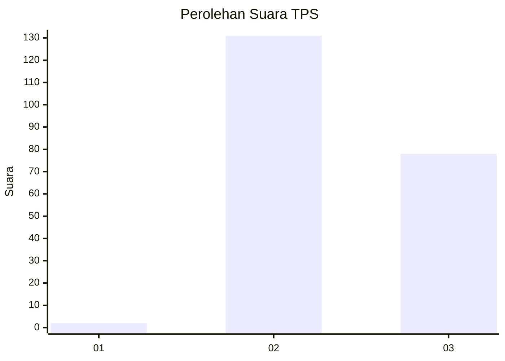
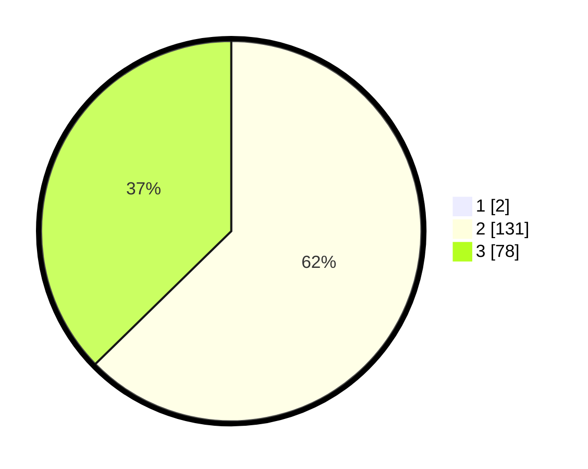

# Hasil

## Grafik

## Tabel

| No. | Nama Paslon    | Suara | Suara (raw) | Persentase |
|:--- |:-------------- | -----:| -----------:| ----------:|
| 1   | ANIES MUHAIMIN | 2     | [2][p-1]    | 0,95       |
| 2   | PRABOWO GIBRAN | 131   | [131][p-2]  | 62,09      |
| 3   | GANJAR MAHFUD  | 78    | [78][p-3]   | 36,97      |

[p-1]: https://github.com/gigit-pemilu/pemilu-2024-51-bali/blob/main/pilpres/hitung-suara/sub/51-bali/sub/08-buleleng/sub/04-banjar/sub/2013-banjar/sub/003-tps/sub/paslon-1.txt
[p-2]: https://github.com/gigit-pemilu/pemilu-2024-51-bali/blob/main/pilpres/hitung-suara/sub/51-bali/sub/08-buleleng/sub/04-banjar/sub/2013-banjar/sub/003-tps/sub/paslon-2.txt
[p-3]: https://github.com/gigit-pemilu/pemilu-2024-51-bali/blob/main/pilpres/hitung-suara/sub/51-bali/sub/08-buleleng/sub/04-banjar/sub/2013-banjar/sub/003-tps/sub/paslon-3.txt

## Foto C Plano

https://sirekap-obj-formc.kpu.go.id/e8cc/pemilu/ppwp/51/08/04/20/13/5108042013003-20240214-141118--cbd8e838-f93a-4b2f-bb80-da1a425dd8ed.jpg

https://sirekap-obj-formc.kpu.go.id/e8cc/pemilu/ppwp/51/08/04/20/13/5108042013003-20240214-141322--97e2dad4-e5b5-4207-92c8-ccd700165394.jpg

https://sirekap-obj-formc.kpu.go.id/e8cc/pemilu/ppwp/51/08/04/20/13/5108042013003-20240214-141820--8843e731-4153-435e-bb29-b39b4c4feef0.jpg

## Metadata

| Key        | Value               |
| ---------- | ------------------- |
| Time Stamp | 2024-02-14 21:46:01 |

