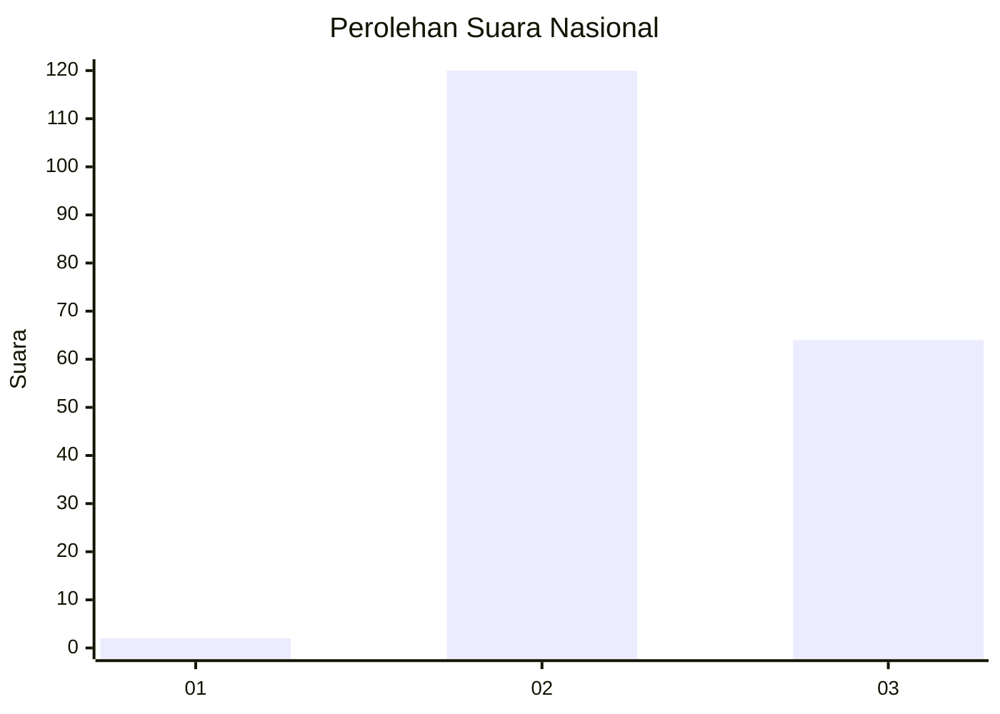
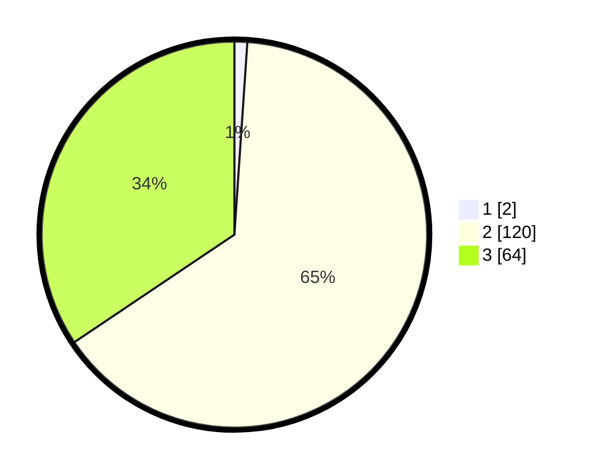

# Hasil

## Grafik

## Tabel

| No. | Nama Paslon    | Suara | Suara (raw) | Persentase |
|:--- |:-------------- | -----:| -----------:| ----------:|
| 1   | ANIES MUHAIMIN | 2     | [2][p-1]    | 1,08       |
| 2   | PRABOWO GIBRAN | 120   | [120][p-2]  | 64,52      |
| 3   | GANJAR MAHFUD  | 64    | [64][p-3]   | 34,41      |

[p-1]: https://github.com/gigit-pemilu/pemilu-2024/blob/main/pilpres/hitung-suara/sub/51-bali/sub/08-buleleng/sub/04-banjar/sub/2013-banjar/sub/004-tps/sub/paslon-1.txt
[p-2]: https://github.com/gigit-pemilu/pemilu-2024/blob/main/pilpres/hitung-suara/sub/51-bali/sub/08-buleleng/sub/04-banjar/sub/2013-banjar/sub/004-tps/sub/paslon-2.txt
[p-3]: https://github.com/gigit-pemilu/pemilu-2024/blob/main/pilpres/hitung-suara/sub/51-bali/sub/08-buleleng/sub/04-banjar/sub/2013-banjar/sub/004-tps/sub/paslon-3.txt

## Foto C Plano

https://sirekap-obj-formc.kpu.go.id/69c1/pemilu/ppwp/51/08/04/20/13/5108042013004-20240214-213236--338e61ea-7af1-4147-822e-3d90dd9e5c3f.jpg

https://sirekap-obj-formc.kpu.go.id/69c1/pemilu/ppwp/51/08/04/20/13/5108042013004-20240214-213836--2952217a-e9c9-4616-a3b8-86c34fe092fc.jpg

https://sirekap-obj-formc.kpu.go.id/69c1/pemilu/ppwp/51/08/04/20/13/5108042013004-20240214-232909--0c9096bf-d262-455e-a025-11534c30a1c0.jpg

## Metadata

| Key        | Value               |
| ---------- | ------------------- |
| Time Stamp | 2024-02-24 23:00:00 |

