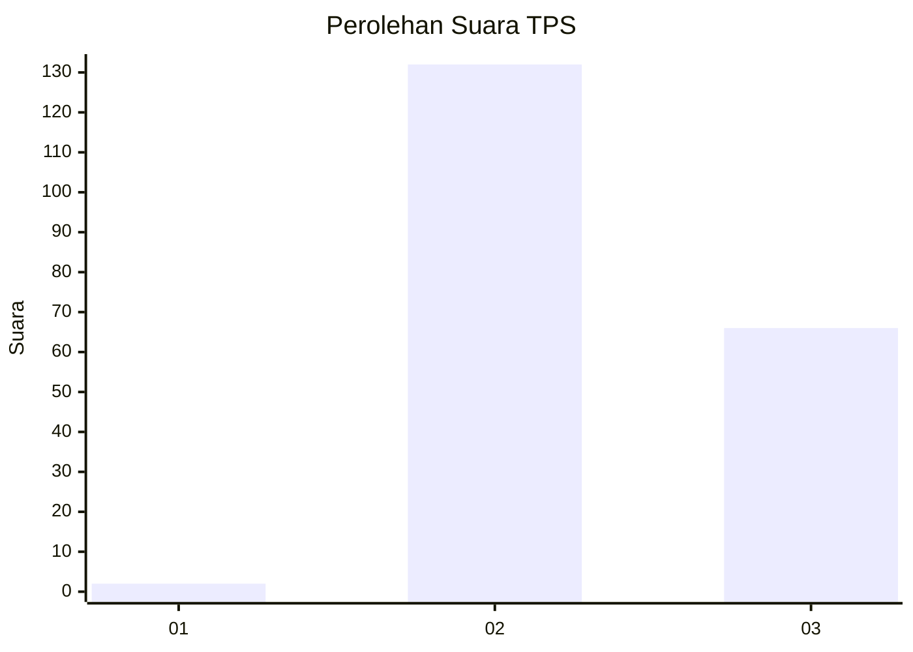
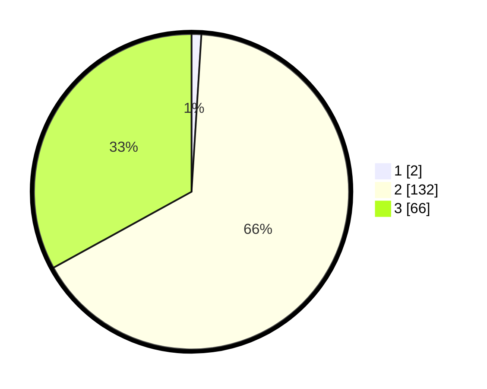

# Hasil

## Grafik

## Tabel

| No. | Nama Paslon    | Suara | Suara (raw) | Persentase |
|:--- |:-------------- | -----:| -----------:| ----------:|
| 1   | ANIES MUHAIMIN | 2     | [2][p-1]    | 1,00       |
| 2   | PRABOWO GIBRAN | 132   | [132][p-2]  | 66,00      |
| 3   | GANJAR MAHFUD  | 66    | [66][p-3]   | 33,00      |

[p-1]: https://github.com/gigit-pemilu/pemilu-2024-51-bali/blob/main/pilpres/hitung-suara/sub/51-bali/sub/08-buleleng/sub/04-banjar/sub/2013-banjar/sub/005-tps/sub/paslon-1.txt
[p-2]: https://github.com/gigit-pemilu/pemilu-2024-51-bali/blob/main/pilpres/hitung-suara/sub/51-bali/sub/08-buleleng/sub/04-banjar/sub/2013-banjar/sub/005-tps/sub/paslon-2.txt
[p-3]: https://github.com/gigit-pemilu/pemilu-2024-51-bali/blob/main/pilpres/hitung-suara/sub/51-bali/sub/08-buleleng/sub/04-banjar/sub/2013-banjar/sub/005-tps/sub/paslon-3.txt

## Foto C Plano

https://sirekap-obj-formc.kpu.go.id/abf4/pemilu/ppwp/51/08/04/20/13/5108042013005-20240214-232953--5cb3cd92-9b3f-406a-bc70-bd1fc16e8026.jpg

https://sirekap-obj-formc.kpu.go.id/abf4/pemilu/ppwp/51/08/04/20/13/5108042013005-20240214-232453--b76fa12d-5c52-49f8-907a-954ef7435b4d.jpg

https://sirekap-obj-formc.kpu.go.id/abf4/pemilu/ppwp/51/08/04/20/13/5108042013005-20240318-084735--a27c2c27-c68f-44de-b1e5-7199ec6c0bf1.jpg

## Metadata

| Key        | Value               |
| ---------- | ------------------- |
| Time Stamp | 2024-03-18 09:00:00 |

