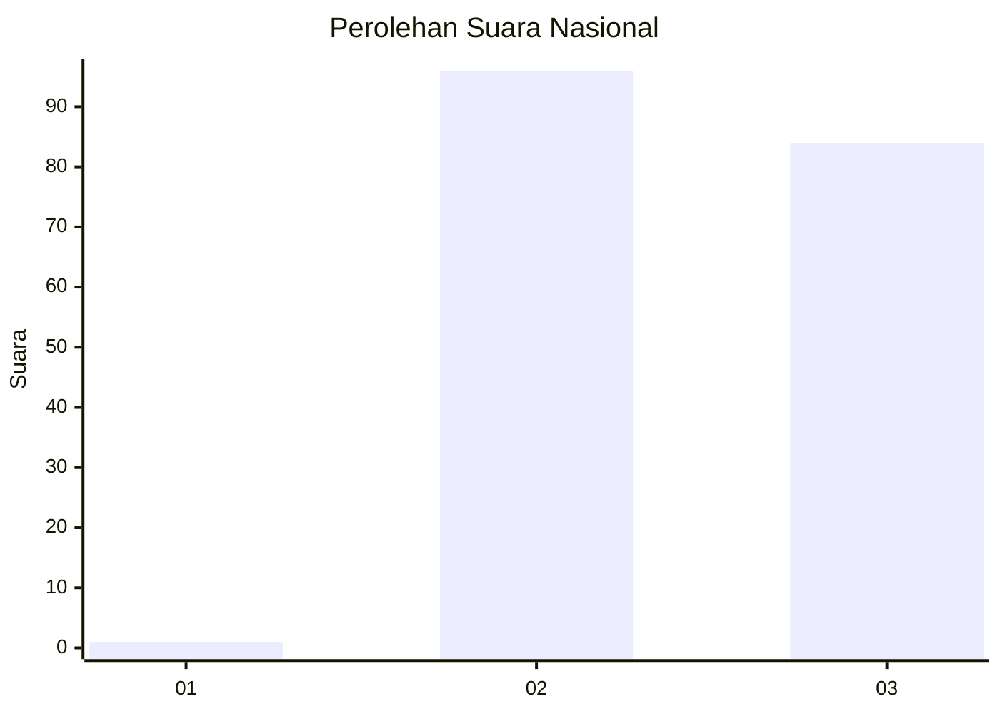
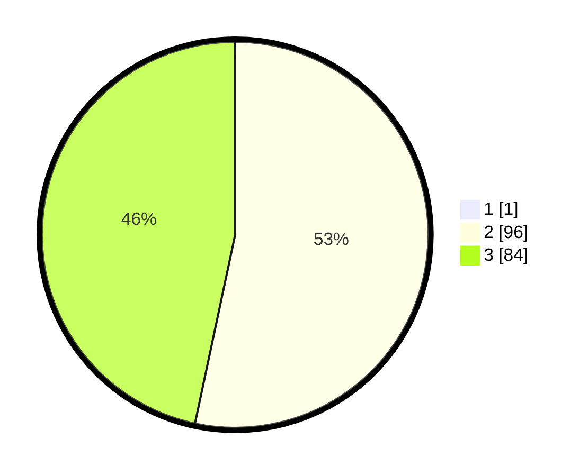

# Hasil

## Grafik

## Tabel

| No. | Nama Paslon    | Suara | Suara (raw) | Persentase |
|:--- |:-------------- | -----:| -----------:| ----------:|
| 1   | ANIES MUHAIMIN | 1     | [1][p-1]    | 0,55       |
| 2   | PRABOWO GIBRAN | 96    | [96][p-2]   | 53,04      |
| 3   | GANJAR MAHFUD  | 84    | [84][p-3]   | 46,41      |

[p-1]: https://github.com/gigit-pemilu/pemilu-2024/blob/main/pilpres/hitung-suara/sub/51-bali/sub/08-buleleng/sub/04-banjar/sub/2013-banjar/sub/015-tps/sub/paslon-1.txt
[p-2]: https://github.com/gigit-pemilu/pemilu-2024/blob/main/pilpres/hitung-suara/sub/51-bali/sub/08-buleleng/sub/04-banjar/sub/2013-banjar/sub/015-tps/sub/paslon-2.txt
[p-3]: https://github.com/gigit-pemilu/pemilu-2024/blob/main/pilpres/hitung-suara/sub/51-bali/sub/08-buleleng/sub/04-banjar/sub/2013-banjar/sub/015-tps/sub/paslon-3.txt

## Foto C Plano

https://sirekap-obj-formc.kpu.go.id/300d/pemilu/ppwp/51/08/04/20/13/5108042013015-20240214-221720--a1887c27-80ec-466e-b1d9-5d2bfafda3ed.jpg

https://sirekap-obj-formc.kpu.go.id/300d/pemilu/ppwp/51/08/04/20/13/5108042013015-20240214-221834--070edeb4-e997-4ae7-953f-a46b59698db7.jpg

https://sirekap-obj-formc.kpu.go.id/300d/pemilu/ppwp/51/08/04/20/13/5108042013015-20240214-221932--89e3d3af-dfa4-49fb-8458-b09202a582d5.jpg

## Metadata

| Key        | Value               |
| ---------- | ------------------- |
| Time Stamp | 2024-02-25 11:00:00 |

