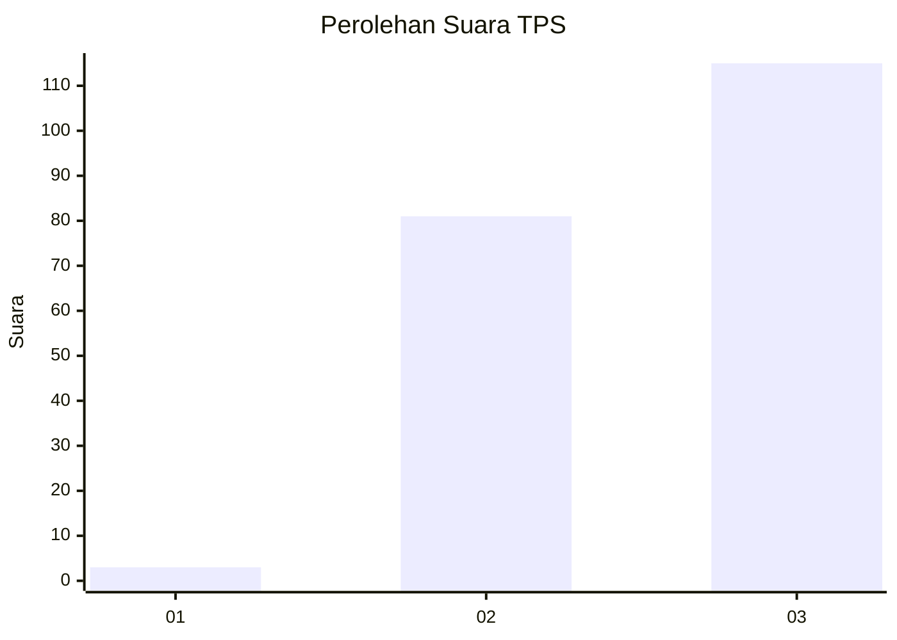
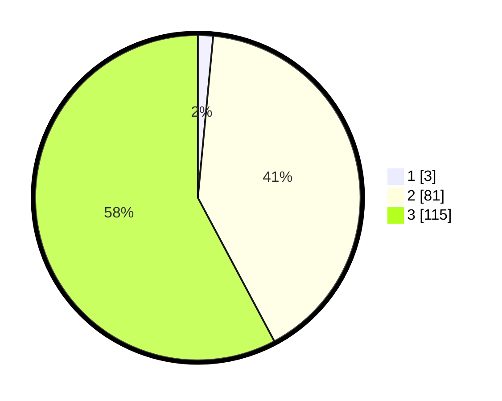

# Hasil

## Grafik

## Tabel

| No. | Nama Paslon    | Suara | Suara (raw) | Persentase |
|:--- |:-------------- | -----:| -----------:| ----------:|
| 1   | ANIES MUHAIMIN | 3     | [3][p-1]    | 1,51       |
| 2   | PRABOWO GIBRAN | 81    | [81][p-2]   | 40,70      |
| 3   | GANJAR MAHFUD  | 115   | [115][p-3]  | 57,79      |

[p-1]: https://github.com/gigit-pemilu/pemilu-2024-51-bali/blob/main/pilpres/hitung-suara/sub/51-bali/sub/08-buleleng/sub/04-banjar/sub/2013-banjar/sub/023-tps/sub/paslon-1.txt
[p-2]: https://github.com/gigit-pemilu/pemilu-2024-51-bali/blob/main/pilpres/hitung-suara/sub/51-bali/sub/08-buleleng/sub/04-banjar/sub/2013-banjar/sub/023-tps/sub/paslon-2.txt
[p-3]: https://github.com/gigit-pemilu/pemilu-2024-51-bali/blob/main/pilpres/hitung-suara/sub/51-bali/sub/08-buleleng/sub/04-banjar/sub/2013-banjar/sub/023-tps/sub/paslon-3.txt

## Foto C Plano

https://sirekap-obj-formc.kpu.go.id/8fb4/pemilu/ppwp/51/08/04/20/13/5108042013023-20240214-213804--f474cef8-e18c-4b20-85cd-c14bdd47422e.jpg

https://sirekap-obj-formc.kpu.go.id/8fb4/pemilu/ppwp/51/08/04/20/13/5108042013023-20240214-213648--4066c786-4e9c-4b2b-9589-6e460ab8cd64.jpg

https://sirekap-obj-formc.kpu.go.id/8fb4/pemilu/ppwp/51/08/04/20/13/5108042013023-20240214-213733--3f08ca0b-2a6c-4803-8e0e-15cd2f717748.jpg

## Metadata

| Key        | Value               |
| ---------- | ------------------- |
| Time Stamp | 2024-02-24 22:31:28 |

