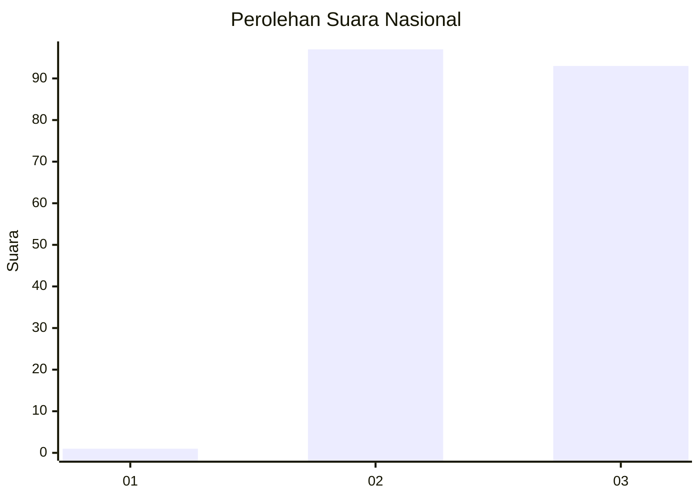
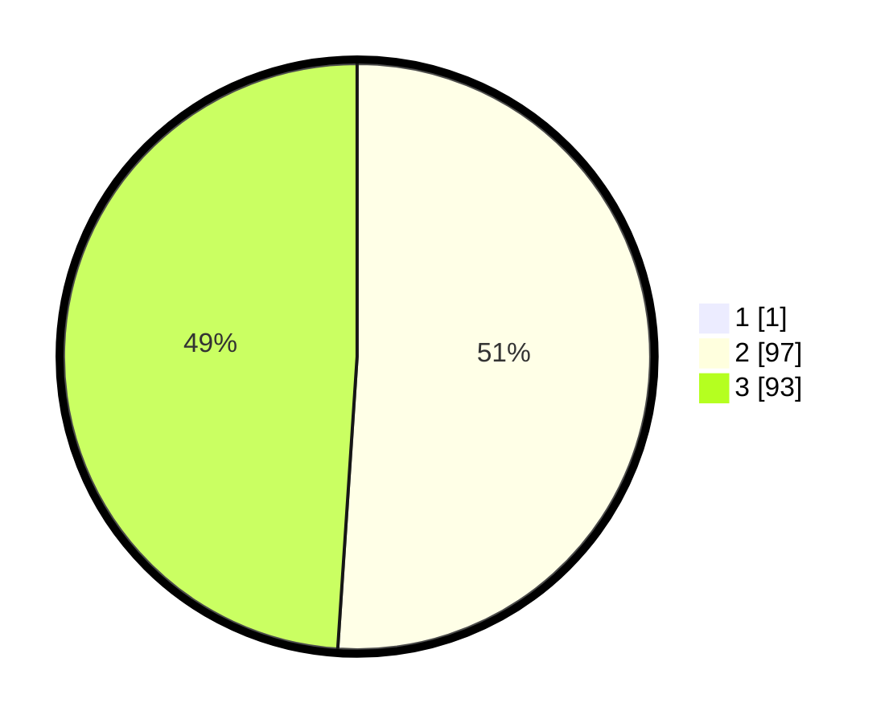

# Hasil

## Grafik

## Tabel

| No. | Nama Paslon    | Suara | Suara (raw) | Persentase |
|:--- |:-------------- | -----:| -----------:| ----------:|
| 1   | ANIES MUHAIMIN | 1     | [1][p-1]    | 0,52       |
| 2   | PRABOWO GIBRAN | 97    | [97][p-2]   | 50,79      |
| 3   | GANJAR MAHFUD  | 93    | [93][p-3]   | 48,69      |

[p-1]: https://github.com/gigit-pemilu/pemilu-2024/blob/main/pilpres/hitung-suara/sub/51-bali/sub/08-buleleng/sub/04-banjar/sub/2013-banjar/sub/024-tps/sub/paslon-1.txt
[p-2]: https://github.com/gigit-pemilu/pemilu-2024/blob/main/pilpres/hitung-suara/sub/51-bali/sub/08-buleleng/sub/04-banjar/sub/2013-banjar/sub/024-tps/sub/paslon-2.txt
[p-3]: https://github.com/gigit-pemilu/pemilu-2024/blob/main/pilpres/hitung-suara/sub/51-bali/sub/08-buleleng/sub/04-banjar/sub/2013-banjar/sub/024-tps/sub/paslon-3.txt

## Foto C Plano

https://sirekap-obj-formc.kpu.go.id/f5d8/pemilu/ppwp/51/08/04/20/13/5108042013024-20240214-140933--8e8b10d4-7598-4a06-87b7-7ef069f1a583.jpg

https://sirekap-obj-formc.kpu.go.id/f5d8/pemilu/ppwp/51/08/04/20/13/5108042013024-20240214-141150--af1a740f-83c4-4eaa-bc55-bb4b768bfd61.jpg

https://sirekap-obj-formc.kpu.go.id/f5d8/pemilu/ppwp/51/08/04/20/13/5108042013024-20240214-141659--63f813a1-9218-4fd9-8ef6-70ffab5c9847.jpg

## Metadata

| Key        | Value               |
| ---------- | ------------------- |
| Time Stamp | 2024-02-15 00:41:44 |

