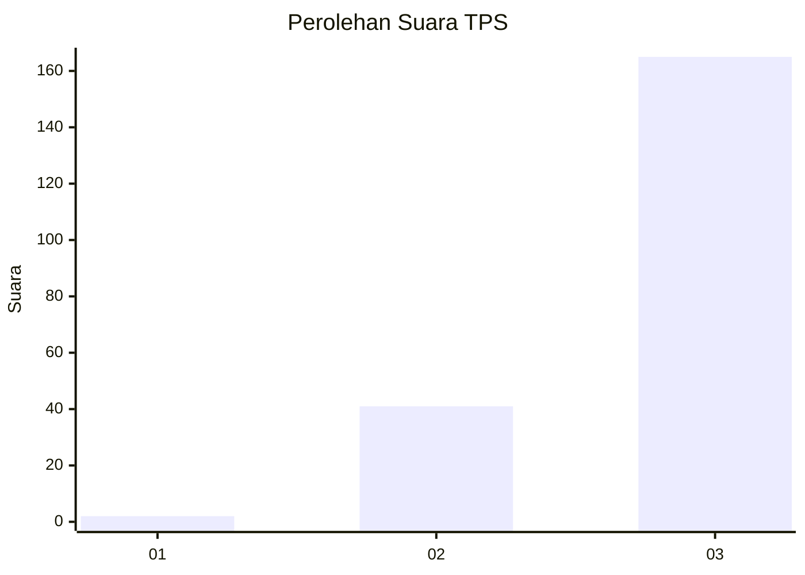
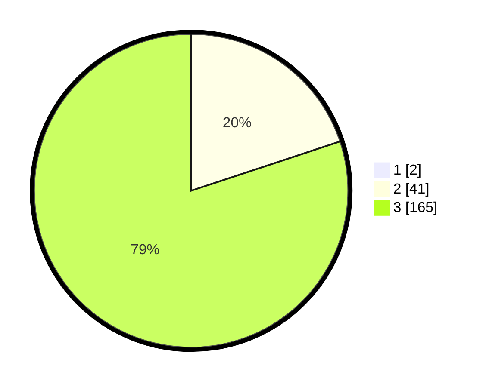

# Hasil

## Grafik

## Tabel

| No. | Nama Paslon    | Suara | Suara (raw) | Persentase |
|:--- |:-------------- | -----:| -----------:| ----------:|
| 1   | ANIES MUHAIMIN | 2     | [2][p-1]    | 0,96       |
| 2   | PRABOWO GIBRAN | 41    | [41][p-2]   | 19,71      |
| 3   | GANJAR MAHFUD  | 165   | [165][p-3]  | 79,33      |

[p-1]: https://github.com/gigit-pemilu/pemilu-2024-51-bali/blob/main/pilpres/hitung-suara/sub/51-bali/sub/08-buleleng/sub/04-banjar/sub/2013-banjar/sub/025-tps/sub/paslon-1.txt
[p-2]: https://github.com/gigit-pemilu/pemilu-2024-51-bali/blob/main/pilpres/hitung-suara/sub/51-bali/sub/08-buleleng/sub/04-banjar/sub/2013-banjar/sub/025-tps/sub/paslon-2.txt
[p-3]: https://github.com/gigit-pemilu/pemilu-2024-51-bali/blob/main/pilpres/hitung-suara/sub/51-bali/sub/08-buleleng/sub/04-banjar/sub/2013-banjar/sub/025-tps/sub/paslon-3.txt

## Foto C Plano

https://sirekap-obj-formc.kpu.go.id/1e4e/pemilu/ppwp/51/08/04/20/13/5108042013025-20240318-091413--b71bfd18-2a68-48a4-8300-0007a7286fde.jpg

https://sirekap-obj-formc.kpu.go.id/1e4e/pemilu/ppwp/51/08/04/20/13/5108042013025-20240215-015530--1df77b48-7a30-465e-9e5d-b2cd56aeb9e0.jpg

https://sirekap-obj-formc.kpu.go.id/1e4e/pemilu/ppwp/51/08/04/20/13/5108042013025-20240215-015727--ff2f826f-065b-47bd-99e8-09c99ba45319.jpg

## Metadata

| Key        | Value               |
| ---------- | ------------------- |
| Time Stamp | 2024-03-18 09:30:00 |

