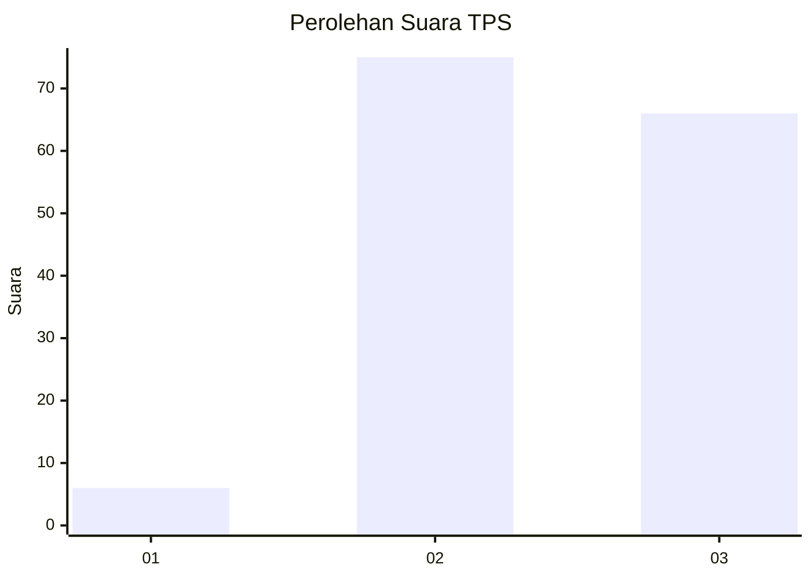

# Hasil

## Grafik

## Tabel

| No. | Nama Paslon    | Suara | Suara (raw) | Persentase |
|:--- |:-------------- | -----:| -----------:| ----------:|
| 1   | ANIES MUHAIMIN | 6     | [6][p-1]    | 4,08       |
| 2   | PRABOWO GIBRAN | 75    | [75][p-2]   | 51,02      |
| 3   | GANJAR MAHFUD  | 66    | [66][p-3]   | 44,90      |

[p-1]: https://github.com/gigit-pemilu/pemilu-2024-51-bali/blob/main/pilpres/hitung-suara/sub/51-bali/sub/08-buleleng/sub/04-banjar/sub/2013-banjar/sub/026-tps/sub/paslon-1.txt
[p-2]: https://github.com/gigit-pemilu/pemilu-2024-51-bali/blob/main/pilpres/hitung-suara/sub/51-bali/sub/08-buleleng/sub/04-banjar/sub/2013-banjar/sub/026-tps/sub/paslon-2.txt
[p-3]: https://github.com/gigit-pemilu/pemilu-2024-51-bali/blob/main/pilpres/hitung-suara/sub/51-bali/sub/08-buleleng/sub/04-banjar/sub/2013-banjar/sub/026-tps/sub/paslon-3.txt

## Foto C Plano

https://sirekap-obj-formc.kpu.go.id/9e1c/pemilu/ppwp/51/08/04/20/13/5108042013026-20240318-091508--8c721111-5e5f-4463-9f7a-7fb24faf48bf.jpg

https://sirekap-obj-formc.kpu.go.id/9e1c/pemilu/ppwp/51/08/04/20/13/5108042013026-20240214-190632--526dc8fc-587d-4061-b06c-319b1f596fc8.jpg

https://sirekap-obj-formc.kpu.go.id/9e1c/pemilu/ppwp/51/08/04/20/13/5108042013026-20240318-091525--8519835d-58c8-4cc7-b61c-3a816107ecd0.jpg

## Metadata

| Key        | Value               |
| ---------- | ------------------- |
| Time Stamp | 2024-03-18 09:30:00 |

