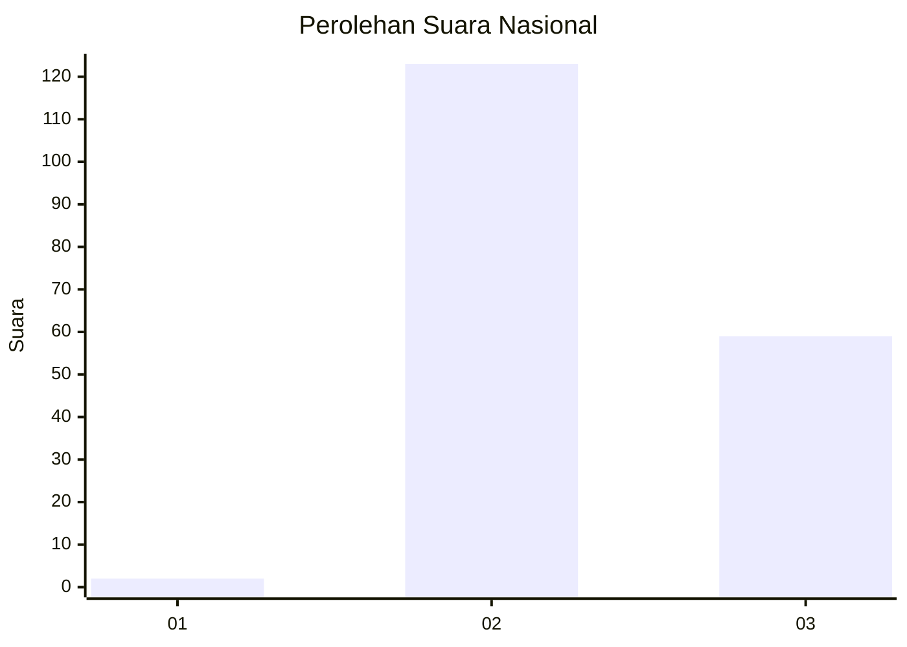
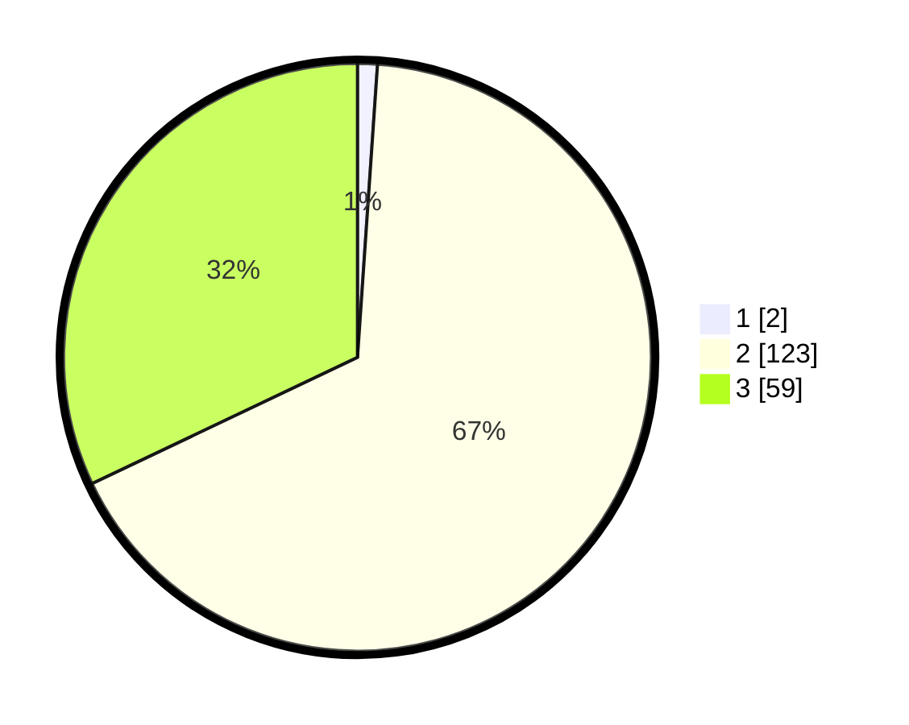

# Hasil

## Grafik

## Tabel

| No. | Nama Paslon    | Suara | Suara (raw) | Persentase |
|:--- |:-------------- | -----:| -----------:| ----------:|
| 1   | ANIES MUHAIMIN | 2     | [2][p-1]    | 1,09       |
| 2   | PRABOWO GIBRAN | 123   | [123][p-2]  | 66,85      |
| 3   | GANJAR MAHFUD  | 59    | [59][p-3]   | 32,07      |

[p-1]: https://github.com/gigit-pemilu/pemilu-2024/blob/main/pilpres/hitung-suara/sub/51-bali/sub/08-buleleng/sub/04-banjar/sub/2013-banjar/sub/029-tps/sub/paslon-1.txt
[p-2]: https://github.com/gigit-pemilu/pemilu-2024/blob/main/pilpres/hitung-suara/sub/51-bali/sub/08-buleleng/sub/04-banjar/sub/2013-banjar/sub/029-tps/sub/paslon-2.txt
[p-3]: https://github.com/gigit-pemilu/pemilu-2024/blob/main/pilpres/hitung-suara/sub/51-bali/sub/08-buleleng/sub/04-banjar/sub/2013-banjar/sub/029-tps/sub/paslon-3.txt

## Foto C Plano

https://sirekap-obj-formc.kpu.go.id/4f48/pemilu/ppwp/51/08/04/20/13/5108042013029-20240215-023501--d8b09e0c-a1e0-4db3-a7e5-06013e252e73.jpg

https://sirekap-obj-formc.kpu.go.id/4f48/pemilu/ppwp/51/08/04/20/13/5108042013029-20240215-023637--91c666a1-b3a8-4e5f-8af8-ca5e30935a34.jpg

https://sirekap-obj-formc.kpu.go.id/4f48/pemilu/ppwp/51/08/04/20/13/5108042013029-20240215-023856--d9c0f6e6-c83b-4c5e-ac86-d0fc5dd21f75.jpg

## Metadata

| Key        | Value               |
| ---------- | ------------------- |
| Time Stamp | 2024-02-24 22:31:28 |

