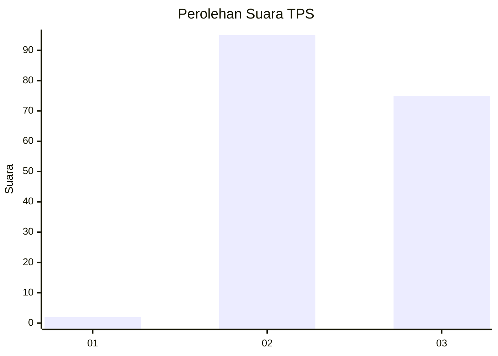
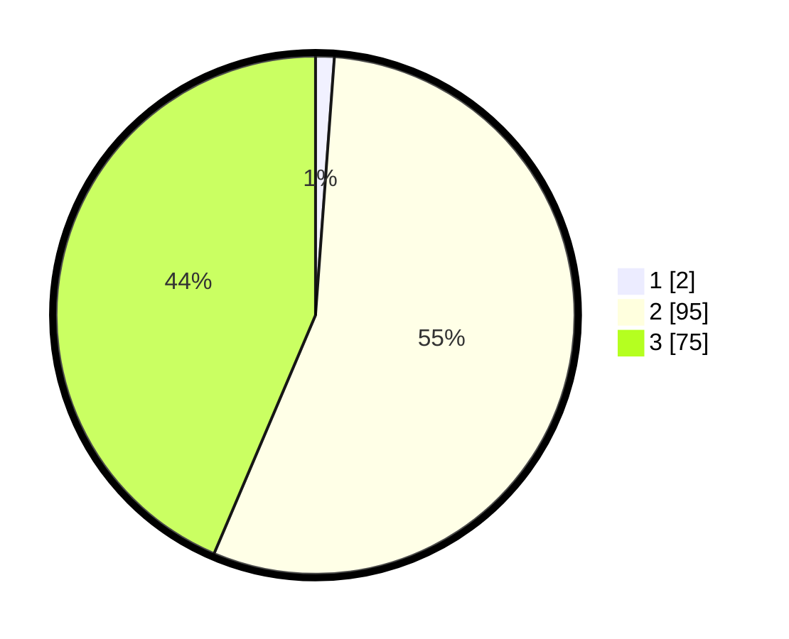

# Hasil

## Grafik

## Tabel

| No. | Nama Paslon    | Suara | Suara (raw) | Persentase |
|:--- |:-------------- | -----:| -----------:| ----------:|
| 1   | ANIES MUHAIMIN | 2     | [2][p-1]    | 1,16       |
| 2   | PRABOWO GIBRAN | 95    | [95][p-2]   | 55,23      |
| 3   | GANJAR MAHFUD  | 75    | [75][p-3]   | 43,60      |

[p-1]: https://github.com/gigit-pemilu/pemilu-2024-51-bali/blob/main/pilpres/hitung-suara/sub/51-bali/sub/08-buleleng/sub/04-banjar/sub/2013-banjar/sub/031-tps/sub/paslon-1.txt
[p-2]: https://github.com/gigit-pemilu/pemilu-2024-51-bali/blob/main/pilpres/hitung-suara/sub/51-bali/sub/08-buleleng/sub/04-banjar/sub/2013-banjar/sub/031-tps/sub/paslon-2.txt
[p-3]: https://github.com/gigit-pemilu/pemilu-2024-51-bali/blob/main/pilpres/hitung-suara/sub/51-bali/sub/08-buleleng/sub/04-banjar/sub/2013-banjar/sub/031-tps/sub/paslon-3.txt

## Foto C Plano

https://sirekap-obj-formc.kpu.go.id/302d/pemilu/ppwp/51/08/04/20/13/5108042013031-20240214-185041--bb510198-ec86-41c5-a361-ccb37a0731ae.jpg

https://sirekap-obj-formc.kpu.go.id/302d/pemilu/ppwp/51/08/04/20/13/5108042013031-20240214-185800--9ab5b7ee-3ce3-46ac-8c88-bb0e95c470c9.jpg

https://sirekap-obj-formc.kpu.go.id/302d/pemilu/ppwp/51/08/04/20/13/5108042013031-20240214-190056--e6ef0e4b-6635-45af-9dac-9709f40f505a.jpg

## Metadata

| Key        | Value               |
| ---------- | ------------------- |
| Time Stamp | 2024-02-24 22:31:28 |

