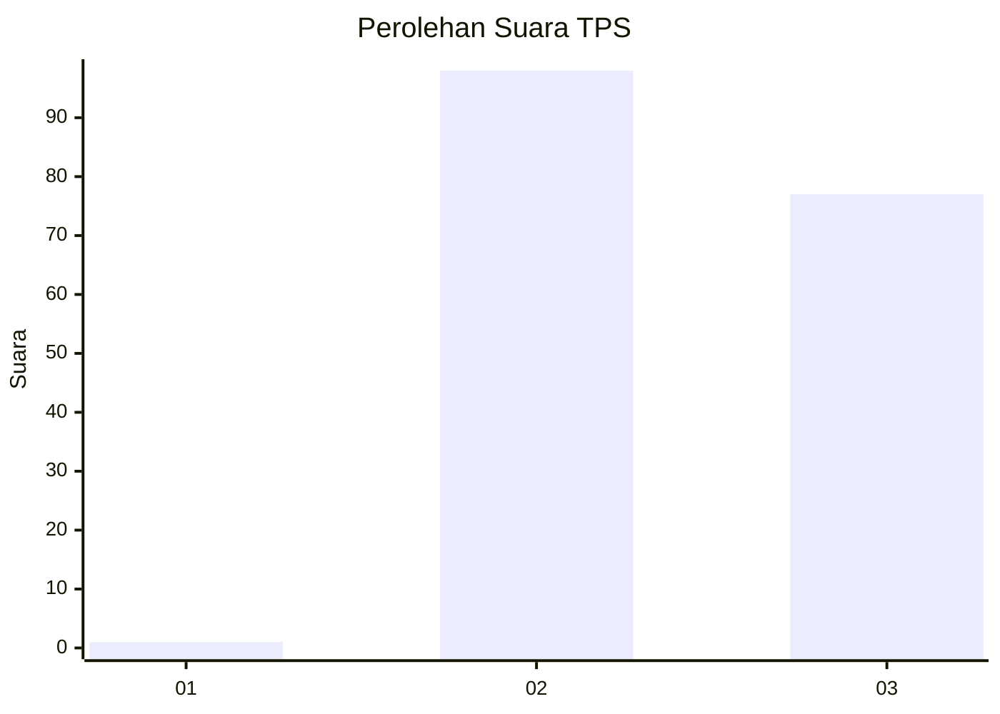
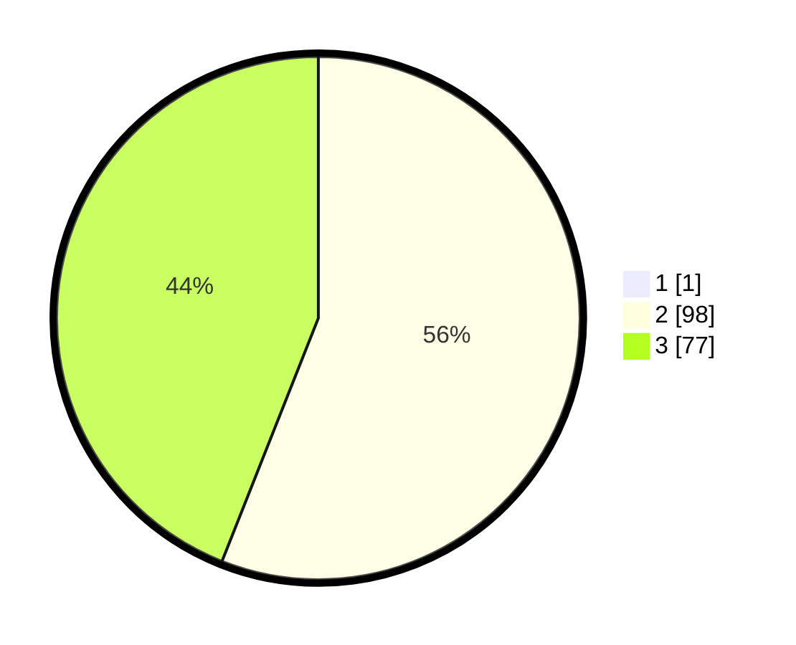

# Hasil

## Grafik

## Tabel

| No. | Nama Paslon    | Suara | Suara (raw) | Persentase |
|:--- |:-------------- | -----:| -----------:| ----------:|
| 1   | ANIES MUHAIMIN | 1     | [1][p-1]    | 0,57       |
| 2   | PRABOWO GIBRAN | 98    | [98][p-2]   | 55,68      |
| 3   | GANJAR MAHFUD  | 77    | [77][p-3]   | 43,75      |

[p-1]: https://github.com/gigit-pemilu/pemilu-2024-51-bali/blob/main/pilpres/hitung-suara/sub/51-bali/sub/08-buleleng/sub/04-banjar/sub/2013-banjar/sub/033-tps/sub/paslon-1.txt
[p-2]: https://github.com/gigit-pemilu/pemilu-2024-51-bali/blob/main/pilpres/hitung-suara/sub/51-bali/sub/08-buleleng/sub/04-banjar/sub/2013-banjar/sub/033-tps/sub/paslon-2.txt
[p-3]: https://github.com/gigit-pemilu/pemilu-2024-51-bali/blob/main/pilpres/hitung-suara/sub/51-bali/sub/08-buleleng/sub/04-banjar/sub/2013-banjar/sub/033-tps/sub/paslon-3.txt

## Foto C Plano

https://sirekap-obj-formc.kpu.go.id/cf61/pemilu/ppwp/51/08/04/20/13/5108042013033-20240214-125815--c139e2a5-c1ef-49e8-9635-fb68b272a9e2.jpg

https://sirekap-obj-formc.kpu.go.id/cf61/pemilu/ppwp/51/08/04/20/13/5108042013033-20240214-125910--2a6f1dba-6ff5-405e-b8c5-292e2dc7d8a8.jpg

https://sirekap-obj-formc.kpu.go.id/cf61/pemilu/ppwp/51/08/04/20/13/5108042013033-20240214-125957--b401ab20-1f4d-40bd-be35-3bf919e7c143.jpg

## Metadata

| Key        | Value               |
| ---------- | ------------------- |
| Time Stamp | 2024-02-14 21:46:01 |

