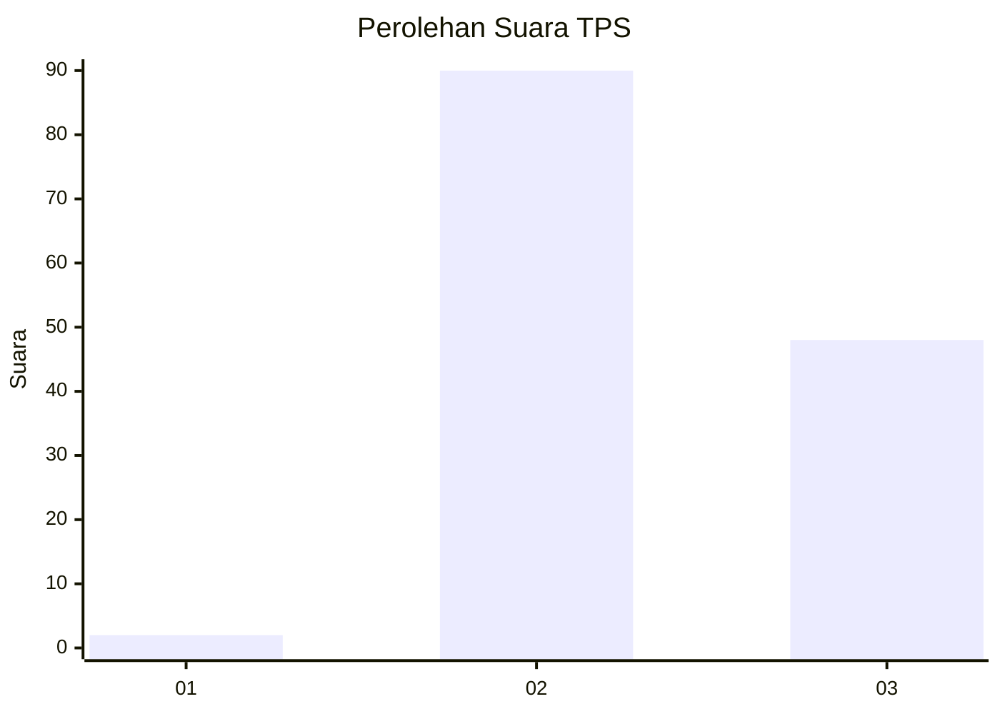
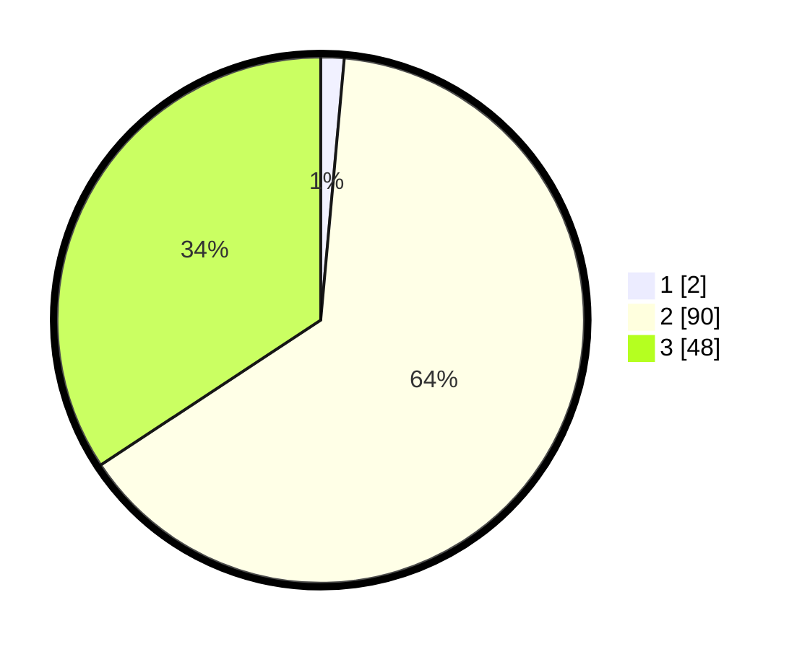

# Hasil

## Grafik

## Tabel

| No. | Nama Paslon    | Suara | Suara (raw) | Persentase |
|:--- |:-------------- | -----:| -----------:| ----------:|
| 1   | ANIES MUHAIMIN | 2     | [2][p-1]    | 1,43       |
| 2   | PRABOWO GIBRAN | 90    | [90][p-2]   | 64,29      |
| 3   | GANJAR MAHFUD  | 48    | [48][p-3]   | 34,29      |

[p-1]: https://github.com/gigit-pemilu/pemilu-2024-51-bali/blob/main/pilpres/hitung-suara/sub/51-bali/sub/08-buleleng/sub/04-banjar/sub/2014-dencarik/sub/015-tps/sub/paslon-1.txt
[p-2]: https://github.com/gigit-pemilu/pemilu-2024-51-bali/blob/main/pilpres/hitung-suara/sub/51-bali/sub/08-buleleng/sub/04-banjar/sub/2014-dencarik/sub/015-tps/sub/paslon-2.txt
[p-3]: https://github.com/gigit-pemilu/pemilu-2024-51-bali/blob/main/pilpres/hitung-suara/sub/51-bali/sub/08-buleleng/sub/04-banjar/sub/2014-dencarik/sub/015-tps/sub/paslon-3.txt

## Foto C Plano

https://sirekap-obj-formc.kpu.go.id/1179/pemilu/ppwp/51/08/04/20/14/5108042014015-20240215-001221--2633d152-de1e-45a4-bb2c-4a90ea13bd7f.jpg

https://sirekap-obj-formc.kpu.go.id/1179/pemilu/ppwp/51/08/04/20/14/5108042014015-20240215-001316--49840913-5aed-49e4-803b-1671c99f50e3.jpg

https://sirekap-obj-formc.kpu.go.id/1179/pemilu/ppwp/51/08/04/20/14/5108042014015-20240215-001655--e1fb6d13-4440-484c-bc20-849a5b6ac92a.jpg

## Metadata

| Key        | Value               |
| ---------- | ------------------- |
| Time Stamp | 2024-02-24 22:31:28 |

