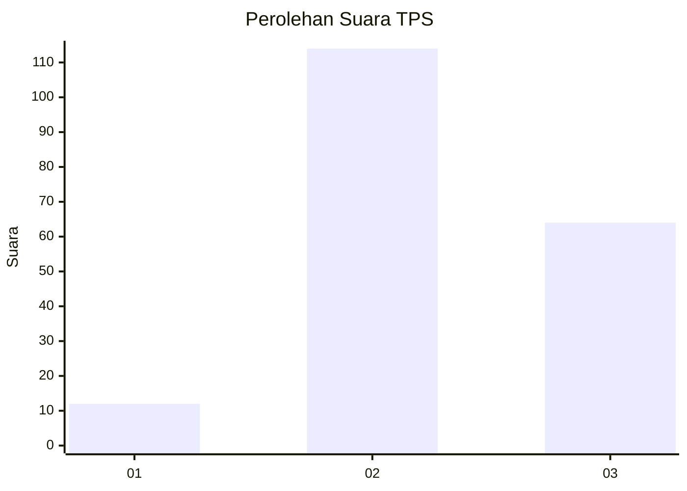
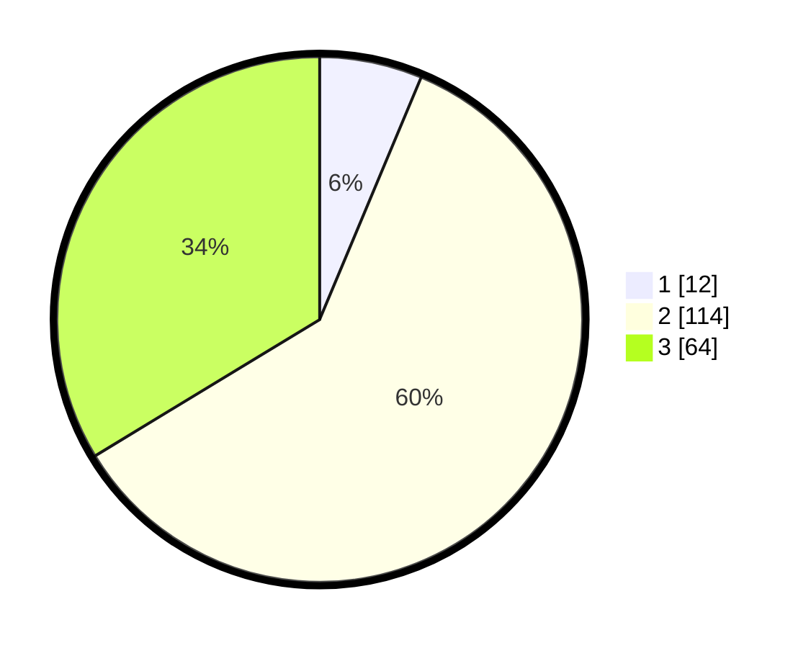

# Hasil

## Grafik

## Tabel

| No. | Nama Paslon    | Suara | Suara (raw) | Persentase |
|:--- |:-------------- | -----:| -----------:| ----------:|
| 1   | ANIES MUHAIMIN | 12    | [12][p-1]   | 6,32       |
| 2   | PRABOWO GIBRAN | 114   | [114][p-2]  | 60,00      |
| 3   | GANJAR MAHFUD  | 64    | [64][p-3]   | 33,68      |

[p-1]: https://github.com/gigit-pemilu/pemilu-2024-51-bali/blob/main/pilpres/hitung-suara/sub/51-bali/sub/08-buleleng/sub/04-banjar/sub/2015-temukus/sub/001-tps/sub/paslon-1.txt
[p-2]: https://github.com/gigit-pemilu/pemilu-2024-51-bali/blob/main/pilpres/hitung-suara/sub/51-bali/sub/08-buleleng/sub/04-banjar/sub/2015-temukus/sub/001-tps/sub/paslon-2.txt
[p-3]: https://github.com/gigit-pemilu/pemilu-2024-51-bali/blob/main/pilpres/hitung-suara/sub/51-bali/sub/08-buleleng/sub/04-banjar/sub/2015-temukus/sub/001-tps/sub/paslon-3.txt

## Foto C Plano

https://sirekap-obj-formc.kpu.go.id/c6f5/pemilu/ppwp/51/08/04/20/15/5108042015001-20240215-015039--a1e57586-d168-445f-823f-c2ab6d8f742e.jpg

https://sirekap-obj-formc.kpu.go.id/c6f5/pemilu/ppwp/51/08/04/20/15/5108042015001-20240215-015310--4aa7dba6-c7e2-4fba-8da5-4b966173228d.jpg

https://sirekap-obj-formc.kpu.go.id/c6f5/pemilu/ppwp/51/08/04/20/15/5108042015001-20240215-015656--bab363a4-eeef-42bf-8fcd-579a841b71bb.jpg

## Metadata

| Key        | Value               |
| ---------- | ------------------- |
| Time Stamp | 2024-02-24 22:31:28 |

