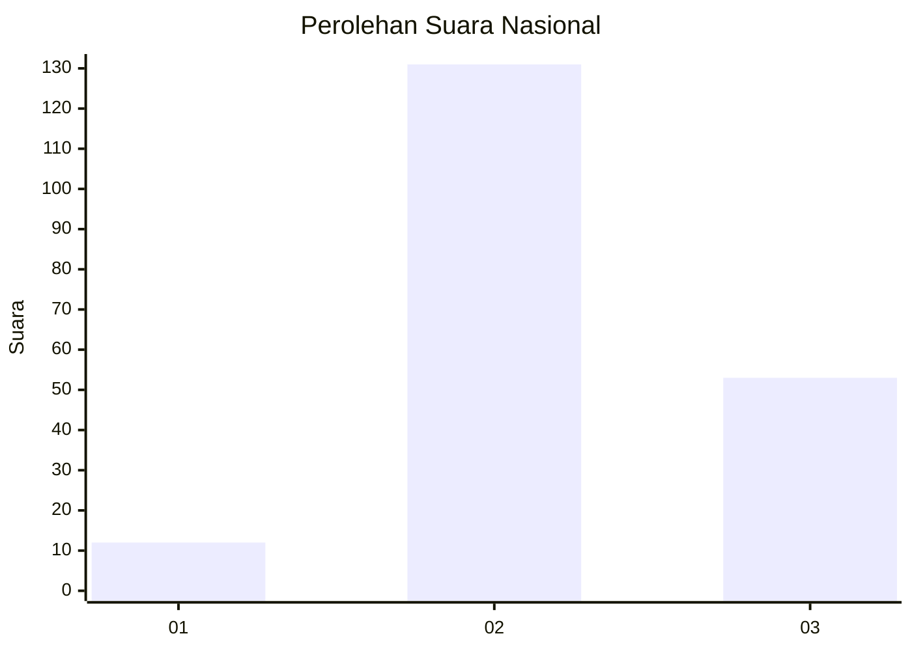

# Hasil

## Grafik

## Tabel

| No. | Nama Paslon    | Suara | Suara (raw) | Persentase |
|:--- |:-------------- | -----:| -----------:| ----------:|
| 1   | ANIES MUHAIMIN | 12    | [12][p-1]   | 6,12       |
| 2   | PRABOWO GIBRAN | 131   | [131][p-2]  | 66,84      |
| 3   | GANJAR MAHFUD  | 53    | [53][p-3]   | 27,04      |

[p-1]: https://github.com/gigit-pemilu/pemilu-2024/blob/main/pilpres/hitung-suara/sub/51-bali/sub/08-buleleng/sub/04-banjar/sub/2015-temukus/sub/002-tps/sub/paslon-1.txt
[p-2]: https://github.com/gigit-pemilu/pemilu-2024/blob/main/pilpres/hitung-suara/sub/51-bali/sub/08-buleleng/sub/04-banjar/sub/2015-temukus/sub/002-tps/sub/paslon-2.txt
[p-3]: https://github.com/gigit-pemilu/pemilu-2024/blob/main/pilpres/hitung-suara/sub/51-bali/sub/08-buleleng/sub/04-banjar/sub/2015-temukus/sub/002-tps/sub/paslon-3.txt

## Foto C Plano

https://sirekap-obj-formc.kpu.go.id/5e12/pemilu/ppwp/51/08/04/20/15/5108042015002-20240214-230333--e400ed73-d102-4c2b-baf2-607173d05002.jpg

https://sirekap-obj-formc.kpu.go.id/5e12/pemilu/ppwp/51/08/04/20/15/5108042015002-20240214-230328--3f6f0556-e2da-437f-9abc-f32b0a43b2d5.jpg

https://sirekap-obj-formc.kpu.go.id/5e12/pemilu/ppwp/51/08/04/20/15/5108042015002-20240214-230513--76e91a0f-78de-4f0c-9422-70d04c62684a.jpg

## Metadata

| Key        | Value               |
| ---------- | ------------------- |
| Time Stamp | 2024-02-17 13:37:34 |

## DATA PEMILIH TETAP

Jumlah pemilih dalam DPT: **272**.
 * L: **132**.
 * P: **140**.

## DATA PENGGUNA HAK PILIH

Jumlah pengguna hak pilih dalam DPT: **189**.
 * L: **94**.
 * P: **95**.

Jumlah pengguna hak pilih dalam DPTb: **0**.
 * L: **0**.
 * P: **0**.

Jumlah pengguna hak pilih dalam DPK: **10**.
 * L: **3**.
 * P: **7**.

Jumlah pengguna hak pilih: **199**.
 * L: **97**.
 * P: **102**.

## JUMLAH SUARA SAH DAN TIDAK SAH

JUMLAH SELURUH SUARA SAH: **196**.

JUMLAH SUARA TIDAK SAH: **3**.

JUMLAH SELURUH SUARA SAH DAN SUARA TIDAK SAH: **199**.

