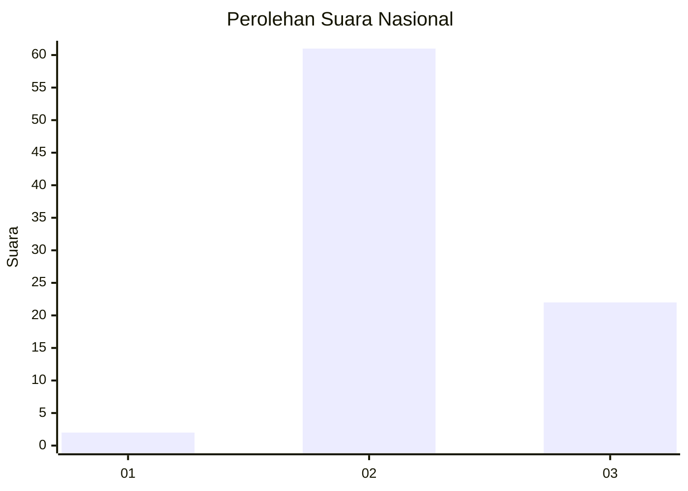
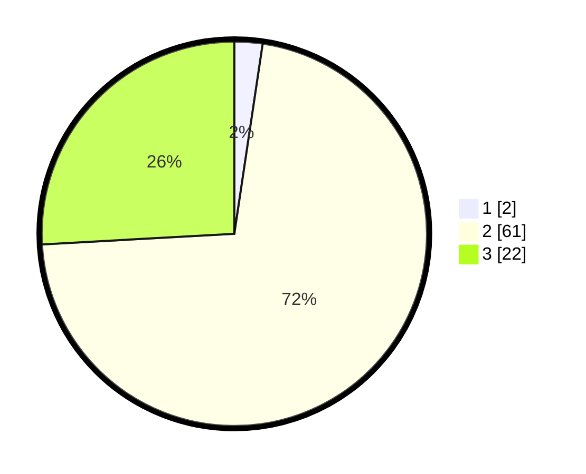

# Hasil

## Grafik

## Tabel

| No. | Nama Paslon    | Suara | Suara (raw) | Persentase |
|:--- |:-------------- | -----:| -----------:| ----------:|
| 1   | ANIES MUHAIMIN | 2     | [2][p-1]    | 2,35       |
| 2   | PRABOWO GIBRAN | 61    | [61][p-2]   | 71,76      |
| 3   | GANJAR MAHFUD  | 22    | [22][p-3]   | 25,88      |

[p-1]: https://github.com/gigit-pemilu/pemilu-2024/blob/main/pilpres/hitung-suara/sub/51-bali/sub/08-buleleng/sub/04-banjar/sub/2015-temukus/sub/005-tps/sub/paslon-1.txt
[p-2]: https://github.com/gigit-pemilu/pemilu-2024/blob/main/pilpres/hitung-suara/sub/51-bali/sub/08-buleleng/sub/04-banjar/sub/2015-temukus/sub/005-tps/sub/paslon-2.txt
[p-3]: https://github.com/gigit-pemilu/pemilu-2024/blob/main/pilpres/hitung-suara/sub/51-bali/sub/08-buleleng/sub/04-banjar/sub/2015-temukus/sub/005-tps/sub/paslon-3.txt

## Foto C Plano

https://sirekap-obj-formc.kpu.go.id/d3f4/pemilu/ppwp/51/08/04/20/15/5108042015005-20240220-140328--a091b544-3f20-479d-baa0-307ed10a4fda.jpg

https://sirekap-obj-formc.kpu.go.id/d3f4/pemilu/ppwp/51/08/04/20/15/5108042015005-20240220-140639--d26ac49e-c666-488e-a584-aa520a4e760f.jpg

https://sirekap-obj-formc.kpu.go.id/d3f4/pemilu/ppwp/51/08/04/20/15/5108042015005-20240220-140729--a85e2a47-7d34-4f4f-b0ad-fb6e38085a08.jpg

## Metadata

| Key        | Value               |
| ---------- | ------------------- |
| Time Stamp | 2024-02-21 15:00:00 |

## DATA PEMILIH TETAP

Jumlah pemilih dalam DPT: **248**.
 * L: **124**.
 * P: **124**.

## DATA PENGGUNA HAK PILIH

Jumlah pengguna hak pilih dalam DPT: **85**.
 * L: **40**.
 * P: **45**.

Jumlah pengguna hak pilih dalam DPTb: **0**.
 * L: **0**.
 * P: **0**.

Jumlah pengguna hak pilih dalam DPK: **0**.
 * L: **0**.
 * P: **0**.

Jumlah pengguna hak pilih: **85**.
 * L: **40**.
 * P: **45**.

## JUMLAH SUARA SAH DAN TIDAK SAH

JUMLAH SELURUH SUARA SAH: **85**.

JUMLAH SUARA TIDAK SAH: **0**.

JUMLAH SELURUH SUARA SAH DAN SUARA TIDAK SAH: **85**.

