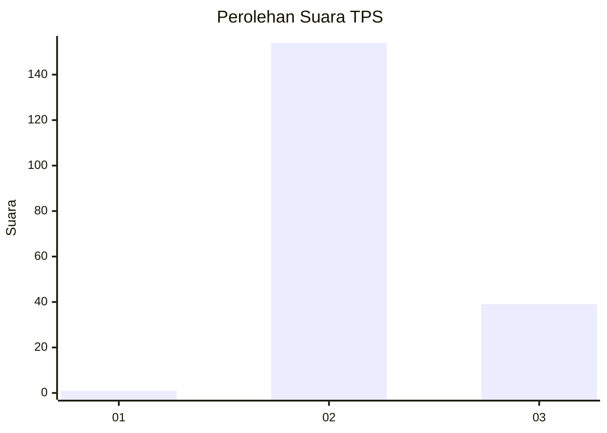
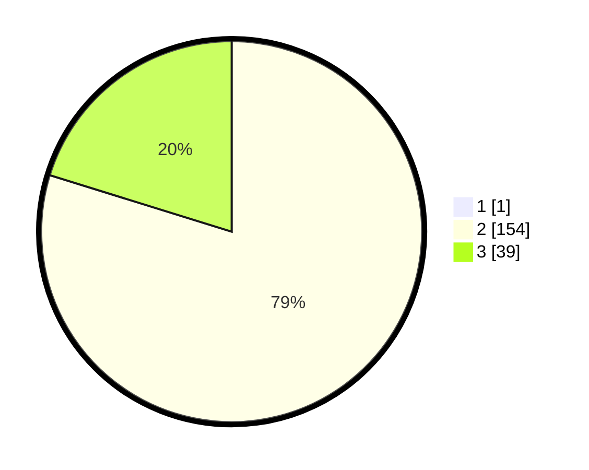

# Hasil

## Grafik

## Tabel

| No. | Nama Paslon    | Suara | Suara (raw) | Persentase |
|:--- |:-------------- | -----:| -----------:| ----------:|
| 1   | ANIES MUHAIMIN | 1     | [1][p-1]    | 0,52       |
| 2   | PRABOWO GIBRAN | 154   | [154][p-2]  | 79,38      |
| 3   | GANJAR MAHFUD  | 39    | [39][p-3]   | 20,10      |

[p-1]: https://github.com/gigit-pemilu/pemilu-2024-51-bali/blob/main/pilpres/hitung-suara/sub/51-bali/sub/08-buleleng/sub/04-banjar/sub/2015-temukus/sub/006-tps/sub/paslon-1.txt
[p-2]: https://github.com/gigit-pemilu/pemilu-2024-51-bali/blob/main/pilpres/hitung-suara/sub/51-bali/sub/08-buleleng/sub/04-banjar/sub/2015-temukus/sub/006-tps/sub/paslon-2.txt
[p-3]: https://github.com/gigit-pemilu/pemilu-2024-51-bali/blob/main/pilpres/hitung-suara/sub/51-bali/sub/08-buleleng/sub/04-banjar/sub/2015-temukus/sub/006-tps/sub/paslon-3.txt

## Foto C Plano

https://sirekap-obj-formc.kpu.go.id/0b6c/pemilu/ppwp/51/08/04/20/15/5108042015006-20240214-204836--2260d2fb-38e8-436c-a842-d78dec11c840.jpg

https://sirekap-obj-formc.kpu.go.id/0b6c/pemilu/ppwp/51/08/04/20/15/5108042015006-20240214-205722--3a5fb779-b6bf-4f63-9438-79f2abd55add.jpg

https://sirekap-obj-formc.kpu.go.id/0b6c/pemilu/ppwp/51/08/04/20/15/5108042015006-20240214-210256--b627f9b3-d9be-4824-bfae-efa4b34ab9a3.jpg

## Metadata

| Key        | Value               |
| ---------- | ------------------- |
| Time Stamp | 2024-02-24 22:31:28 |

