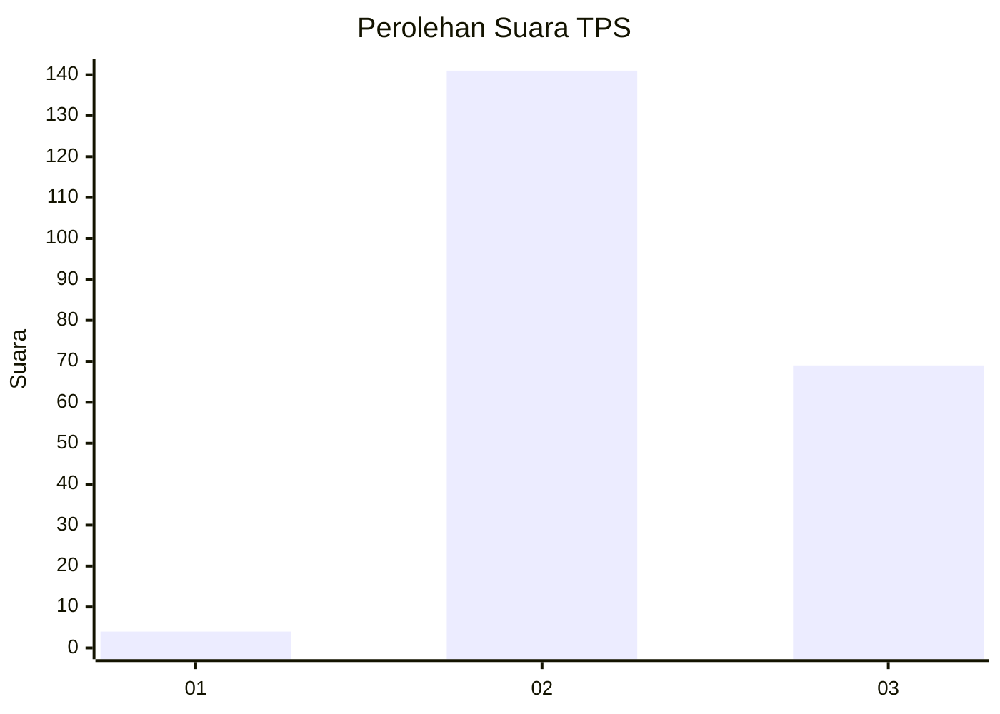
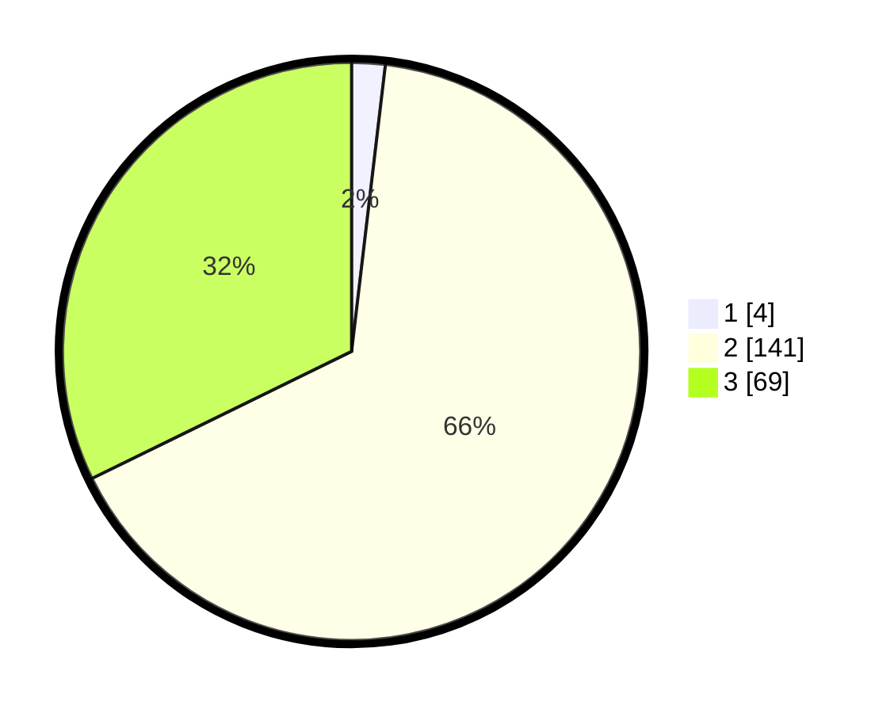

# Hasil

## Grafik

## Tabel

| No. | Nama Paslon    | Suara | Suara (raw) | Persentase |
|:--- |:-------------- | -----:| -----------:| ----------:|
| 1   | ANIES MUHAIMIN | 4     | [4][p-1]    | 1,87       |
| 2   | PRABOWO GIBRAN | 141   | [141][p-2]  | 65,89      |
| 3   | GANJAR MAHFUD  | 69    | [69][p-3]   | 32,24      |

[p-1]: https://github.com/gigit-pemilu/pemilu-2024-51-bali/blob/main/pilpres/hitung-suara/sub/51-bali/sub/08-buleleng/sub/04-banjar/sub/2015-temukus/sub/009-tps/sub/paslon-1.txt
[p-2]: https://github.com/gigit-pemilu/pemilu-2024-51-bali/blob/main/pilpres/hitung-suara/sub/51-bali/sub/08-buleleng/sub/04-banjar/sub/2015-temukus/sub/009-tps/sub/paslon-2.txt
[p-3]: https://github.com/gigit-pemilu/pemilu-2024-51-bali/blob/main/pilpres/hitung-suara/sub/51-bali/sub/08-buleleng/sub/04-banjar/sub/2015-temukus/sub/009-tps/sub/paslon-3.txt

## Foto C Plano

https://sirekap-obj-formc.kpu.go.id/7ffd/pemilu/ppwp/51/08/04/20/15/5108042015009-20240214-233713--5303e76c-a431-47d5-8e41-eff942a47a67.jpg

https://sirekap-obj-formc.kpu.go.id/7ffd/pemilu/ppwp/51/08/04/20/15/5108042015009-20240214-234436--cc09bea0-149d-4e94-b33b-64b9e338f4db.jpg

https://sirekap-obj-formc.kpu.go.id/7ffd/pemilu/ppwp/51/08/04/20/15/5108042015009-20240214-234650--09a260f4-42de-43e2-b7ae-223e08ff2090.jpg

## Metadata

| Key        | Value               |
| ---------- | ------------------- |
| Time Stamp | 2024-02-24 22:31:28 |

